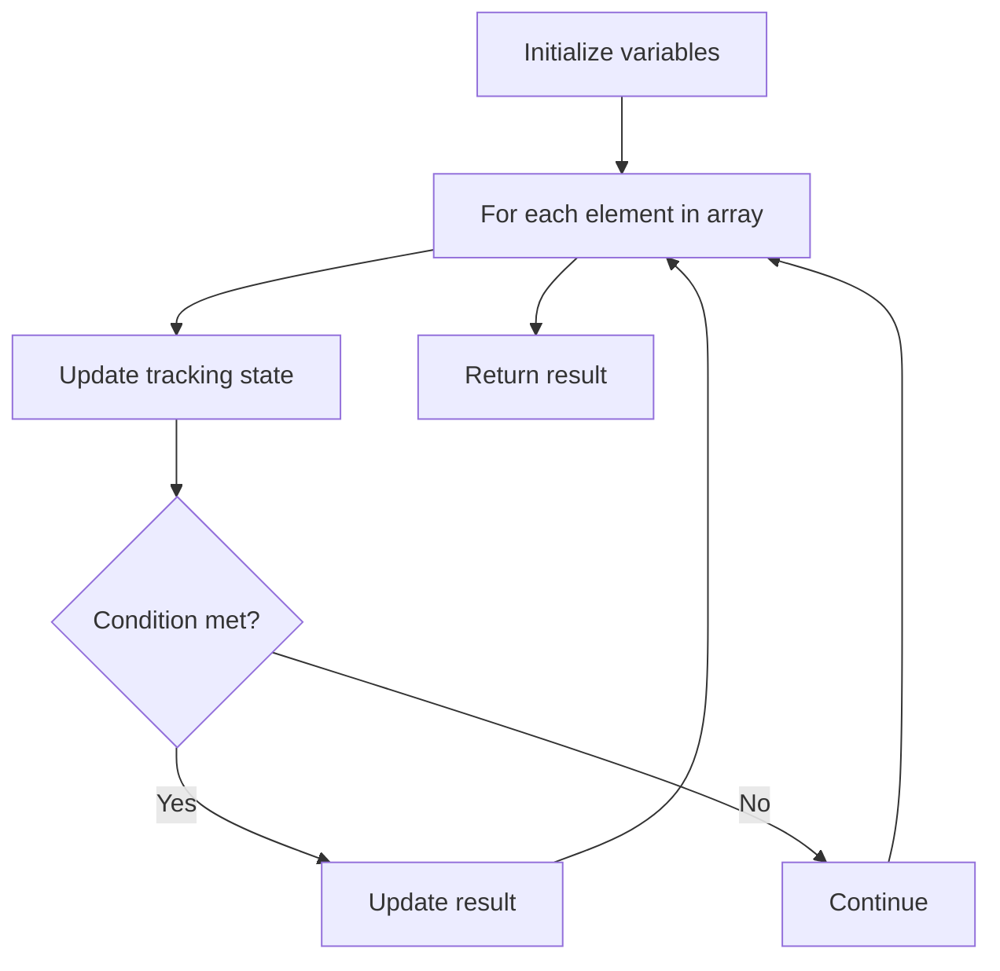

# Problem 941: Valid Mountain Array

**Difficulty:** Easy  
**Tags:** Array  
**Pattern:** Array Processing  
**Link:** [leetcode.com/problems/valid-mountain-array](https://leetcode.com/problems/valid-mountain-array/)

## Description

Given an array of integers `arr`, return *`true` if and only if it is a valid mountain array*.

Recall that arr is a mountain array if and only if:

	- `arr.length >= 3`
	- There exists some `i` with `0 < i < arr.length - 1` such that:
	
		`arr[0] < arr[1] < ... < arr[i - 1] < arr[i] `
		- `arr[i] > arr[i + 1] > ... > arr[arr.length - 1]`
	
	

 

Example 1:

```
**Input:** arr = [2,1]
**Output:** false

```
Example 2:

```
**Input:** arr = [3,5,5]
**Output:** false

```
Example 3:

```
**Input:** arr = [0,3,2,1]
**Output:** true

```

 

**Constraints:**

	- `1 <= arr.length <= 10^4`
	- `0 <= arr[i] <= 10^4`

## Approach: Array Processing

Process the array with a linear scan, tracking state variables. Look for patterns: running maximum/minimum, counting, or transformations.

## Pseudocode

```
1. Initialize tracking variables
2. Iterate through array:
   a. Update tracking state
   b. Check conditions
   c. Update result
3. Return result
```

## Algorithm Flow



## Complexity Analysis

- **Time:** O(n)
- **Space:** O(1)

## Solution (Python3)

```python
class Solution:
    def validMountainArray(self, arr: List[int]) -> bool:
        # Array processing - O(n) time
        result = False
        for i in range(len(arr)):
            # Process element
            pass
        return result
```

## Solution (C++)

```cpp
#include <string>
#include <vector>
using namespace std;

class Solution {
public:
    bool validMountainArray(vector<int>& arr) {
        // Array processing - O(n) time
        for (int i = 0; i < (int)arr.size(); i++) {
            // Process element
        }
        return false;
    }
};
```
