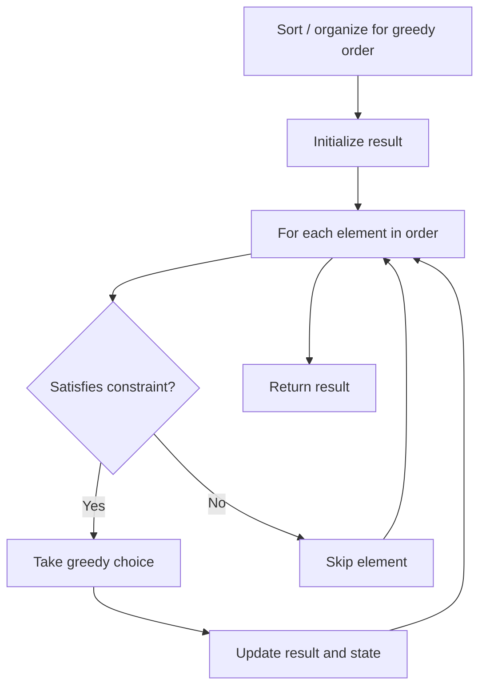

# Problem 942: DI String Match

**Difficulty:** Easy  
**Tags:** Array, Two Pointers, String, Greedy  
**Pattern:** Greedy  
**Link:** [leetcode.com/problems/di-string-match](https://leetcode.com/problems/di-string-match/)

## Description

A permutation `perm` of `n + 1` integers of all the integers in the range `[0, n]` can be represented as a string `s` of length `n` where:

	- `s[i] == 'I'` if `perm[i] < perm[i + 1]`, and
	- `s[i] == 'D'` if `perm[i] > perm[i + 1]`.

Given a string `s`, reconstruct the permutation `perm` and return it. If there are multiple valid permutations perm, return **any of them**.

 

Example 1:

```
**Input:** s = "IDID"
**Output:** [0,4,1,3,2]

```
Example 2:

```
**Input:** s = "III"
**Output:** [0,1,2,3]

```
Example 3:

```
**Input:** s = "DDI"
**Output:** [3,2,0,1]

```

 

**Constraints:**

	- `1 <= s.length <= 10^5`
	- `s[i]` is either `'I'` or `'D'`.

## Approach: Greedy

Make the locally optimal choice at each step, trusting it leads to a global optimum. Greedy works when the problem has the greedy-choice property and optimal substructure.

## Pseudocode

```
1. Sort or organize data for greedy ordering
2. Initialize result
3. For each element in greedy order:
   a. If element satisfies constraint:
      - Take the greedy choice
      - Update result and state
4. Return result
```

## Algorithm Flow



## Complexity Analysis

- **Time:** O(n log n)
- **Space:** O(1)

## Solution (Python3)

```python
class Solution:
    def diStringMatch(self, s: str) -> List[int]:
        # Greedy approach - O(n) time
        result = 0
        curr_max = 0
        for i in range(len(s)):
            if isinstance(s[i], int):
                curr_max = max(curr_max, s[i])
                result = max(result, curr_max)
            else:
                result += 1
        return result
```

## Solution (C++)

```cpp
#include <algorithm>
#include <string>
#include <vector>
using namespace std;

class Solution {
public:
    vector<int> diStringMatch(string& s) {
        // Greedy approach - O(n) time
        int result = 0, curr_max = 0;
        for (int i = 0; i < (int)s.size(); i++) {
            curr_max = max(curr_max, s[i]);
            result = max(result, curr_max);
        }
        return result;
    }
};
```
