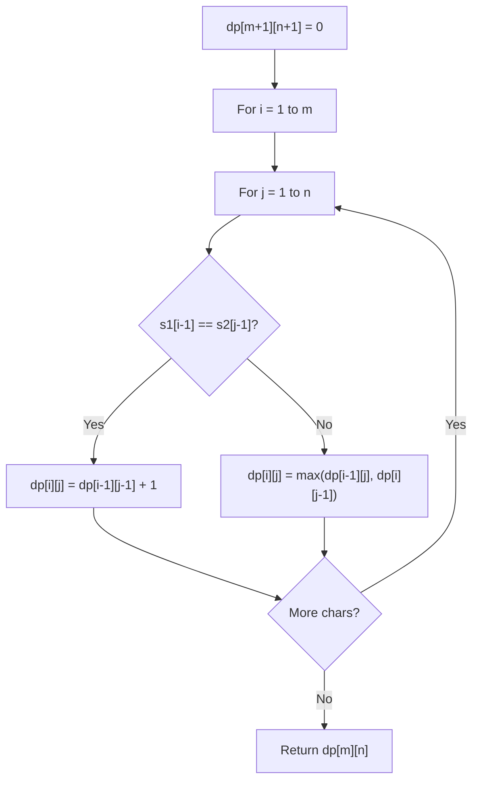

# Problem 943: Find the Shortest Superstring

**Difficulty:** Hard  
**Tags:** Array, String, Dynamic Programming, Bit Manipulation, Bitmask  
**Pattern:** Dynamic Programming (String)  
**Link:** [leetcode.com/problems/find-the-shortest-superstring](https://leetcode.com/problems/find-the-shortest-superstring/)

## Description

Given an array of strings `words`, return *the smallest string that contains each string in* `words` *as a substring*. If there are multiple valid strings of the smallest length, return **any of them**.

You may assume that no string in `words` is a substring of another string in `words`.

 

Example 1:

```

**Input:** words = ["alex","loves","leetcode"]
**Output:** "alexlovesleetcode"
**Explanation:** All permutations of "alex","loves","leetcode" would also be accepted.

```

Example 2:

```

**Input:** words = ["catg","ctaagt","gcta","ttca","atgcatc"]
**Output:** "gctaagttcatgcatc"

```

 

**Constraints:**

	- `1 <= words.length <= 12`
	- `1 <= words[i].length <= 20`
	- `words[i]` consists of lowercase English letters.
	- All the strings of `words` are **unique**.

## Approach: Dynamic Programming (String)

Compare or match two strings using a 2D DP table. dp[i][j] represents the answer for substrings s1[0..i-1] and s2[0..j-1]. Common patterns: LCS, edit distance, regex matching.

## Pseudocode

```
1. Create dp[m+1][n+1]
2. Initialize base cases
3. For i from 1 to m:
   For j from 1 to n:
     If s1[i-1] == s2[j-1]: dp[i][j] = dp[i-1][j-1] + 1
     Else: dp[i][j] = best of (dp[i-1][j], dp[i][j-1], dp[i-1][j-1])
4. Return dp[m][n]
```

## Algorithm Flow



## Complexity Analysis

- **Time:** O(m * n)
- **Space:** O(m * n)

## Solution (Python3)

```python
class Solution:
    def shortestSuperstring(self, words: List[str]) -> str:
        # String DP - O(m*n) time and space
        m, n = len(words), len(words)
        dp = [[0] * (n + 1) for _ in range(m + 1)]
        for i in range(1, m + 1):
            for j in range(1, n + 1):
                if words[i-1] == words[j-1]:
                    dp[i][j] = dp[i-1][j-1] + 1
                else:
                    dp[i][j] = max(dp[i-1][j], dp[i][j-1])
        return dp[m][n]
```

## Solution (C++)

```cpp
#include <algorithm>
#include <string>
#include <vector>
using namespace std;

class Solution {
public:
    string shortestSuperstring(vector<string>& words) {
        // String DP - O(m*n) time and space
        int m = words.size(), n = words.size();
        vector<vector<int>> dp(m + 1, vector<int>(n + 1, 0));
        for (int i = 1; i <= m; i++) {
            for (int j = 1; j <= n; j++) {
                if (words[i-1] == words[j-1])
                    dp[i][j] = dp[i-1][j-1] + 1;
                else
                    dp[i][j] = max(dp[i-1][j], dp[i][j-1]);
            }
        }
        return dp[m][n];
    }
};
```
