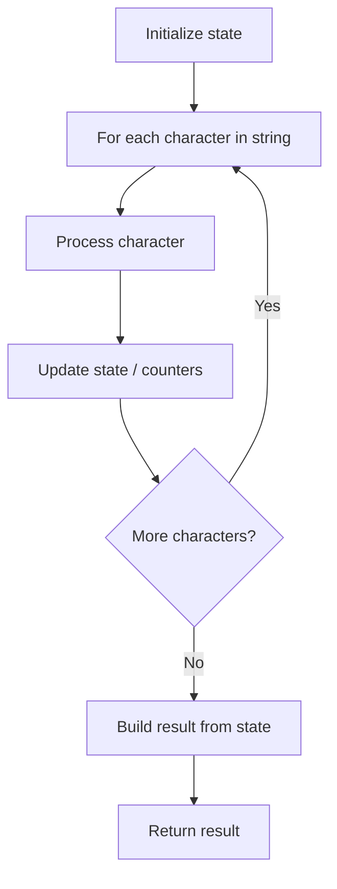

# Problem 944: Delete Columns to Make Sorted

**Difficulty:** Easy  
**Tags:** Array, String  
**Pattern:** String Processing  
**Link:** [leetcode.com/problems/delete-columns-to-make-sorted](https://leetcode.com/problems/delete-columns-to-make-sorted/)

## Description

You are given an array of `n` strings `strs`, all of the same length.

The strings can be arranged such that there is one on each line, making a grid.

	- For example, `strs = ["abc", "bce", "cae"]` can be arranged as follows:

```

abc
bce
cae

```

You want to **delete** the columns that are **not sorted lexicographically**. In the above example (**0-indexed**), columns 0 (`'a'`, `'b'`, `'c'`) and 2 (`'c'`, `'e'`, `'e'`) are sorted, while column 1 (`'b'`, `'c'`, `'a'`) is not, so you would delete column 1.

Return *the number of columns that you will delete*.

 

Example 1:

```

**Input:** strs = ["cba","daf","ghi"]
**Output:** 1
**Explanation:** The grid looks as follows:
  cba
  daf
  ghi
Columns 0 and 2 are sorted, but column 1 is not, so you only need to delete 1 column.

```

Example 2:

```

**Input:** strs = ["a","b"]
**Output:** 0
**Explanation:** The grid looks as follows:
  a
  b
Column 0 is the only column and is sorted, so you will not delete any columns.

```

Example 3:

```

**Input:** strs = ["zyx","wvu","tsr"]
**Output:** 3
**Explanation:** The grid looks as follows:
  zyx
  wvu
  tsr
All 3 columns are not sorted, so you will delete all 3.

```

 

**Constraints:**

	- `n == strs.length`
	- `1 <= n <= 100`
	- `1 <= strs[i].length <= 1000`
	- `strs[i]` consists of lowercase English letters.

## Approach: String Processing

Process the string character by character. Common techniques: two pointers, sliding window, hash map for frequencies, stack for matching.

## Pseudocode

```
1. Initialize result / tracking state
2. Iterate through string characters:
   a. Process character based on rules
   b. Update state (counters, pointers, stack)
3. Build and return result
```

## Algorithm Flow



## Complexity Analysis

- **Time:** O(n)
- **Space:** O(n)

## Solution (Python3)

```python
class Solution:
    def minDeletionSize(self, strs: List[str]) -> int:
        # String processing approach - O(n) time
        result = []
        for ch in strs:
            if ch.isalnum():
                result.append(ch.lower())
        # Check palindrome or process
        processed = ''.join(result)
        return processed == processed[::-1] if isinstance(0, bool) else processed
```

## Solution (C++)

```cpp
#include <algorithm>
#include <cctype>
#include <string>
#include <vector>
using namespace std;

class Solution {
public:
    int minDeletionSize(vector<string>& strs) {
        // String processing approach - O(n) time
        string processed;
        for (char ch : strs) {
            if (isalnum(ch)) {
                processed += tolower(ch);
            }
        }
        string rev = processed;
        reverse(rev.begin(), rev.end());
        return processed == rev;
    }
};
```
