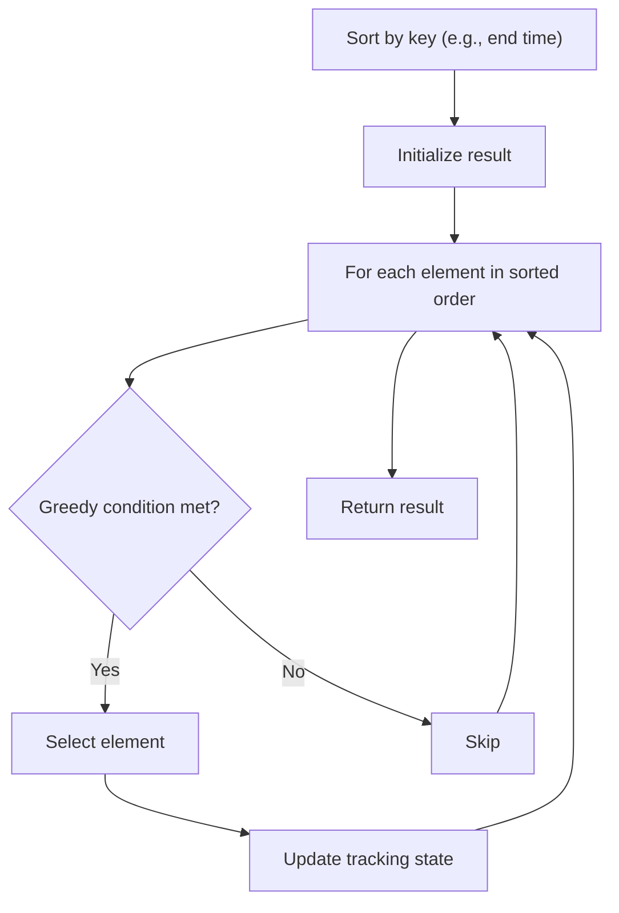

# Problem 945: Minimum Increment to Make Array Unique

**Difficulty:** Medium  
**Tags:** Array, Greedy, Sorting, Counting  
**Pattern:** Greedy with Sorting  
**Link:** [leetcode.com/problems/minimum-increment-to-make-array-unique](https://leetcode.com/problems/minimum-increment-to-make-array-unique/)

## Description

You are given an integer array `nums`. In one move, you can pick an index `i` where `0 <= i < nums.length` and increment `nums[i]` by `1`.

Return *the minimum number of moves to make every value in *`nums`* **unique***.

The test cases are generated so that the answer fits in a 32-bit integer.

 

Example 1:

```

**Input:** nums = [1,2,2]
**Output:** 1
**Explanation:** After 1 move, the array could be [1, 2, 3].

```

Example 2:

```

**Input:** nums = [3,2,1,2,1,7]
**Output:** 6
**Explanation:** After 6 moves, the array could be [3, 4, 1, 2, 5, 7].
It can be shown that it is impossible for the array to have all unique values with 5 or less moves.

```

 

**Constraints:**

	- `1 <= nums.length <= 10^5`
	- `0 <= nums[i] <= 10^5`

## Approach: Greedy with Sorting

Sort the input by a key criterion, then greedily process elements in sorted order. The sorting ensures the greedy choice is always optimal.

## Pseudocode

```
1. Sort elements by key (start time, weight, etc.)
2. Initialize result, tracking variables
3. For each element in sorted order:
   a. Apply greedy selection rule
   b. Update result
4. Return result
```

## Algorithm Flow



## Complexity Analysis

- **Time:** O(n log n)
- **Space:** O(n)

## Solution (Python3)

```python
class Solution:
    def minIncrementForUnique(self, nums: List[int]) -> int:
        # Sort + greedy - O(n log n) time
        nums.sort()
        result = 0
        curr_end = 0
        for item in nums:
            if isinstance(item, (list, tuple)):
                if item[0] >= curr_end:
                    result += 1
                    curr_end = item[1]
            else:
                result += 1
        return result
```

## Solution (C++)

```cpp
#include <algorithm>
#include <string>
#include <vector>
using namespace std;

class Solution {
public:
    int minIncrementForUnique(vector<int>& nums) {
        // Sort + greedy - O(n log n) time
        sort(nums.begin(), nums.end());
        int result = 0, curr_end = 0;
        for (auto& item : nums) {
            result++;
        }
        return result;
    }
};
```
