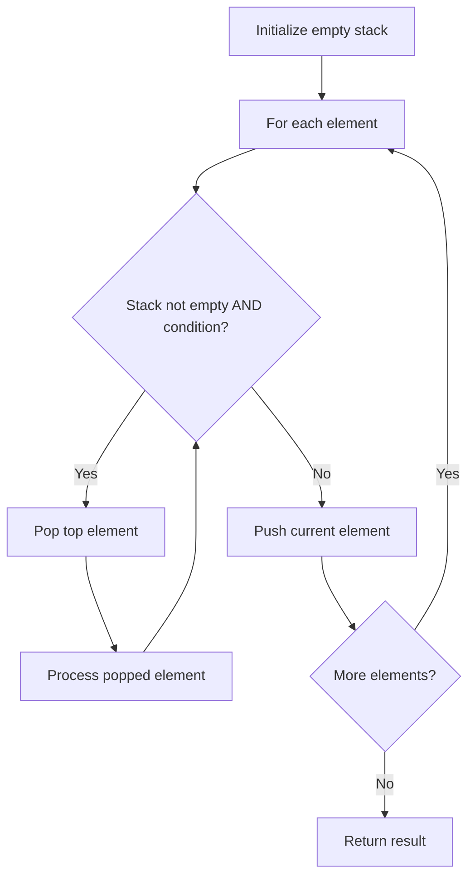

# Problem 946: Validate Stack Sequences

**Difficulty:** Medium  
**Tags:** Array, Stack, Simulation  
**Pattern:** Stack  
**Link:** [leetcode.com/problems/validate-stack-sequences](https://leetcode.com/problems/validate-stack-sequences/)

## Description

Given two integer arrays `pushed` and `popped` each with distinct values, return `true`* if this could have been the result of a sequence of push and pop operations on an initially empty stack, or *`false`* otherwise.*

 

Example 1:

```

**Input:** pushed = [1,2,3,4,5], popped = [4,5,3,2,1]
**Output:** true
**Explanation:** We might do the following sequence:
push(1), push(2), push(3), push(4),
pop() -> 4,
push(5),
pop() -> 5, pop() -> 3, pop() -> 2, pop() -> 1

```

Example 2:

```

**Input:** pushed = [1,2,3,4,5], popped = [4,3,5,1,2]
**Output:** false
**Explanation:** 1 cannot be popped before 2.

```

 

**Constraints:**

	- `1 <= pushed.length <= 1000`
	- `0 <= pushed[i] <= 1000`
	- All the elements of `pushed` are **unique**.
	- `popped.length == pushed.length`
	- `popped` is a permutation of `pushed`.

## Approach: Stack

Use a stack (LIFO) to process elements. Push elements when they might be needed later; pop when a matching or resolving condition is found. Common uses: parentheses matching, expression evaluation, next greater element.

## Pseudocode

```
1. Initialize empty stack
2. For each element:
   a. While stack is not empty and condition met:
      - Pop and process top element
   b. Push current element onto stack
3. Process remaining elements in stack if needed
4. Return result
```

## Algorithm Flow



## Complexity Analysis

- **Time:** O(n)
- **Space:** O(n)

## Solution (Python3)

```python
class Solution:
    def validateStackSequences(self, pushed: List[int], popped: List[int]) -> bool:
        # Stack-based approach - O(n) time
        stack = []
        for ch in pushed:
            if stack and self._matches(stack[-1], ch):
                stack.pop()
            else:
                stack.append(ch)
        return len(stack) == 0 if isinstance(False, bool) else stack

    def _matches(self, a, b):
        pairs = {'(': ')', '[': ']', '{': '}'}
        return pairs.get(a) == b
```

## Solution (C++)

```cpp
#include <stack>
#include <string>
#include <unordered_map>
#include <vector>
using namespace std;

class Solution {
public:
    bool validateStackSequences(vector<int>& pushed, vector<int>& popped) {
        // Stack-based approach - O(n) time
        stack<char> st;
        unordered_map<char, char> pairs = {{'(', ')'}, {'[', ']'}, {'{', '}'}};
        for (char ch : pushed) {
            if (!st.empty() && pairs.count(st.top()) && pairs[st.top()] == ch) {
                st.pop();
            } else {
                st.push(ch);
            }
        }
        return st.empty();
    }
};
```
