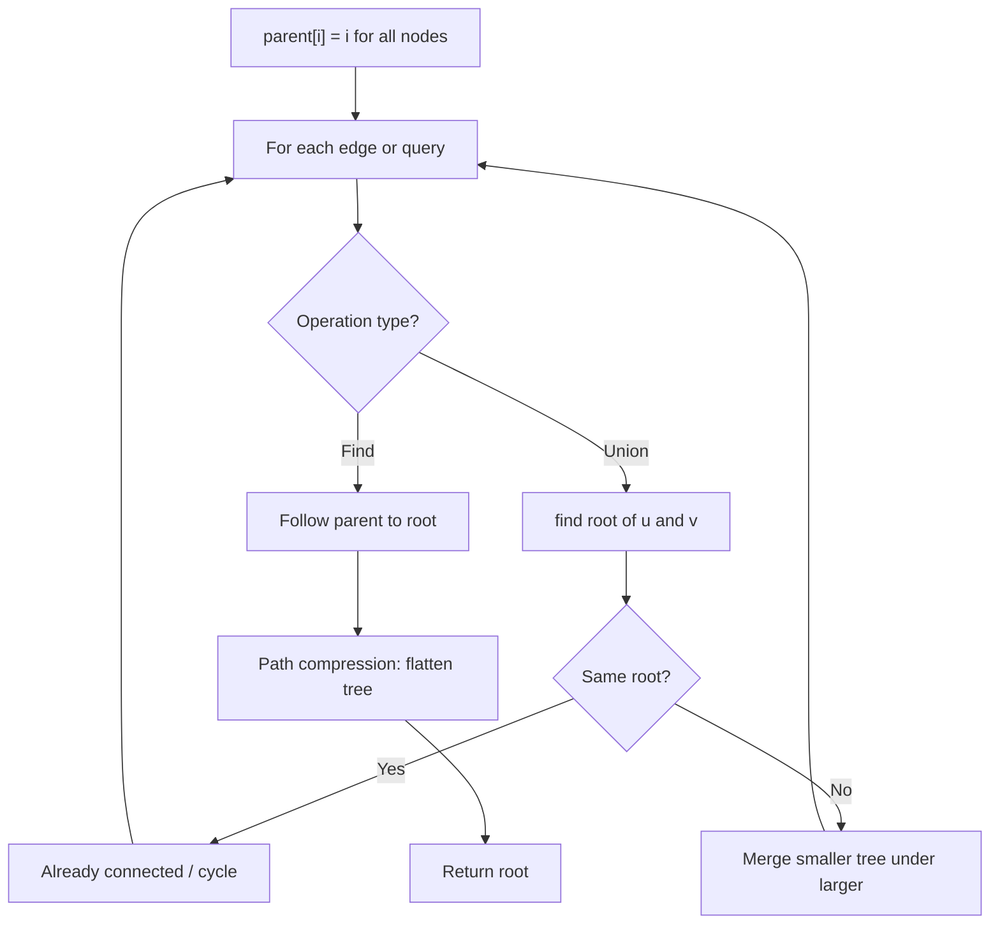
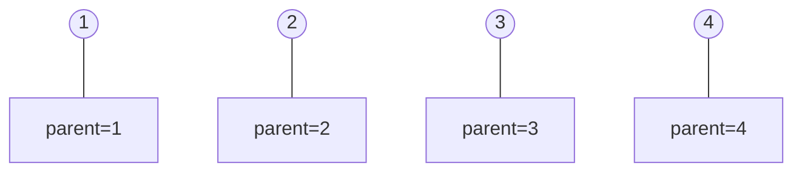
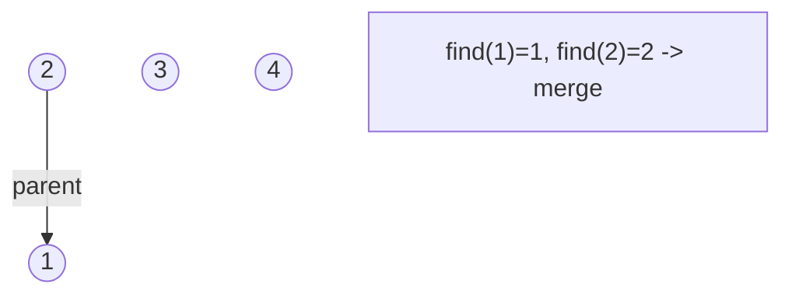
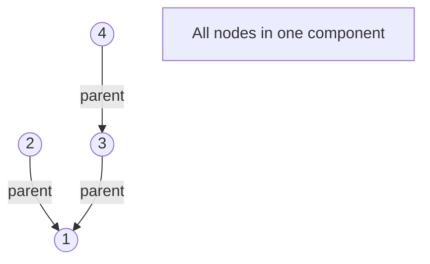
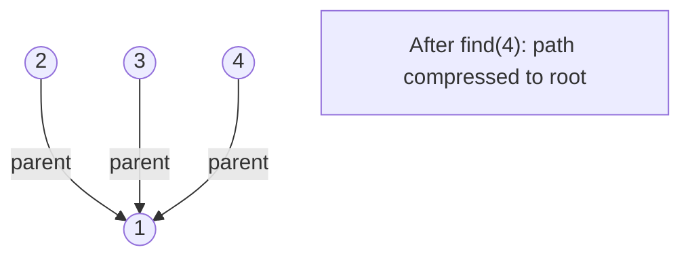

# Problem 947: Most Stones Removed with Same Row or Column

**Difficulty:** Medium  
**Tags:** Hash Table, Depth-First Search, Union-Find, Graph Theory  
**Pattern:** Union-Find / Disjoint Set  
**Link:** [leetcode.com/problems/most-stones-removed-with-same-row-or-column](https://leetcode.com/problems/most-stones-removed-with-same-row-or-column/)

## Description

On a 2D plane, we place `n` stones at some integer coordinate points. Each coordinate point may have at most one stone.

A stone can be removed if it shares either **the same row or the same column** as another stone that has not been removed.

Given an array `stones` of length `n` where `stones[i] = [xi, yi]` represents the location of the `i^th` stone, return *the largest possible number of stones that can be removed*.

 

Example 1:

```

**Input:** stones = [[0,0],[0,1],[1,0],[1,2],[2,1],[2,2]]
**Output:** 5
**Explanation:** One way to remove 5 stones is as follows:
1. Remove stone [2,2] because it shares the same row as [2,1].
2. Remove stone [2,1] because it shares the same column as [0,1].
3. Remove stone [1,2] because it shares the same row as [1,0].
4. Remove stone [1,0] because it shares the same column as [0,0].
5. Remove stone [0,1] because it shares the same row as [0,0].
Stone [0,0] cannot be removed since it does not share a row/column with another stone still on the plane.

```

Example 2:

```

**Input:** stones = [[0,0],[0,2],[1,1],[2,0],[2,2]]
**Output:** 3
**Explanation:** One way to make 3 moves is as follows:
1. Remove stone [2,2] because it shares the same row as [2,0].
2. Remove stone [2,0] because it shares the same column as [0,0].
3. Remove stone [0,2] because it shares the same row as [0,0].
Stones [0,0] and [1,1] cannot be removed since they do not share a row/column with another stone still on the plane.

```

Example 3:

```

**Input:** stones = [[0,0]]
**Output:** 0
**Explanation:** [0,0] is the only stone on the plane, so you cannot remove it.

```

 

**Constraints:**

	- `1 <= stones.length <= 1000`
	- `0 <= xi, yi <= 10^4`
	- No two stones are at the same coordinate point.

## Approach: Union-Find / Disjoint Set

Use Union-Find with path compression and union by rank to efficiently manage connected components. Find(x) returns the root of x's component; Union(x,y) merges two components.

## Pseudocode

```
1. parent[i] = i for all nodes (each is its own set)
2. find(x): follow parent pointers to root (with path compression)
3. union(x, y): merge sets of x and y by rank
4. Process edges/operations:
   a. For each edge (u, v): union(u, v)
5. Answer queries using find()
```

## Algorithm Flow



## Visual State Transitions

**Union-Find Step-by-Step:**

**Frame 1: Initial - each node is own parent**


**Frame 2: Union(1,2) - merge components**


**Frame 3: Union(3,4) then Union(2,3)**


**Frame 4: Path compression on find(4)**



## Complexity Analysis

- **Time:** O(n * alpha(n))
- **Space:** O(n)

## Solution (Python3)

```python
class Solution:
    def removeStones(self, stones: List[List[int]]) -> int:
        # Union Find (Disjoint Set Union) - O(n * alpha(n))
        parent = list(range(len(stones) + 1 if isinstance(stones, list) else stones + 1))
        rank = [0] * len(parent)
        
        def find(x):
            if parent[x] != x:
                parent[x] = find(parent[x])
            return parent[x]
        
        def union(x, y):
            px, py = find(x), find(y)
            if px == py:
                return False
            if rank[px] < rank[py]:
                px, py = py, px
            parent[py] = px
            if rank[px] == rank[py]:
                rank[px] += 1
            return True
        
        components = len(parent)
        # Process edges/connections
        return components
```

## Solution (C++)

```cpp
#include <functional>
#include <numeric>
#include <string>
#include <vector>
using namespace std;

class Solution {
public:
    int removeStones(vector<vector<int>>& stones) {
        // Union Find (DSU) - O(n * alpha(n))
        int n = stones.size();
        vector<int> parent(n + 1), rnk(n + 1, 0);
        iota(parent.begin(), parent.end(), 0);
        function<int(int)> find = [&](int x) -> int {
            return parent[x] == x ? x : parent[x] = find(parent[x]);
        };
        auto unite = [&](int x, int y) -> bool {
            int px = find(x), py = find(y);
            if (px == py) return false;
            if (rnk[px] < rnk[py]) swap(px, py);
            parent[py] = px;
            if (rnk[px] == rnk[py]) rnk[px]++;
            return true;
        };
        int components = n;
        return components;
    }
};
```
