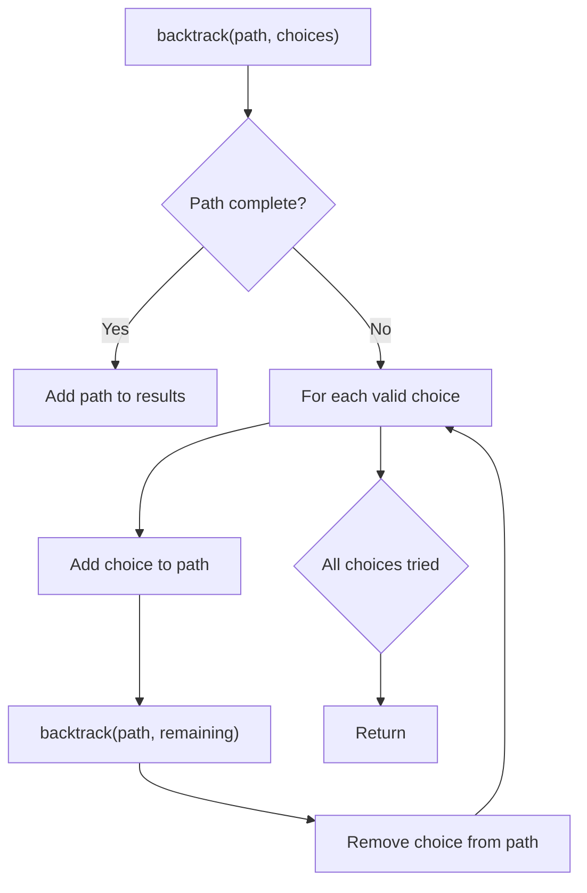
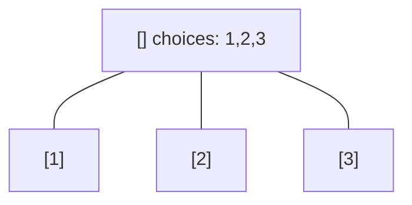
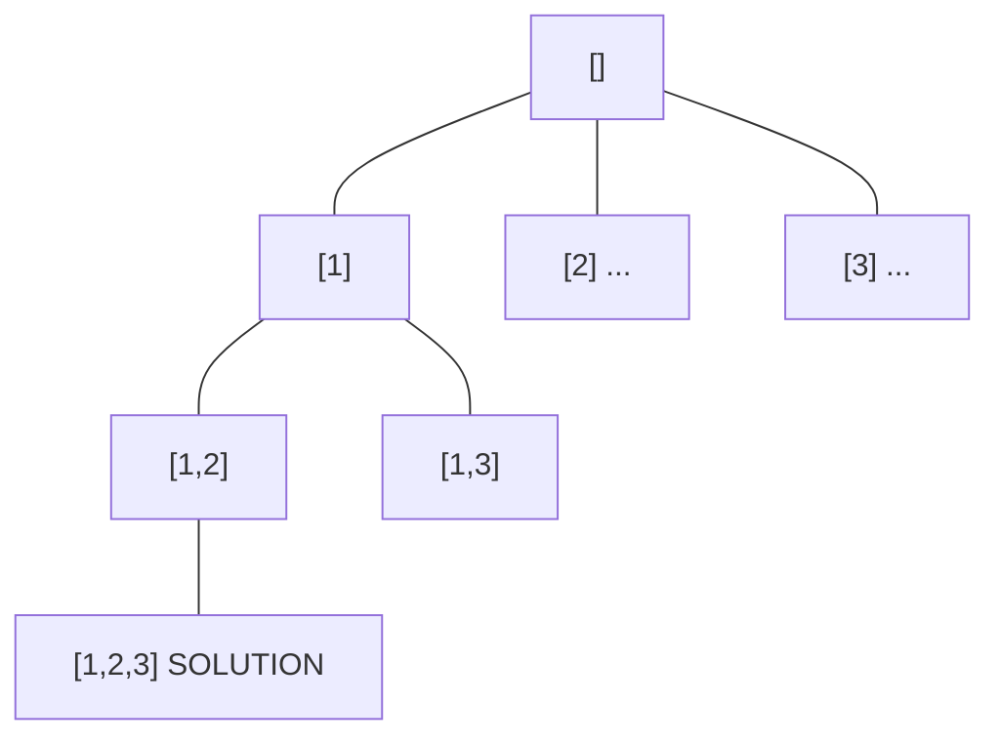
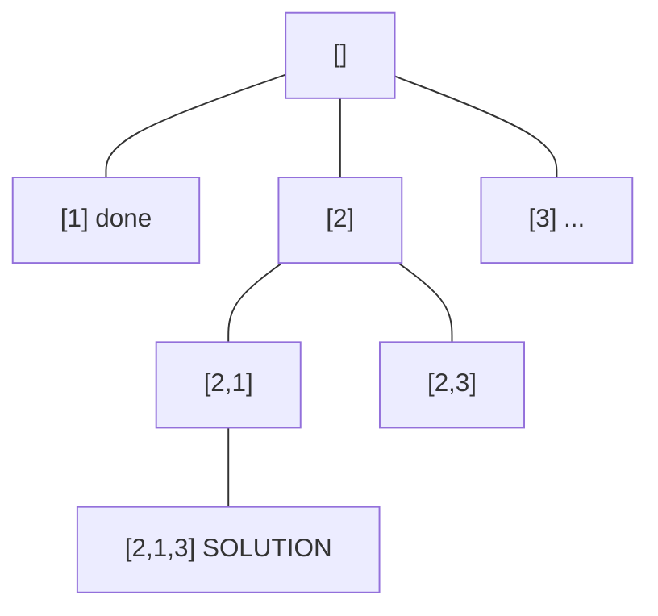
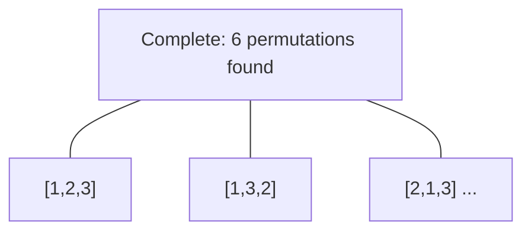

# Problem 949: Largest Time for Given Digits

**Difficulty:** Medium  
**Tags:** Array, String, Backtracking, Enumeration  
**Pattern:** Backtracking  
**Link:** [leetcode.com/problems/largest-time-for-given-digits](https://leetcode.com/problems/largest-time-for-given-digits/)

## Description

Given an array `arr` of 4 digits, find the latest 24-hour time that can be made using each digit **exactly once**.

24-hour times are formatted as `"HH:MM"`, where `HH` is between `00` and `23`, and `MM` is between `00` and `59`. The earliest 24-hour time is `00:00`, and the latest is `23:59`.

Return *the latest 24-hour time in `"HH:MM"` format*. If no valid time can be made, return an empty string.

 

Example 1:

```

**Input:** arr = [1,2,3,4]
**Output:** "23:41"
**Explanation:** The valid 24-hour times are "12:34", "12:43", "13:24", "13:42", "14:23", "14:32", "21:34", "21:43", "23:14", and "23:41". Of these times, "23:41" is the latest.

```

Example 2:

```

**Input:** arr = [5,5,5,5]
**Output:** ""
**Explanation:** There are no valid 24-hour times as "55:55" is not valid.

```

 

**Constraints:**

	- `arr.length == 4`
	- `0 <= arr[i] <= 9`

## Approach: Backtracking

Explore all possible solutions by building candidates incrementally. At each step, make a choice and recurse. If the choice leads to a dead end, undo the choice (backtrack) and try the next option.

## Pseudocode

```
1. Define backtrack(path, choices):
   a. If path is a complete solution: add to results
   b. For each choice in choices:
      - If choice is valid:
        * Add choice to path
        * backtrack(path, remaining_choices)
        * Remove choice from path (backtrack)
2. Call backtrack([], all_choices)
```

## Algorithm Flow



## Visual State Transitions

**Backtracking Decision Tree:**

**Frame 1: Root - start with empty path**


**Frame 2: Explore branch [1]**


**Frame 3: Backtrack, explore [2]**


**Frame 4: All solutions found**



## Complexity Analysis

- **Time:** O(k^n) or O(n!)
- **Space:** O(n)

## Solution (Python3)

```python
class Solution:
    def largestTimeFromDigits(self, arr: List[int]) -> str:
        # Backtracking - O(2^n) or O(n!) time
        result = []
        
        def backtrack(path, start):
            result.append(path[:])
            for i in range(start, len(arr)):
                path.append(arr[i])
                backtrack(path, i + 1)
                path.pop()
        
        backtrack([], 0)
        return result
```

## Solution (C++)

```cpp
#include <functional>
#include <string>
#include <vector>
using namespace std;

class Solution {
public:
    string largestTimeFromDigits(vector<int>& arr) {
        // Backtracking - O(2^n) or O(n!) time
        vector<vector<int>> result;
        vector<int> path;
        function<void(int)> backtrack = [&](int start) {
            result.push_back(path);
            for (int i = start; i < (int)arr.size(); i++) {
                path.push_back(arr[i]);
                backtrack(i + 1);
                path.pop_back();
            }
        };
        backtrack(0);
        return result;
    }
};
```
