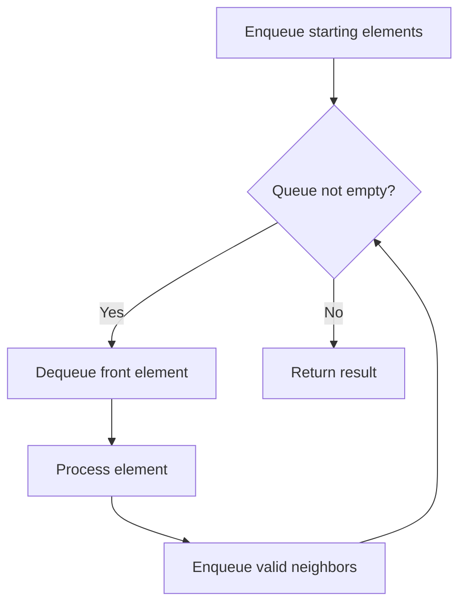

# Problem 950: Reveal Cards In Increasing Order

**Difficulty:** Medium  
**Tags:** Array, Queue, Sorting, Simulation  
**Pattern:** Queue / BFS  
**Link:** [leetcode.com/problems/reveal-cards-in-increasing-order](https://leetcode.com/problems/reveal-cards-in-increasing-order/)

## Description

You are given an integer array `deck`. There is a deck of cards where every card has a unique integer. The integer on the `i^th` card is `deck[i]`.

You can order the deck in any order you want. Initially, all the cards start face down (unrevealed) in one deck.

You will do the following steps repeatedly until all cards are revealed:

	- Take the top card of the deck, reveal it, and take it out of the deck.
	- If there are still cards in the deck then put the next top card of the deck at the bottom of the deck.
	- If there are still unrevealed cards, go back to step 1. Otherwise, stop.

Return *an ordering of the deck that would reveal the cards in increasing order*.

**Note** that the first entry in the answer is considered to be the top of the deck.

 

Example 1:

```

**Input:** deck = [17,13,11,2,3,5,7]
**Output:** [2,13,3,11,5,17,7]
**Explanation:** 
We get the deck in the order [17,13,11,2,3,5,7] (this order does not matter), and reorder it.
After reordering, the deck starts as [2,13,3,11,5,17,7], where 2 is the top of the deck.
We reveal 2, and move 13 to the bottom.  The deck is now [3,11,5,17,7,13].
We reveal 3, and move 11 to the bottom.  The deck is now [5,17,7,13,11].
We reveal 5, and move 17 to the bottom.  The deck is now [7,13,11,17].
We reveal 7, and move 13 to the bottom.  The deck is now [11,17,13].
We reveal 11, and move 17 to the bottom.  The deck is now [13,17].
We reveal 13, and move 17 to the bottom.  The deck is now [17].
We reveal 17.
Since all the cards revealed are in increasing order, the answer is correct.

```

Example 2:

```

**Input:** deck = [1,1000]
**Output:** [1,1000]

```

 

**Constraints:**

	- `1 <= deck.length <= 1000`
	- `1 <= deck[i] <= 10^6`
	- All the values of `deck` are **unique**.

## Approach: Queue / BFS

Use a queue (FIFO) for level-order or breadth-first processing. Enqueue starting elements, then process level by level.

## Pseudocode

```
1. Initialize queue with starting element(s)
2. While queue is not empty:
   a. Dequeue front element
   b. Process element
   c. Enqueue valid neighbors/children
3. Return result
```

## Algorithm Flow



## Complexity Analysis

- **Time:** O(n)
- **Space:** O(n)

## Solution (Python3)

```python
class Solution:
    def deckRevealedIncreasing(self, deck: List[int]) -> List[int]:
        # Queue-based approach - O(n) time
        from collections import deque
        queue = deque()
        for val in deck:
            queue.append(val)
        result = []
        while queue:
            result.append(queue.popleft())
        return result
```

## Solution (C++)

```cpp
#include <queue>
#include <string>
#include <vector>
using namespace std;

class Solution {
public:
    vector<int> deckRevealedIncreasing(vector<int>& deck) {
        // Queue-based approach - O(n) time
        queue<int> q;
        for (int val : deck) {
            q.push(val);
        }
        vector<int> result;
        while (!q.empty()) {
            result.push_back(q.front());
            q.pop();
        }
        return result;
    }
};
```
