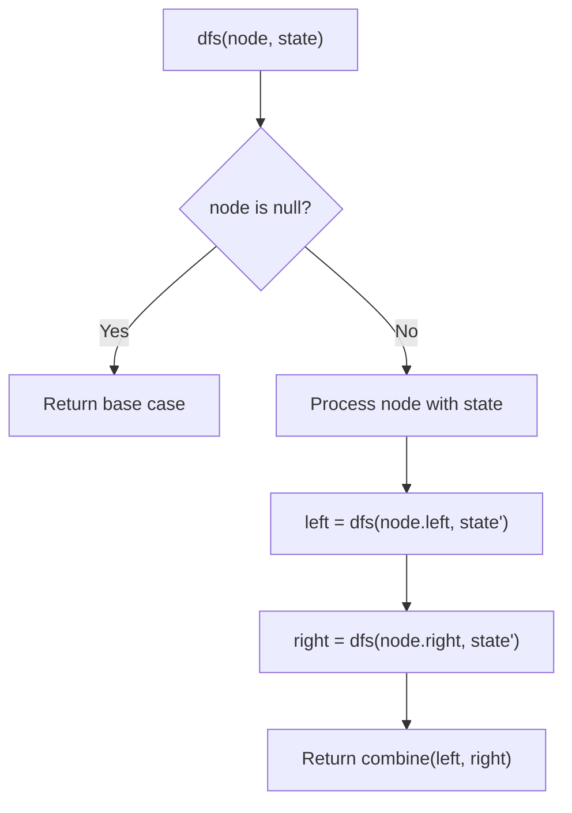
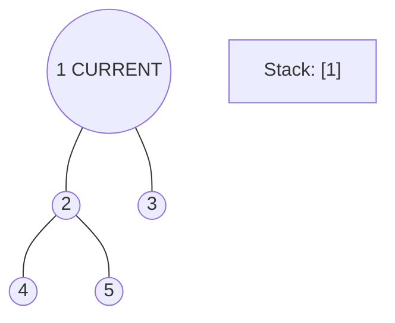
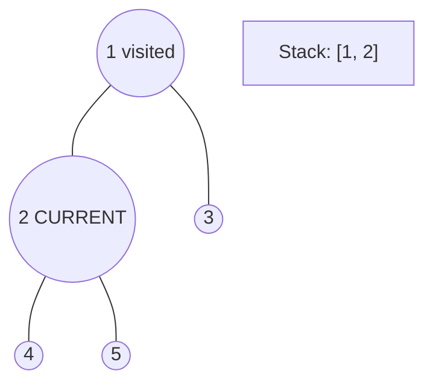
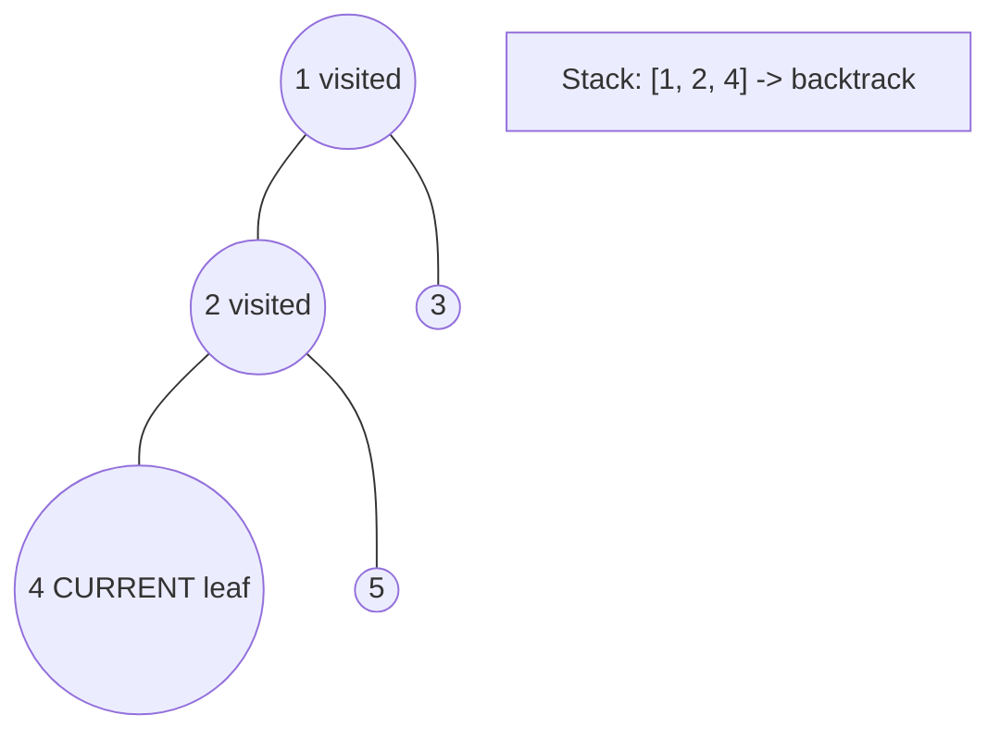
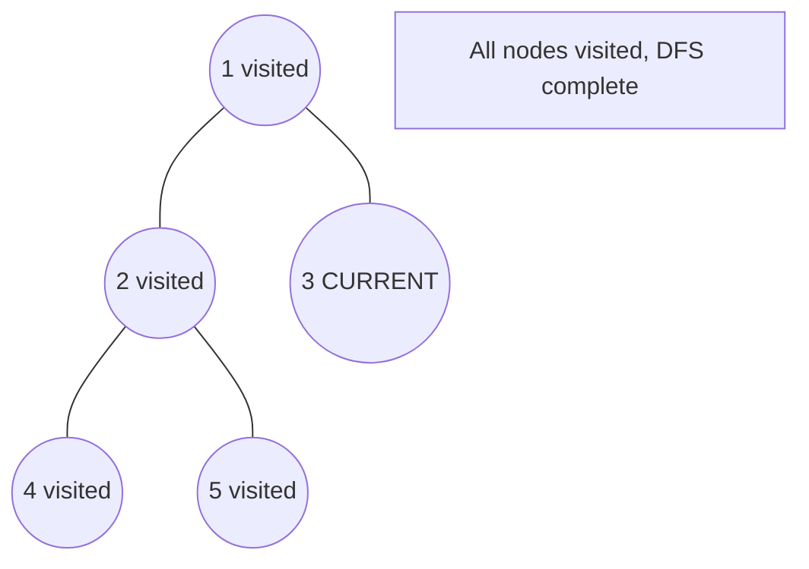

# Problem 951: Flip Equivalent Binary Trees

**Difficulty:** Medium  
**Tags:** Tree, Depth-First Search, Binary Tree  
**Pattern:** DFS Tree Traversal  
**Link:** [leetcode.com/problems/flip-equivalent-binary-trees](https://leetcode.com/problems/flip-equivalent-binary-trees/)

## Description

For a binary tree **T**, we can define a **flip operation** as follows: choose any node, and swap the left and right child subtrees.

A binary tree **X** is *flip equivalent* to a binary tree **Y** if and only if we can make **X** equal to **Y** after some number of flip operations.

Given the roots of two binary trees `root1` and `root2`, return `true` if the two trees are flip equivalent or `false` otherwise.

 

Example 1:

```

**Input:** root1 = [1,2,3,4,5,6,null,null,null,7,8], root2 = [1,3,2,null,6,4,5,null,null,null,null,8,7]
**Output:** true
**Explanation: **We flipped at nodes with values 1, 3, and 5.

```

Example 2:

```

**Input:** root1 = [], root2 = []
**Output:** true

```

Example 3:

```

**Input:** root1 = [], root2 = [1]
**Output:** false

```

 

**Constraints:**

	- The number of nodes in each tree is in the range `[0, 100]`.
	- Each tree will have **unique node values** in the range `[0, 99]`.

## Approach: DFS Tree Traversal

Perform depth-first search on the tree. Recurse on left and right subtrees, combining results bottom-up. Track state (path, depth, sum) during traversal.

## Pseudocode

```
1. Define dfs(node, state):
   a. Base case: if null, return default
   b. Process node with current state
   c. left_result = dfs(node.left, updated_state)
   d. right_result = dfs(node.right, updated_state)
   e. Return combine(left_result, right_result)
2. Return dfs(root, initial_state)
```

## Algorithm Flow



## Visual State Transitions

**DFS Tree Traversal Step-by-Step:**

**Frame 1: Start at root**


**Frame 2: Go left - visit node 2**


**Frame 3: Go left - visit node 4 (leaf)**


**Frame 4: Backtrack, visit node 5, then node 3**



## Complexity Analysis

- **Time:** O(n)
- **Space:** O(h)

## Solution (Python3)

```python
class Solution:
    def flipEquiv(self, root1: Optional[TreeNode], root2: Optional[TreeNode]) -> bool:
        # DFS on binary tree - O(n) time, O(h) space
        def dfs(node):
            if not node:
                return 0
            left = dfs(node.left)
            right = dfs(node.right)
            return 1 + max(left, right)
        
        result = dfs(root1)
        return result
```

## Solution (C++)

```cpp
#include <algorithm>
#include <functional>
#include <string>
#include <vector>
using namespace std;

class Solution {
public:
    bool flipEquiv(TreeNode* root1, TreeNode* root2) {
        // DFS on binary tree - O(n) time, O(h) space
        function<int(TreeNode*)> dfs = [&](TreeNode* node) -> int {
            if (!node) return 0;
            int left = dfs(node->left);
            int right = dfs(node->right);
            return 1 + max(left, right);
        };
        return dfs(root1);
    }
};
```
