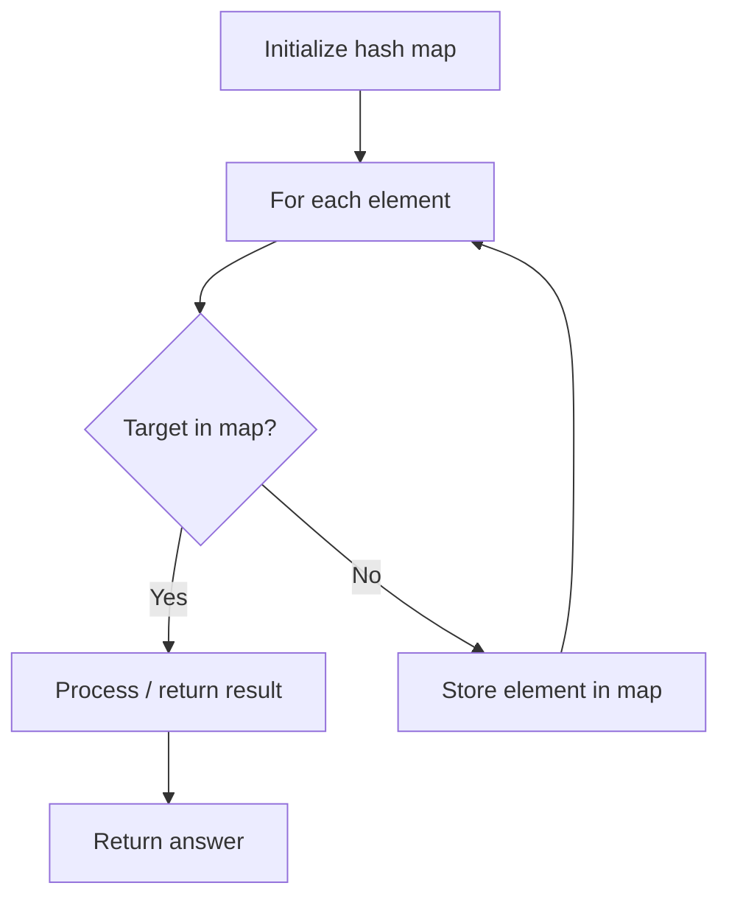

# Problem 953: Verifying an Alien Dictionary

**Difficulty:** Easy  
**Tags:** Array, Hash Table, String  
**Pattern:** Hash Map Lookup  
**Link:** [leetcode.com/problems/verifying-an-alien-dictionary](https://leetcode.com/problems/verifying-an-alien-dictionary/)

## Description

In an alien language, surprisingly, they also use English lowercase letters, but possibly in a different `order`. The `order` of the alphabet is some permutation of lowercase letters.

Given a sequence of `words` written in the alien language, and the `order` of the alphabet, return `true` if and only if the given `words` are sorted lexicographically in this alien language.

 

Example 1:

```

**Input:** words = ["hello","leetcode"], order = "hlabcdefgijkmnopqrstuvwxyz"
**Output:** true
**Explanation: **As 'h' comes before 'l' in this language, then the sequence is sorted.

```

Example 2:

```

**Input:** words = ["word","world","row"], order = "worldabcefghijkmnpqstuvxyz"
**Output:** false
**Explanation: **As 'd' comes after 'l' in this language, then words[0] > words[1], hence the sequence is unsorted.

```

Example 3:

```

**Input:** words = ["apple","app"], order = "abcdefghijklmnopqrstuvwxyz"
**Output:** false
**Explanation: **The first three characters "app" match, and the second string is shorter (in size.) According to lexicographical rules "apple" > "app", because 'l' > '∅', where '∅' is defined as the blank character which is less than any other character (More info).

```

 

**Constraints:**

	- `1 <= words.length <= 100`
	- `1 <= words[i].length <= 20`
	- `order.length == 26`
	- All characters in `words[i]` and `order` are English lowercase letters.

## Approach: Hash Map Lookup

Use a hash map (dictionary) to store elements for O(1) lookup. Iterate through the input, checking membership or counting frequencies in the map.

## Pseudocode

```
1. Initialize hash map
2. Iterate through elements:
   a. Check if target/complement exists in map
   b. If found: process result
   c. Otherwise: store element in map
3. Return result
```

## Algorithm Flow



## Complexity Analysis

- **Time:** O(n)
- **Space:** O(n)

## Solution (Python3)

```python
class Solution:
    def isAlienSorted(self, words: List[str], order: str) -> bool:
        # Hash map approach - O(n) time, O(n) space
        seen = {}
        for i, val in enumerate(words):
            complement = order - val
            if complement in seen:
                return [seen[complement], i]
            seen[val] = i
        return False
```

## Solution (C++)

```cpp
#include <string>
#include <unordered_map>
#include <vector>
using namespace std;

class Solution {
public:
    bool isAlienSorted(vector<string>& words, string& order) {
        // Hash map approach - O(n) time, O(n) space
        unordered_map<int, int> seen;
        for (int i = 0; i < words.size(); i++) {
            int complement = order - words[i];
            if (seen.count(complement)) {
                return {seen[complement], i};
            }
            seen[words[i]] = i;
        }
        return false;
    }
};
```
