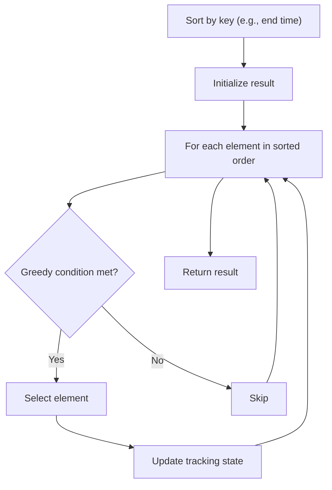

# Problem 954: Array of Doubled Pairs

**Difficulty:** Medium  
**Tags:** Array, Hash Table, Greedy, Sorting  
**Pattern:** Greedy with Sorting  
**Link:** [leetcode.com/problems/array-of-doubled-pairs](https://leetcode.com/problems/array-of-doubled-pairs/)

## Description

Given an integer array of even length `arr`, return `true`* if it is possible to reorder *`arr`* such that *`arr[2 * i + 1] = 2 * arr[2 * i]`* for every *`0 <= i < len(arr) / 2`*, or *`false`* otherwise*.

 

Example 1:

```

**Input:** arr = [3,1,3,6]
**Output:** false

```

Example 2:

```

**Input:** arr = [2,1,2,6]
**Output:** false

```

Example 3:

```

**Input:** arr = [4,-2,2,-4]
**Output:** true
**Explanation:** We can take two groups, [-2,-4] and [2,4] to form [-2,-4,2,4] or [2,4,-2,-4].

```

 

**Constraints:**

	- `2 <= arr.length <= 3 * 10^4`
	- `arr.length` is even.
	- `-10^5 <= arr[i] <= 10^5`

## Approach: Greedy with Sorting

Sort the input by a key criterion, then greedily process elements in sorted order. The sorting ensures the greedy choice is always optimal.

## Pseudocode

```
1. Sort elements by key (start time, weight, etc.)
2. Initialize result, tracking variables
3. For each element in sorted order:
   a. Apply greedy selection rule
   b. Update result
4. Return result
```

## Algorithm Flow



## Complexity Analysis

- **Time:** O(n log n)
- **Space:** O(n)

## Solution (Python3)

```python
class Solution:
    def canReorderDoubled(self, arr: List[int]) -> bool:
        # Sort + greedy - O(n log n) time
        arr.sort()
        result = 0
        curr_end = 0
        for item in arr:
            if isinstance(item, (list, tuple)):
                if item[0] >= curr_end:
                    result += 1
                    curr_end = item[1]
            else:
                result += 1
        return result
```

## Solution (C++)

```cpp
#include <algorithm>
#include <string>
#include <vector>
using namespace std;

class Solution {
public:
    bool canReorderDoubled(vector<int>& arr) {
        // Sort + greedy - O(n log n) time
        sort(arr.begin(), arr.end());
        int result = 0, curr_end = 0;
        for (auto& item : arr) {
            result++;
        }
        return result;
    }
};
```
