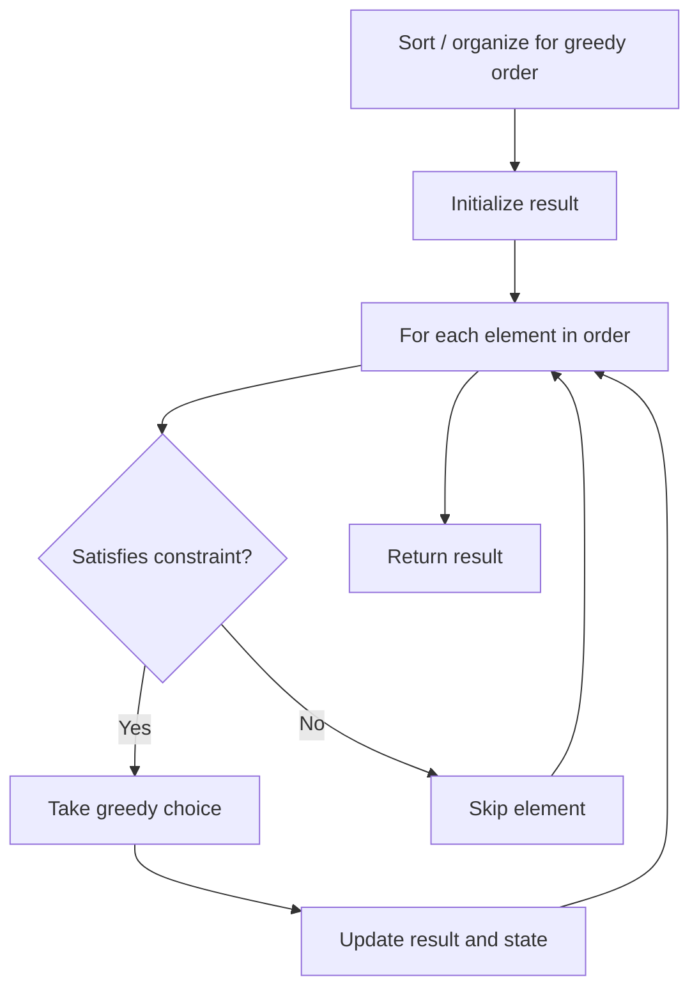

# Problem 955: Delete Columns to Make Sorted II

**Difficulty:** Medium  
**Tags:** Array, String, Greedy  
**Pattern:** Greedy  
**Link:** [leetcode.com/problems/delete-columns-to-make-sorted-ii](https://leetcode.com/problems/delete-columns-to-make-sorted-ii/)

## Description

You are given an array of `n` strings `strs`, all of the same length.

We may choose any deletion indices, and we delete all the characters in those indices for each string.

For example, if we have `strs = ["abcdef","uvwxyz"]` and deletion indices `{0, 2, 3}`, then the final array after deletions is `["bef", "vyz"]`.

Suppose we chose a set of deletion indices `answer` such that after deletions, the final array has its elements in **lexicographic** order (i.e., `strs[0] <= strs[1] <= strs[2] <= ... <= strs[n - 1]`). Return *the minimum possible value of* `answer.length`.

 

Example 1:

```

**Input:** strs = ["ca","bb","ac"]
**Output:** 1
**Explanation:** 
After deleting the first column, strs = ["a", "b", "c"].
Now strs is in lexicographic order (ie. strs[0] <= strs[1] <= strs[2]).
We require at least 1 deletion since initially strs was not in lexicographic order, so the answer is 1.

```

Example 2:

```

**Input:** strs = ["xc","yb","za"]
**Output:** 0
**Explanation:** 
strs is already in lexicographic order, so we do not need to delete anything.
Note that the rows of strs are not necessarily in lexicographic order:
i.e., it is NOT necessarily true that (strs[0][0] <= strs[0][1] <= ...)

```

Example 3:

```

**Input:** strs = ["zyx","wvu","tsr"]
**Output:** 3
**Explanation:** We have to delete every column.

```

 

**Constraints:**

	- `n == strs.length`
	- `1 <= n <= 100`
	- `1 <= strs[i].length <= 100`
	- `strs[i]` consists of lowercase English letters.

## Approach: Greedy

Make the locally optimal choice at each step, trusting it leads to a global optimum. Greedy works when the problem has the greedy-choice property and optimal substructure.

## Pseudocode

```
1. Sort or organize data for greedy ordering
2. Initialize result
3. For each element in greedy order:
   a. If element satisfies constraint:
      - Take the greedy choice
      - Update result and state
4. Return result
```

## Algorithm Flow



## Complexity Analysis

- **Time:** O(n log n)
- **Space:** O(1)

## Solution (Python3)

```python
class Solution:
    def minDeletionSize(self, strs: List[str]) -> int:
        # Greedy approach - O(n) time
        result = 0
        curr_max = 0
        for i in range(len(strs)):
            if isinstance(strs[i], int):
                curr_max = max(curr_max, strs[i])
                result = max(result, curr_max)
            else:
                result += 1
        return result
```

## Solution (C++)

```cpp
#include <algorithm>
#include <string>
#include <vector>
using namespace std;

class Solution {
public:
    int minDeletionSize(vector<string>& strs) {
        // Greedy approach - O(n) time
        int result = 0, curr_max = 0;
        for (int i = 0; i < (int)strs.size(); i++) {
            curr_max = max(curr_max, strs[i]);
            result = max(result, curr_max);
        }
        return result;
    }
};
```
