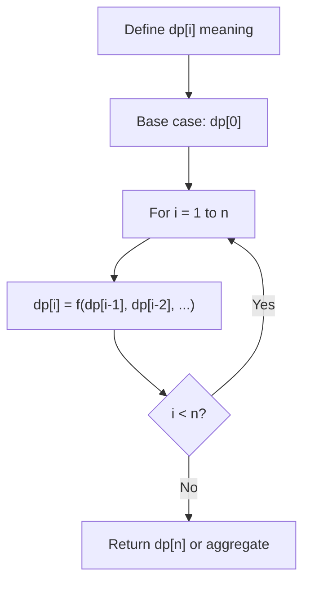
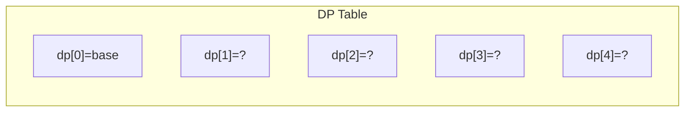
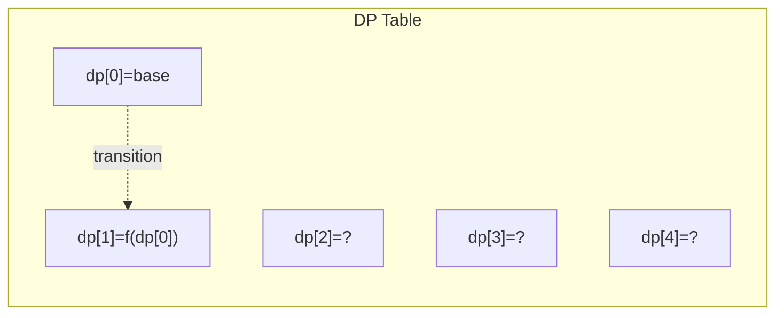
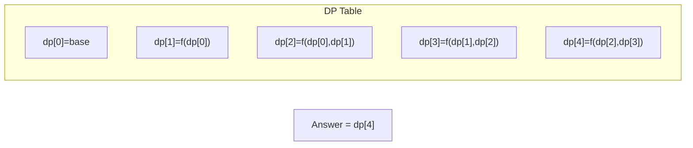

# Problem 956: Tallest Billboard

**Difficulty:** Hard  
**Tags:** Array, Dynamic Programming  
**Pattern:** Dynamic Programming (1D)  
**Link:** [leetcode.com/problems/tallest-billboard](https://leetcode.com/problems/tallest-billboard/)

## Description

You are installing a billboard and want it to have the largest height. The billboard will have two steel supports, one on each side. Each steel support must be an equal height.

You are given a collection of `rods` that can be welded together. For example, if you have rods of lengths `1`, `2`, and `3`, you can weld them together to make a support of length `6`.

Return *the largest possible height of your billboard installation*. If you cannot support the billboard, return `0`.

 

Example 1:

```

**Input:** rods = [1,2,3,6]
**Output:** 6
**Explanation:** We have two disjoint subsets {1,2,3} and {6}, which have the same sum = 6.

```

Example 2:

```

**Input:** rods = [1,2,3,4,5,6]
**Output:** 10
**Explanation:** We have two disjoint subsets {2,3,5} and {4,6}, which have the same sum = 10.

```

Example 3:

```

**Input:** rods = [1,2]
**Output:** 0
**Explanation:** The billboard cannot be supported, so we return 0.

```

 

**Constraints:**

	- `1 <= rods.length <= 20`
	- `1 <= rods[i] <= 1000`
	- `sum(rods[i]) <= 5000`

## Approach: Dynamic Programming (1D)

Break the problem into overlapping subproblems. Define dp[i] as the optimal value for the subproblem ending at or considering index i. Build the solution bottom-up, using previously computed dp values.

## Pseudocode

```
1. Define dp[i] = optimal value for subproblem i
2. Base case: dp[0] = initial value
3. For i from 1 to n:
   a. dp[i] = recurrence(dp[i-1], dp[i-2], ...)
4. Return dp[n] or max/min of dp
```

## Algorithm Flow



## Visual State Transitions

**1D Dynamic Programming Table Build:**

**Frame 1: Initialize base cases**


**Frame 2: Fill dp[1] from dp[0]**


**Frame 3: Fill remaining cells**



## Complexity Analysis

- **Time:** O(n)
- **Space:** O(n)

## Solution (Python3)

```python
class Solution:
    def tallestBillboard(self, rods: List[int]) -> int:
        # Dynamic programming (1D) - O(n) time, O(n) space
        if not rods:
            return 0
        n = len(rods) if isinstance(rods, list) else rods
        dp = [0] * (n + 1)
        dp[0] = 1  # base case
        for i in range(1, n + 1):
            dp[i] = dp[i-1]  # transition (customize per problem)
            if i >= 2:
                dp[i] += dp[i-2]
        return dp[n]
```

## Solution (C++)

```cpp
#include <string>
#include <vector>
using namespace std;

class Solution {
public:
    int tallestBillboard(vector<int>& rods) {
        // Dynamic programming (1D) - O(n) time, O(n) space
        int n = rods;
        if (n <= 0) return 0;
        vector<int> dp(n + 1, 0);
        dp[0] = 1;
        for (int i = 1; i <= n; i++) {
            dp[i] = dp[i-1];
            if (i >= 2) dp[i] += dp[i-2];
        }
        return dp[n];
    }
};
```
