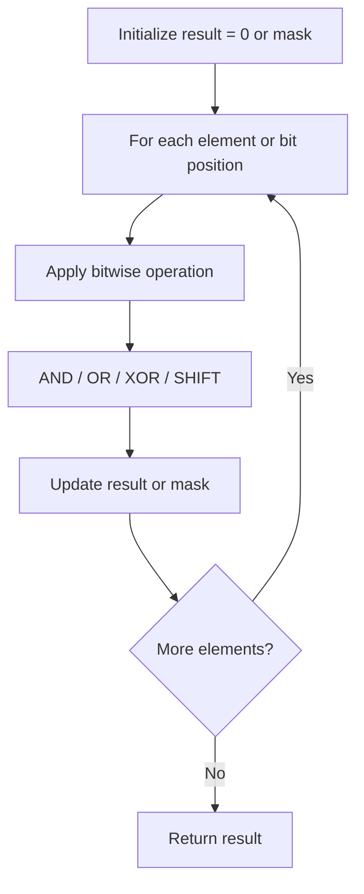

# Problem 957: Prison Cells After N Days

**Difficulty:** Medium  
**Tags:** Array, Hash Table, Math, Bit Manipulation  
**Pattern:** Bit Manipulation  
**Link:** [leetcode.com/problems/prison-cells-after-n-days](https://leetcode.com/problems/prison-cells-after-n-days/)

## Description

There are `8` prison cells in a row and each cell is either occupied or vacant.

Each day, whether the cell is occupied or vacant changes according to the following rules:

	- If a cell has two adjacent neighbors that are both occupied or both vacant, then the cell becomes occupied.
	- Otherwise, it becomes vacant.

**Note** that because the prison is a row, the first and the last cells in the row can't have two adjacent neighbors.

You are given an integer array `cells` where `cells[i] == 1` if the `i^th` cell is occupied and `cells[i] == 0` if the `i^th` cell is vacant, and you are given an integer `n`.

Return the state of the prison after `n` days (i.e., `n` such changes described above).

 

Example 1:

```

**Input:** cells = [0,1,0,1,1,0,0,1], n = 7
**Output:** [0,0,1,1,0,0,0,0]
**Explanation:** The following table summarizes the state of the prison on each day:
Day 0: [0, 1, 0, 1, 1, 0, 0, 1]
Day 1: [0, 1, 1, 0, 0, 0, 0, 0]
Day 2: [0, 0, 0, 0, 1, 1, 1, 0]
Day 3: [0, 1, 1, 0, 0, 1, 0, 0]
Day 4: [0, 0, 0, 0, 0, 1, 0, 0]
Day 5: [0, 1, 1, 1, 0, 1, 0, 0]
Day 6: [0, 0, 1, 0, 1, 1, 0, 0]
Day 7: [0, 0, 1, 1, 0, 0, 0, 0]

```

Example 2:

```

**Input:** cells = [1,0,0,1,0,0,1,0], n = 1000000000
**Output:** [0,0,1,1,1,1,1,0]

```

 

**Constraints:**

	- `cells.length == 8`
	- `cells[i]` is either `0` or `1`.
	- `1 <= n <= 10^9`

## Approach: Bit Manipulation

Operate on individual bits using bitwise operators (AND, OR, XOR, shift). Common tricks: x & (x-1) removes lowest set bit, x ^ x = 0, XOR all elements to find unique.

## Pseudocode

```
1. Apply bitwise operations:
   - XOR all elements to cancel paired bits
   - Use bitmask to track state
   - Shift and mask to extract/set individual bits
2. Return result
```

## Algorithm Flow



## Complexity Analysis

- **Time:** O(n) or O(log n)
- **Space:** O(1)

## Solution (Python3)

```python
class Solution:
    def prisonAfterNDays(self, cells: List[int], n: int) -> List[int]:
        # Bit manipulation - O(n) time, O(1) space
        result = 0
        for val in cells:
            result ^= val
        return result
```

## Solution (C++)

```cpp
#include <string>
#include <vector>
using namespace std;

class Solution {
public:
    vector<int> prisonAfterNDays(vector<int>& cells, int n) {
        // Bit manipulation - O(n) time, O(1) space
        int result = 0;
        for (int val : cells) {
            result ^= val;
        }
        return result;
    }
};
```
