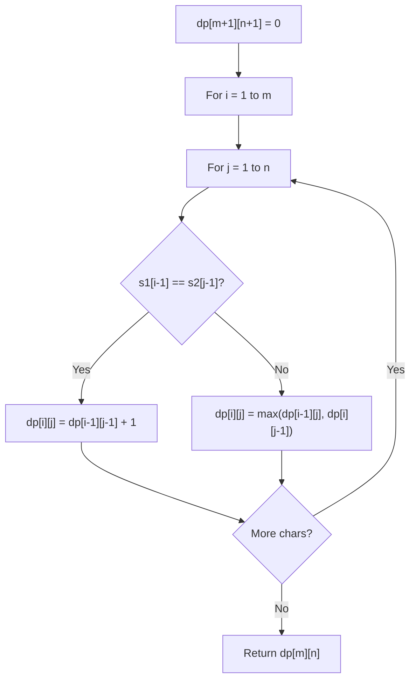

# Problem 960: Delete Columns to Make Sorted III

**Difficulty:** Hard  
**Tags:** Array, String, Dynamic Programming  
**Pattern:** Dynamic Programming (String)  
**Link:** [leetcode.com/problems/delete-columns-to-make-sorted-iii](https://leetcode.com/problems/delete-columns-to-make-sorted-iii/)

## Description

You are given an array of `n` strings `strs`, all of the same length.

We may choose any deletion indices, and we delete all the characters in those indices for each string.

For example, if we have `strs = ["abcdef","uvwxyz"]` and deletion indices `{0, 2, 3}`, then the final array after deletions is `["bef", "vyz"]`.

Suppose we chose a set of deletion indices `answer` such that after deletions, the final array has **every string (row) in lexicographic** order. (i.e., `(strs[0][0] <= strs[0][1] <= ... <= strs[0][strs[0].length - 1])`, and `(strs[1][0] <= strs[1][1] <= ... <= strs[1][strs[1].length - 1])`, and so on). Return *the minimum possible value of* `answer.length`.

 

Example 1:

```

**Input:** strs = ["babca","bbazb"]
**Output:** 3
**Explanation:** After deleting columns 0, 1, and 4, the final array is strs = ["bc", "az"].
Both these rows are individually in lexicographic order (ie. strs[0][0] <= strs[0][1] and strs[1][0] <= strs[1][1]).
Note that strs[0] > strs[1] - the array strs is not necessarily in lexicographic order.
```

Example 2:

```

**Input:** strs = ["edcba"]
**Output:** 4
**Explanation:** If we delete less than 4 columns, the only row will not be lexicographically sorted.

```

Example 3:

```

**Input:** strs = ["ghi","def","abc"]
**Output:** 0
**Explanation:** All rows are already lexicographically sorted.

```

 

**Constraints:**

	- `n == strs.length`
	- `1 <= n <= 100`
	- `1 <= strs[i].length <= 100`
	- `strs[i]` consists of lowercase English letters.

	-

## Approach: Dynamic Programming (String)

Compare or match two strings using a 2D DP table. dp[i][j] represents the answer for substrings s1[0..i-1] and s2[0..j-1]. Common patterns: LCS, edit distance, regex matching.

## Pseudocode

```
1. Create dp[m+1][n+1]
2. Initialize base cases
3. For i from 1 to m:
   For j from 1 to n:
     If s1[i-1] == s2[j-1]: dp[i][j] = dp[i-1][j-1] + 1
     Else: dp[i][j] = best of (dp[i-1][j], dp[i][j-1], dp[i-1][j-1])
4. Return dp[m][n]
```

## Algorithm Flow



## Complexity Analysis

- **Time:** O(m * n)
- **Space:** O(m * n)

## Solution (Python3)

```python
class Solution:
    def minDeletionSize(self, strs: List[str]) -> int:
        # String DP - O(m*n) time and space
        m, n = len(strs), len(strs)
        dp = [[0] * (n + 1) for _ in range(m + 1)]
        for i in range(1, m + 1):
            for j in range(1, n + 1):
                if strs[i-1] == strs[j-1]:
                    dp[i][j] = dp[i-1][j-1] + 1
                else:
                    dp[i][j] = max(dp[i-1][j], dp[i][j-1])
        return dp[m][n]
```

## Solution (C++)

```cpp
#include <algorithm>
#include <string>
#include <vector>
using namespace std;

class Solution {
public:
    int minDeletionSize(vector<string>& strs) {
        // String DP - O(m*n) time and space
        int m = strs.size(), n = strs.size();
        vector<vector<int>> dp(m + 1, vector<int>(n + 1, 0));
        for (int i = 1; i <= m; i++) {
            for (int j = 1; j <= n; j++) {
                if (strs[i-1] == strs[j-1])
                    dp[i][j] = dp[i-1][j-1] + 1;
                else
                    dp[i][j] = max(dp[i-1][j], dp[i][j-1]);
            }
        }
        return dp[m][n];
    }
};
```
