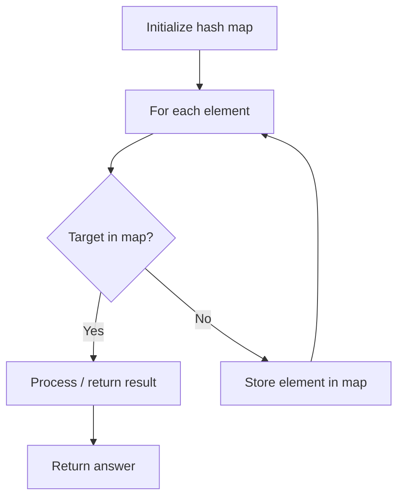

# Problem 961: N-Repeated Element in Size 2N Array

**Difficulty:** Easy  
**Tags:** Array, Hash Table  
**Pattern:** Hash Map Lookup  
**Link:** [leetcode.com/problems/n-repeated-element-in-size-2n-array](https://leetcode.com/problems/n-repeated-element-in-size-2n-array/)

## Description

You are given an integer array `nums` with the following properties:

	- `nums.length == 2 * n`.
	- `nums` contains `n + 1` **unique** values, `n` of which occur **exactly once** in the array.
	- Exactly one element of `nums` is repeated `n` times.

Return *the element that is repeated *`n`* times*.

 

Example 1:

```
**Input:** nums = [1,2,3,3]
**Output:** 3

```
Example 2:

```
**Input:** nums = [2,1,2,5,3,2]
**Output:** 2

```
Example 3:

```
**Input:** nums = [5,1,5,2,5,3,5,4]
**Output:** 5

```

 

**Constraints:**

	- `2 <= n <= 5000`
	- `nums.length == 2 * n`
	- `0 <= nums[i] <= 10^4`
	- `nums` contains `n + 1` **unique** elements and one of them is repeated exactly `n` times.

## Approach: Hash Map Lookup

Use a hash map (dictionary) to store elements for O(1) lookup. Iterate through the input, checking membership or counting frequencies in the map.

## Pseudocode

```
1. Initialize hash map
2. Iterate through elements:
   a. Check if target/complement exists in map
   b. If found: process result
   c. Otherwise: store element in map
3. Return result
```

## Algorithm Flow



## Complexity Analysis

- **Time:** O(n)
- **Space:** O(n)

## Solution (Python3)

```python
class Solution:
    def repeatedNTimes(self, nums: List[int]) -> int:
        # Hash map approach - O(n) time, O(n) space
        seen = {}
        for i, val in enumerate(nums):
            complement = nums - val
            if complement in seen:
                return [seen[complement], i]
            seen[val] = i
        return 0
```

## Solution (C++)

```cpp
#include <string>
#include <unordered_map>
#include <vector>
using namespace std;

class Solution {
public:
    int repeatedNTimes(vector<int>& nums) {
        // Hash map approach - O(n) time, O(n) space
        unordered_map<int, int> seen;
        for (int i = 0; i < nums.size(); i++) {
            int complement = nums - nums[i];
            if (seen.count(complement)) {
                return {seen[complement], i};
            }
            seen[nums[i]] = i;
        }
        return 0;
    }
};
```
