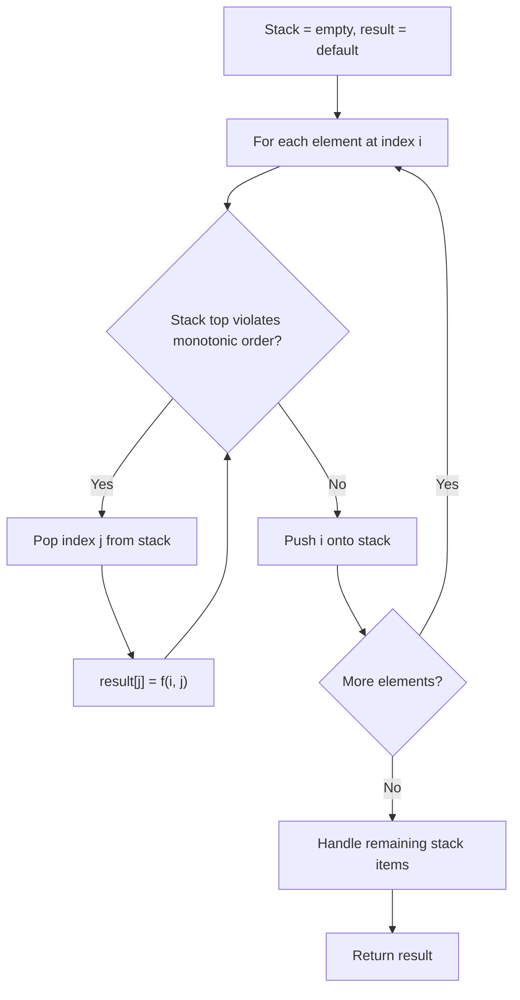
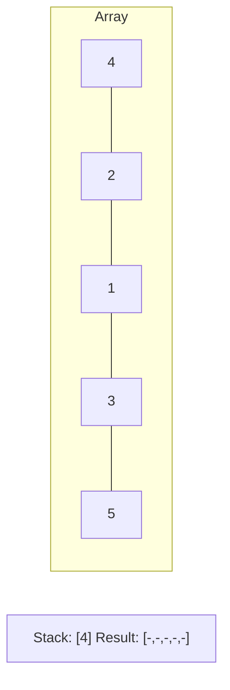
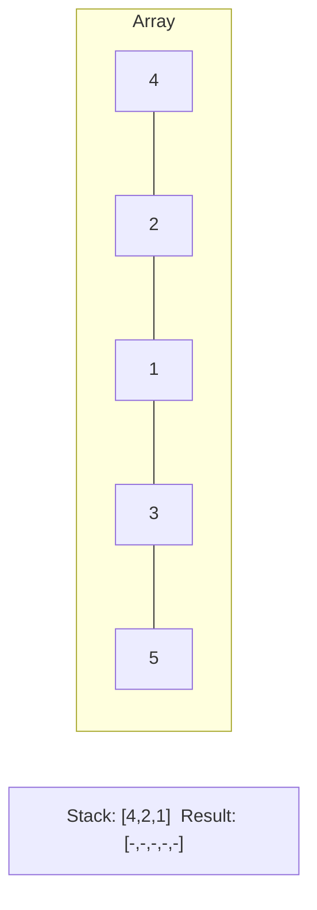
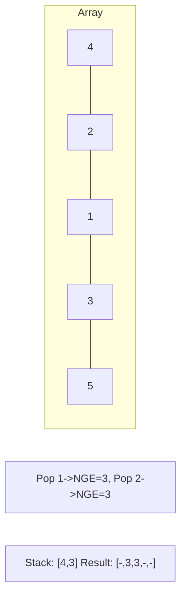
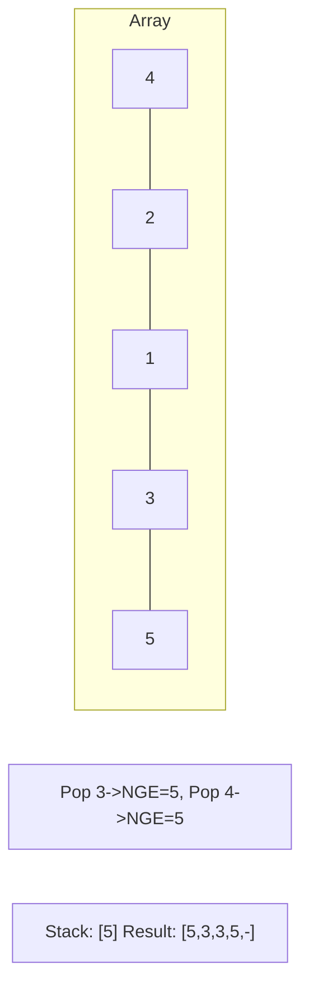

# Problem 962: Maximum Width Ramp

**Difficulty:** Medium  
**Tags:** Array, Two Pointers, Stack, Monotonic Stack  
**Pattern:** Monotonic Stack  
**Link:** [leetcode.com/problems/maximum-width-ramp](https://leetcode.com/problems/maximum-width-ramp/)

## Description

A **ramp** in an integer array `nums` is a pair `(i, j)` for which `i < j` and `nums[i] <= nums[j]`. The **width** of such a ramp is `j - i`.

Given an integer array `nums`, return *the maximum width of a **ramp** in *`nums`. If there is no **ramp** in `nums`, return `0`.

 

Example 1:

```

**Input:** nums = [6,0,8,2,1,5]
**Output:** 4
**Explanation:** The maximum width ramp is achieved at (i, j) = (1, 5): nums[1] = 0 and nums[5] = 5.

```

Example 2:

```

**Input:** nums = [9,8,1,0,1,9,4,0,4,1]
**Output:** 7
**Explanation:** The maximum width ramp is achieved at (i, j) = (2, 9): nums[2] = 1 and nums[9] = 1.

```

 

**Constraints:**

	- `2 <= nums.length <= 5 * 10^4`
	- `0 <= nums[i] <= 5 * 10^4`

## Approach: Monotonic Stack

Maintain a stack where elements are always in monotonic order (increasing or decreasing). When a new element violates the monotonic property, pop elements and compute results (e.g., next greater/smaller element, spans, areas).

## Pseudocode

```
1. Initialize empty stack, result array
2. For each element (index i):
   a. While stack not empty and arr[i] breaks monotonic order:
      - Pop index j from stack
      - result[j] = compute(i, j)
   b. Push i onto stack
3. Handle remaining elements in stack
4. Return result
```

## Algorithm Flow



## Visual State Transitions

**Monotonic Stack (Next Greater Element):**

**Frame 1: Process first elements**


**Frame 2: Push smaller elements**


**Frame 3: Element 3 pops 1 and 2**


**Frame 4: Element 5 pops all**



## Complexity Analysis

- **Time:** O(n)
- **Space:** O(n)

## Solution (Python3)

```python
class Solution:
    def maxWidthRamp(self, nums: List[int]) -> int:
        # Monotonic stack - O(n) time, O(n) space
        n = len(nums)
        result = [0] * n
        stack = []  # indices
        for i in range(n):
            while stack and nums[i] > nums[stack[-1]]:
                idx = stack.pop()
                result[idx] = i - idx
            stack.append(i)
        return result
```

## Solution (C++)

```cpp
#include <stack>
#include <string>
#include <vector>
using namespace std;

class Solution {
public:
    int maxWidthRamp(vector<int>& nums) {
        // Monotonic stack - O(n) time, O(n) space
        int n = nums.size();
        vector<int> result(n, 0);
        stack<int> st;
        for (int i = 0; i < n; i++) {
            while (!st.empty() && nums[i] > nums[st.top()]) {
                int idx = st.top(); st.pop();
                result[idx] = i - idx;
            }
            st.push(i);
        }
        return result;
    }
};
```
