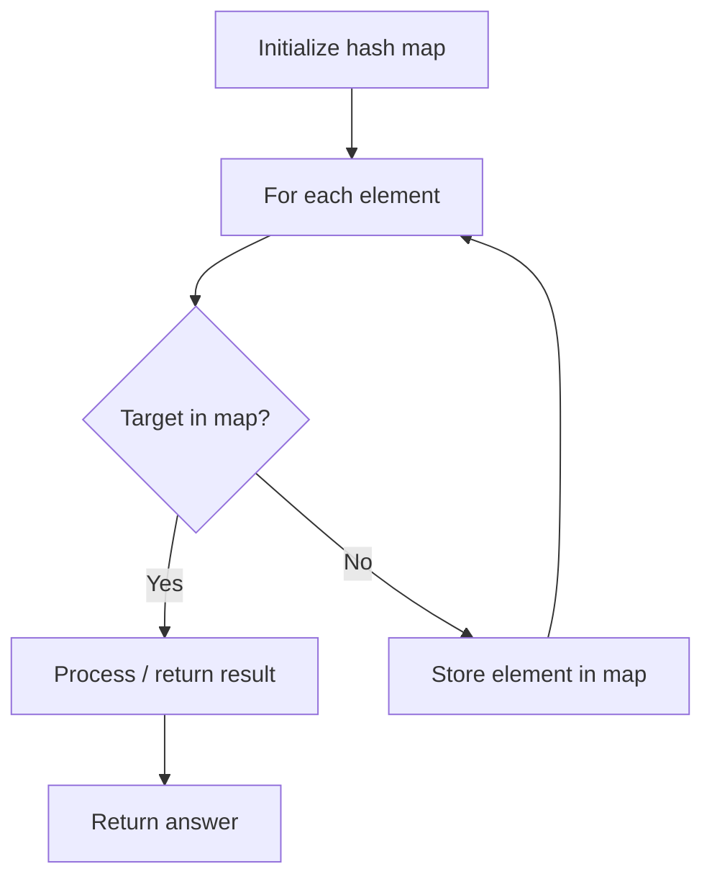

# Problem 963: Minimum Area Rectangle II

**Difficulty:** Medium  
**Tags:** Array, Hash Table, Math, Geometry  
**Pattern:** Hash Map Lookup  
**Link:** [leetcode.com/problems/minimum-area-rectangle-ii](https://leetcode.com/problems/minimum-area-rectangle-ii/)

## Description

You are given an array of points in the **X-Y** plane `points` where `points[i] = [xi, yi]`.

Return *the minimum area of any rectangle formed from these points, with sides **not necessarily parallel** to the X and Y axes*. If there is not any such rectangle, return `0`.

Answers within `10^-5` of the actual answer will be accepted.

 

Example 1:

```

**Input:** points = [[1,2],[2,1],[1,0],[0,1]]
**Output:** 2.00000
**Explanation:** The minimum area rectangle occurs at [1,2],[2,1],[1,0],[0,1], with an area of 2.

```

Example 2:

```

**Input:** points = [[0,1],[2,1],[1,1],[1,0],[2,0]]
**Output:** 1.00000
**Explanation:** The minimum area rectangle occurs at [1,0],[1,1],[2,1],[2,0], with an area of 1.

```

Example 3:

```

**Input:** points = [[0,3],[1,2],[3,1],[1,3],[2,1]]
**Output:** 0
**Explanation:** There is no possible rectangle to form from these points.

```

 

**Constraints:**

	- `1 <= points.length <= 50`
	- `points[i].length == 2`
	- `0 <= xi, yi <= 4 * 10^4`
	- All the given points are **unique**.

## Approach: Hash Map Lookup

Use a hash map (dictionary) to store elements for O(1) lookup. Iterate through the input, checking membership or counting frequencies in the map.

## Pseudocode

```
1. Initialize hash map
2. Iterate through elements:
   a. Check if target/complement exists in map
   b. If found: process result
   c. Otherwise: store element in map
3. Return result
```

## Algorithm Flow



## Complexity Analysis

- **Time:** O(n)
- **Space:** O(n)

## Solution (Python3)

```python
class Solution:
    def minAreaFreeRect(self, points: List[List[int]]) -> float:
        # Hash map approach - O(n) time, O(n) space
        seen = {}
        for i, val in enumerate(points):
            complement = points - val
            if complement in seen:
                return [seen[complement], i]
            seen[val] = i
        return 0.0
```

## Solution (C++)

```cpp
#include <string>
#include <unordered_map>
#include <vector>
using namespace std;

class Solution {
public:
    double minAreaFreeRect(vector<vector<int>>& points) {
        // Hash map approach - O(n) time, O(n) space
        unordered_map<int, int> seen;
        for (int i = 0; i < points.size(); i++) {
            int complement = points - points[i];
            if (seen.count(complement)) {
                return {seen[complement], i};
            }
            seen[points[i]] = i;
        }
        return 0.0;
    }
};
```
