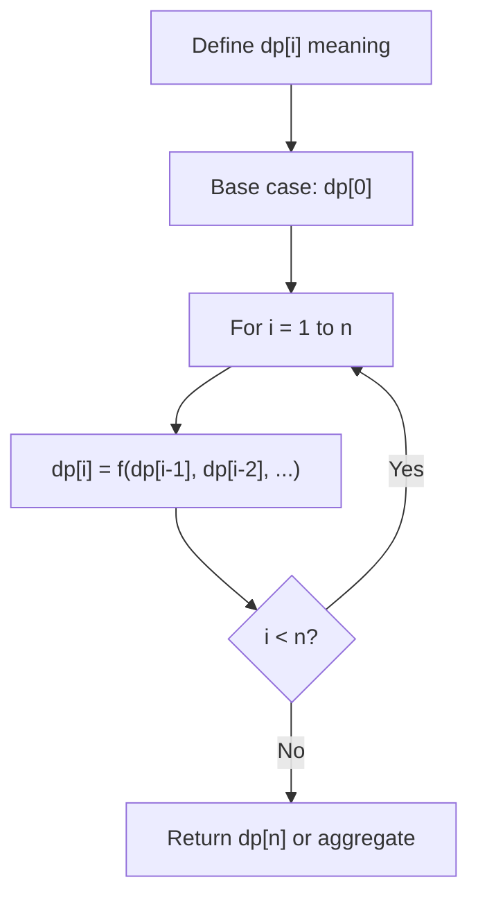
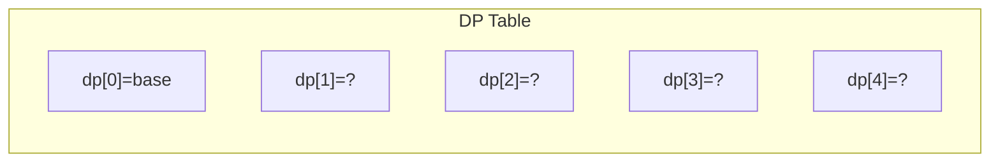
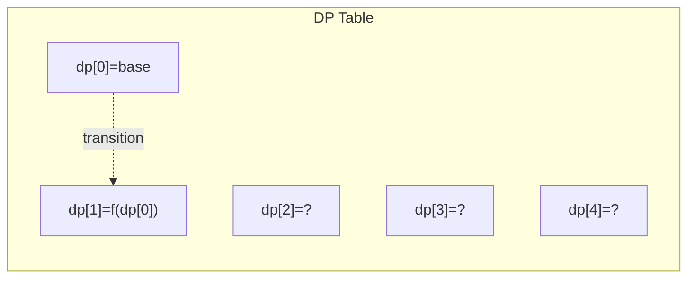
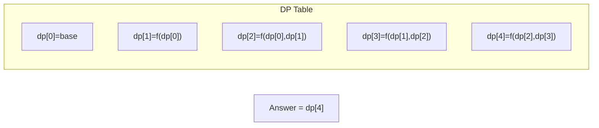

# Problem 964: Least Operators to Express Number

**Difficulty:** Hard  
**Tags:** Math, Dynamic Programming, Memoization  
**Pattern:** Dynamic Programming (1D)  
**Link:** [leetcode.com/problems/least-operators-to-express-number](https://leetcode.com/problems/least-operators-to-express-number/)

## Description

Given a single positive integer `x`, we will write an expression of the form `x (op1) x (op2) x (op3) x ...` where each operator `op1`, `op2`, etc. is either addition, subtraction, multiplication, or division (`+`, `-`, `*`, or `/)`. For example, with `x = 3`, we might write `3 * 3 / 3 + 3 - 3` which is a value of 3.

When writing such an expression, we adhere to the following conventions:

	- The division operator (`/`) returns rational numbers.
	- There are no parentheses placed anywhere.
	- We use the usual order of operations: multiplication and division happen before addition and subtraction.
	- It is not allowed to use the unary negation operator (`-`). For example, "`x - x`" is a valid expression as it only uses subtraction, but "`-x + x`" is not because it uses negation.

We would like to write an expression with the least number of operators such that the expression equals the given `target`. Return the least number of operators used.

 

Example 1:

```

**Input:** x = 3, target = 19
**Output:** 5
**Explanation:** 3 * 3 + 3 * 3 + 3 / 3.
The expression contains 5 operations.

```

Example 2:

```

**Input:** x = 5, target = 501
**Output:** 8
**Explanation:** 5 * 5 * 5 * 5 - 5 * 5 * 5 + 5 / 5.
The expression contains 8 operations.

```

Example 3:

```

**Input:** x = 100, target = 100000000
**Output:** 3
**Explanation:** 100 * 100 * 100 * 100.
The expression contains 3 operations.

```

 

**Constraints:**

	- `2 <= x <= 100`
	- `1 <= target <= 2 * 10^8`

## Approach: Dynamic Programming (1D)

Break the problem into overlapping subproblems. Define dp[i] as the optimal value for the subproblem ending at or considering index i. Build the solution bottom-up, using previously computed dp values.

## Pseudocode

```
1. Define dp[i] = optimal value for subproblem i
2. Base case: dp[0] = initial value
3. For i from 1 to n:
   a. dp[i] = recurrence(dp[i-1], dp[i-2], ...)
4. Return dp[n] or max/min of dp
```

## Algorithm Flow



## Visual State Transitions

**1D Dynamic Programming Table Build:**

**Frame 1: Initialize base cases**


**Frame 2: Fill dp[1] from dp[0]**


**Frame 3: Fill remaining cells**



## Complexity Analysis

- **Time:** O(n)
- **Space:** O(n)

## Solution (Python3)

```python
class Solution:
    def leastOpsExpressTarget(self, x: int, target: int) -> int:
        # Dynamic programming (1D) - O(n) time, O(n) space
        if not x:
            return 0
        n = len(x) if isinstance(x, list) else x
        dp = [0] * (n + 1)
        dp[0] = 1  # base case
        for i in range(1, n + 1):
            dp[i] = dp[i-1]  # transition (customize per problem)
            if i >= 2:
                dp[i] += dp[i-2]
        return dp[n]
```

## Solution (C++)

```cpp
#include <string>
#include <vector>
using namespace std;

class Solution {
public:
    int leastOpsExpressTarget(int x, int target) {
        // Dynamic programming (1D) - O(n) time, O(n) space
        int n = x;
        if (n <= 0) return 0;
        vector<int> dp(n + 1, 0);
        dp[0] = 1;
        for (int i = 1; i <= n; i++) {
            dp[i] = dp[i-1];
            if (i >= 2) dp[i] += dp[i-2];
        }
        return dp[n];
    }
};
```
