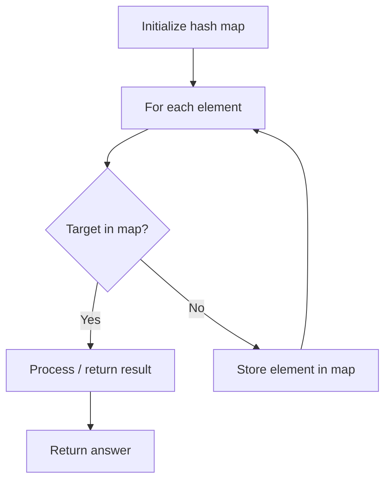

# Problem 966: Vowel Spellchecker

**Difficulty:** Medium  
**Tags:** Array, Hash Table, String  
**Pattern:** Hash Map Lookup  
**Link:** [leetcode.com/problems/vowel-spellchecker](https://leetcode.com/problems/vowel-spellchecker/)

## Description

Given a `wordlist`, we want to implement a spellchecker that converts a query word into a correct word.

For a given `query` word, the spell checker handles two categories of spelling mistakes:

	- Capitalization: If the query matches a word in the wordlist (**case-insensitive**), then the query word is returned with the same case as the case in the wordlist.

	
		Example: `wordlist = ["yellow"]`, `query = "YellOw"`: `correct = "yellow"`
		- Example: `wordlist = ["Yellow"]`, `query = "yellow"`: `correct = "Yellow"`
		- Example: `wordlist = ["yellow"]`, `query = "yellow"`: `correct = "yellow"`
	
	
	- Vowel Errors: If after replacing the vowels `('a', 'e', 'i', 'o', 'u')` of the query word with any vowel individually, it matches a word in the wordlist (**case-insensitive**), then the query word is returned with the same case as the match in the wordlist.
	
		Example: `wordlist = ["YellOw"]`, `query = "yollow"`: `correct = "YellOw"`
		- Example: `wordlist = ["YellOw"]`, `query = "yeellow"`: `correct = ""` (no match)
		- Example: `wordlist = ["YellOw"]`, `query = "yllw"`: `correct = ""` (no match)
	
	

In addition, the spell checker operates under the following precedence rules:

	- When the query exactly matches a word in the wordlist (**case-sensitive**), you should return the same word back.
	- When the query matches a word up to capitalization, you should return the first such match in the wordlist.
	- When the query matches a word up to vowel errors, you should return the first such match in the wordlist.
	- If the query has no matches in the wordlist, you should return the empty string.

Given some `queries`, return a list of words `answer`, where `answer[i]` is the correct word for `query = queries[i]`.

 

Example 1:

```
**Input:** wordlist = ["KiTe","kite","hare","Hare"], queries = ["kite","Kite","KiTe","Hare","HARE","Hear","hear","keti","keet","keto"]
**Output:** ["kite","KiTe","KiTe","Hare","hare","","","KiTe","","KiTe"]

```
Example 2:

```
**Input:** wordlist = ["yellow"], queries = ["YellOw"]
**Output:** ["yellow"]

```

 

**Constraints:**

	- `1 <= wordlist.length, queries.length <= 5000`
	- `1 <= wordlist[i].length, queries[i].length <= 7`
	- `wordlist[i]` and `queries[i]` consist only of only English letters.

## Approach: Hash Map Lookup

Use a hash map (dictionary) to store elements for O(1) lookup. Iterate through the input, checking membership or counting frequencies in the map.

## Pseudocode

```
1. Initialize hash map
2. Iterate through elements:
   a. Check if target/complement exists in map
   b. If found: process result
   c. Otherwise: store element in map
3. Return result
```

## Algorithm Flow



## Complexity Analysis

- **Time:** O(n)
- **Space:** O(n)

## Solution (Python3)

```python
class Solution:
    def spellchecker(self, wordlist: List[str], queries: List[str]) -> List[str]:
        # Hash map approach - O(n) time, O(n) space
        seen = {}
        for i, val in enumerate(wordlist):
            complement = queries - val
            if complement in seen:
                return [seen[complement], i]
            seen[val] = i
        return []
```

## Solution (C++)

```cpp
#include <string>
#include <unordered_map>
#include <vector>
using namespace std;

class Solution {
public:
    vector<string> spellchecker(vector<string>& wordlist, vector<string>& queries) {
        // Hash map approach - O(n) time, O(n) space
        unordered_map<int, int> seen;
        for (int i = 0; i < wordlist.size(); i++) {
            int complement = queries - wordlist[i];
            if (seen.count(complement)) {
                return {seen[complement], i};
            }
            seen[wordlist[i]] = i;
        }
        return {};
    }
};
```
