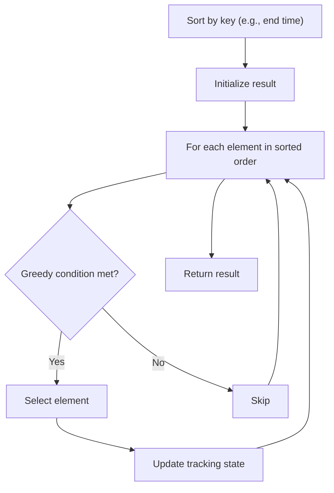

# Problem 969: Pancake Sorting

**Difficulty:** Medium  
**Tags:** Array, Two Pointers, Greedy, Sorting  
**Pattern:** Greedy with Sorting  
**Link:** [leetcode.com/problems/pancake-sorting](https://leetcode.com/problems/pancake-sorting/)

## Description

Given an array of integers `arr`, sort the array by performing a series of **pancake flips**.

In one pancake flip we do the following steps:

	- Choose an integer `k` where `1 <= k <= arr.length`.
	- Reverse the sub-array `arr[0...k-1]` (**0-indexed**).

For example, if `arr = [3,2,1,4]` and we performed a pancake flip choosing `k = 3`, we reverse the sub-array `[3,2,1]`, so `arr = [1,2,3,4]` after the pancake flip at `k = 3`.

Return *an array of the *`k`*-values corresponding to a sequence of pancake flips that sort *`arr`. Any valid answer that sorts the array within `10 * arr.length` flips will be judged as correct.

 

Example 1:

```

**Input:** arr = [3,2,4,1]
**Output:** [4,2,4,3]
**Explanation: **
We perform 4 pancake flips, with k values 4, 2, 4, and 3.
Starting state: arr = [3, 2, 4, 1]
After 1st flip (k = 4): arr = [1, 4, 2, 3]
After 2nd flip (k = 2): arr = [4, 1, 2, 3]
After 3rd flip (k = 4): arr = [3, 2, 1, 4]
After 4th flip (k = 3): arr = [1, 2, 3, 4], which is sorted.

```

Example 2:

```

**Input:** arr = [1,2,3]
**Output:** []
**Explanation: **The input is already sorted, so there is no need to flip anything.
Note that other answers, such as [3, 3], would also be accepted.

```

 

**Constraints:**

	- `1 <= arr.length <= 100`
	- `1 <= arr[i] <= arr.length`
	- All integers in `arr` are unique (i.e. `arr` is a permutation of the integers from `1` to `arr.length`).

## Approach: Greedy with Sorting

Sort the input by a key criterion, then greedily process elements in sorted order. The sorting ensures the greedy choice is always optimal.

## Pseudocode

```
1. Sort elements by key (start time, weight, etc.)
2. Initialize result, tracking variables
3. For each element in sorted order:
   a. Apply greedy selection rule
   b. Update result
4. Return result
```

## Algorithm Flow



## Complexity Analysis

- **Time:** O(n log n)
- **Space:** O(n)

## Solution (Python3)

```python
class Solution:
    def pancakeSort(self, arr: List[int]) -> List[int]:
        # Sort + greedy - O(n log n) time
        arr.sort()
        result = 0
        curr_end = 0
        for item in arr:
            if isinstance(item, (list, tuple)):
                if item[0] >= curr_end:
                    result += 1
                    curr_end = item[1]
            else:
                result += 1
        return result
```

## Solution (C++)

```cpp
#include <algorithm>
#include <string>
#include <vector>
using namespace std;

class Solution {
public:
    vector<int> pancakeSort(vector<int>& arr) {
        // Sort + greedy - O(n log n) time
        sort(arr.begin(), arr.end());
        int result = 0, curr_end = 0;
        for (auto& item : arr) {
            result++;
        }
        return result;
    }
};
```
