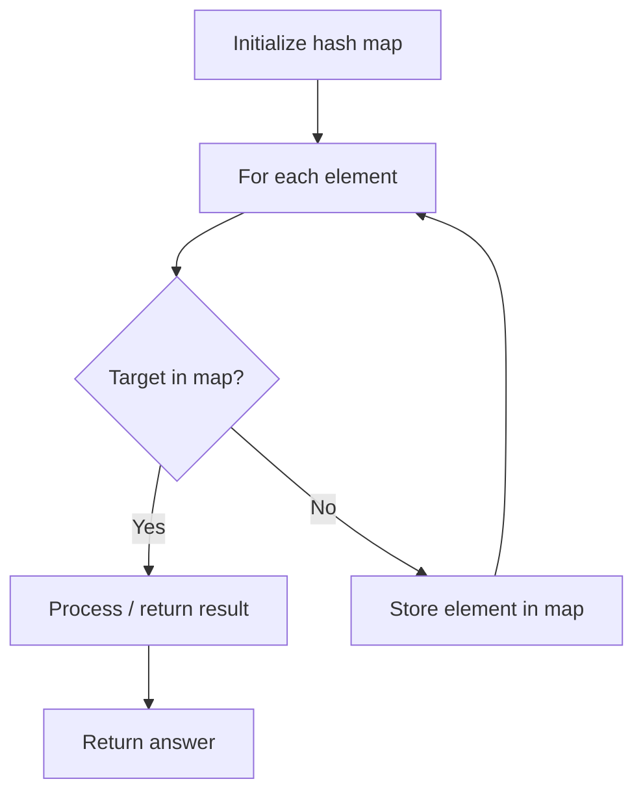

# Problem 970: Powerful Integers

**Difficulty:** Medium  
**Tags:** Hash Table, Math, Enumeration  
**Pattern:** Hash Map Lookup  
**Link:** [leetcode.com/problems/powerful-integers](https://leetcode.com/problems/powerful-integers/)

## Description

Given three integers `x`, `y`, and `bound`, return *a list of all the **powerful integers** that have a value less than or equal to* `bound`.

An integer is **powerful** if it can be represented as `x^i + y^j` for some integers `i >= 0` and `j >= 0`.

You may return the answer in **any order**. In your answer, each value should occur **at most once**.

 

Example 1:

```

**Input:** x = 2, y = 3, bound = 10
**Output:** [2,3,4,5,7,9,10]
**Explanation:**
2 = 20 + 30
3 = 21 + 30
4 = 20 + 31
5 = 21 + 31
7 = 22 + 31
9 = 23 + 30
10 = 20 + 32

```

Example 2:

```

**Input:** x = 3, y = 5, bound = 15
**Output:** [2,4,6,8,10,14]

```

 

**Constraints:**

	- `1 <= x, y <= 100`
	- `0 <= bound <= 10^6`

## Approach: Hash Map Lookup

Use a hash map (dictionary) to store elements for O(1) lookup. Iterate through the input, checking membership or counting frequencies in the map.

## Pseudocode

```
1. Initialize hash map
2. Iterate through elements:
   a. Check if target/complement exists in map
   b. If found: process result
   c. Otherwise: store element in map
3. Return result
```

## Algorithm Flow



## Complexity Analysis

- **Time:** O(n)
- **Space:** O(n)

## Solution (Python3)

```python
class Solution:
    def powerfulIntegers(self, x: int, y: int, bound: int) -> List[int]:
        # Hash map approach - O(n) time, O(n) space
        seen = {}
        for i, val in enumerate(x):
            complement = y - val
            if complement in seen:
                return [seen[complement], i]
            seen[val] = i
        return []
```

## Solution (C++)

```cpp
#include <string>
#include <unordered_map>
#include <vector>
using namespace std;

class Solution {
public:
    vector<int> powerfulIntegers(int x, int y, int bound) {
        // Hash map approach - O(n) time, O(n) space
        unordered_map<int, int> seen;
        for (int i = 0; i < x.size(); i++) {
            int complement = y - x[i];
            if (seen.count(complement)) {
                return {seen[complement], i};
            }
            seen[x[i]] = i;
        }
        return {};
    }
};
```
