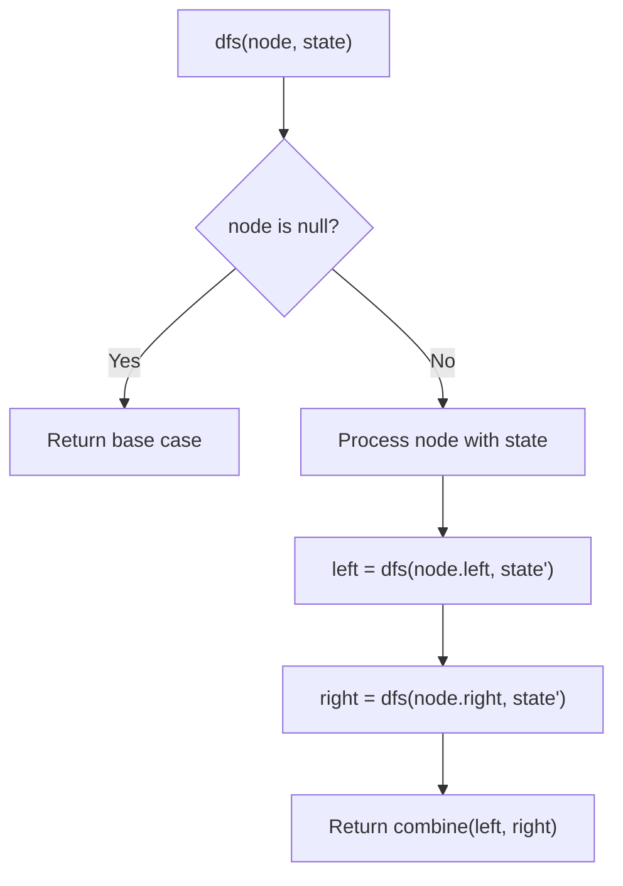
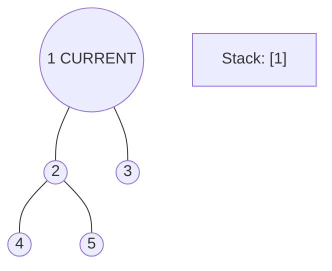
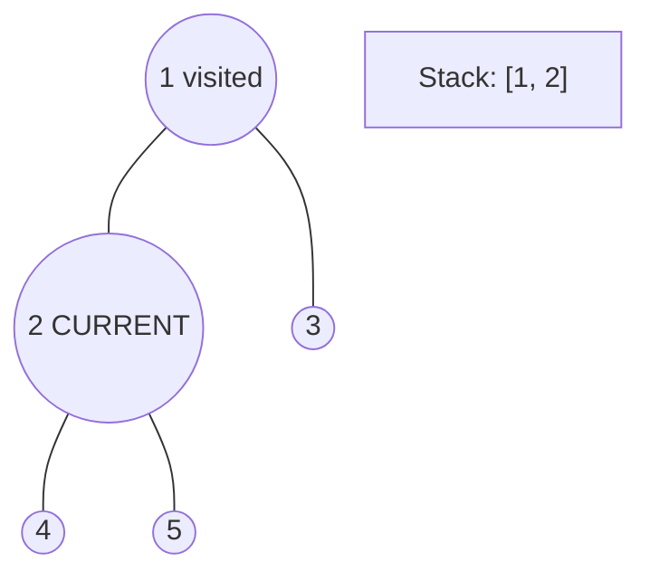
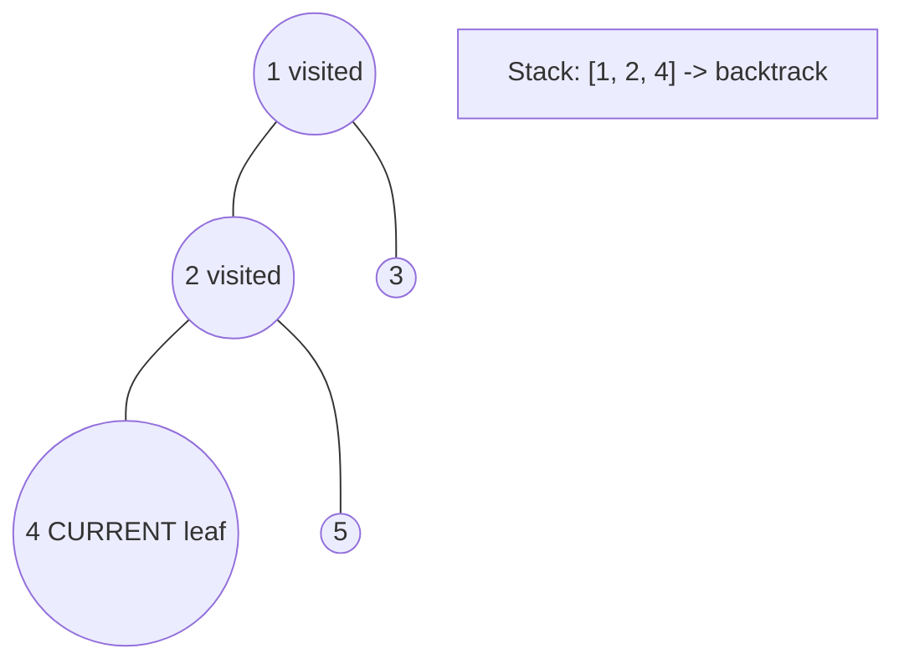
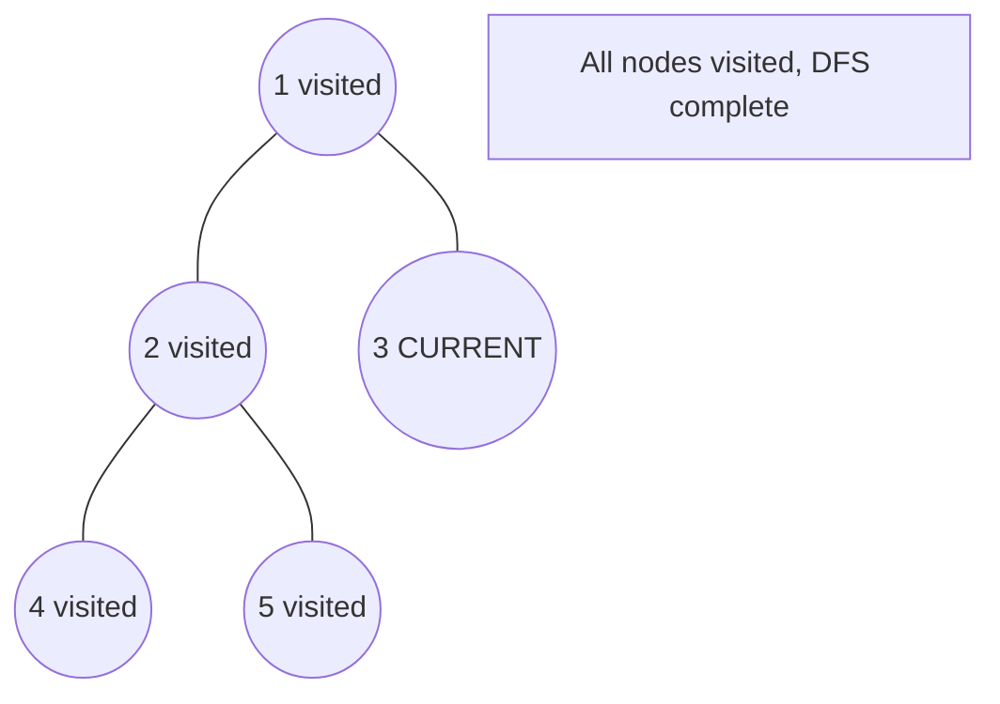

# Problem 971: Flip Binary Tree To Match Preorder Traversal

**Difficulty:** Medium  
**Tags:** Tree, Depth-First Search, Binary Tree  
**Pattern:** DFS Tree Traversal  
**Link:** [leetcode.com/problems/flip-binary-tree-to-match-preorder-traversal](https://leetcode.com/problems/flip-binary-tree-to-match-preorder-traversal/)

## Description

You are given the `root` of a binary tree with `n` nodes, where each node is uniquely assigned a value from `1` to `n`. You are also given a sequence of `n` values `voyage`, which is the **desired** **pre-order traversal** of the binary tree.

Any node in the binary tree can be **flipped** by swapping its left and right subtrees. For example, flipping node 1 will have the following effect:

Flip the **smallest** number of nodes so that the **pre-order traversal** of the tree **matches** `voyage`.

Return *a list of the values of all **flipped** nodes. You may return the answer in **any order**. If it is **impossible** to flip the nodes in the tree to make the pre-order traversal match *`voyage`*, return the list *`[-1]`.

 

Example 1:

```

**Input:** root = [1,2], voyage = [2,1]
**Output:** [-1]
**Explanation:** It is impossible to flip the nodes such that the pre-order traversal matches voyage.

```

Example 2:

```

**Input:** root = [1,2,3], voyage = [1,3,2]
**Output:** [1]
**Explanation:** Flipping node 1 swaps nodes 2 and 3, so the pre-order traversal matches voyage.
```

Example 3:

```

**Input:** root = [1,2,3], voyage = [1,2,3]
**Output:** []
**Explanation:** The tree's pre-order traversal already matches voyage, so no nodes need to be flipped.

```

 

**Constraints:**

	- The number of nodes in the tree is `n`.
	- `n == voyage.length`
	- `1 <= n <= 100`
	- `1 <= Node.val, voyage[i] <= n`
	- All the values in the tree are **unique**.
	- All the values in `voyage` are **unique**.

## Approach: DFS Tree Traversal

Perform depth-first search on the tree. Recurse on left and right subtrees, combining results bottom-up. Track state (path, depth, sum) during traversal.

## Pseudocode

```
1. Define dfs(node, state):
   a. Base case: if null, return default
   b. Process node with current state
   c. left_result = dfs(node.left, updated_state)
   d. right_result = dfs(node.right, updated_state)
   e. Return combine(left_result, right_result)
2. Return dfs(root, initial_state)
```

## Algorithm Flow



## Visual State Transitions

**DFS Tree Traversal Step-by-Step:**

**Frame 1: Start at root**


**Frame 2: Go left - visit node 2**


**Frame 3: Go left - visit node 4 (leaf)**


**Frame 4: Backtrack, visit node 5, then node 3**



## Complexity Analysis

- **Time:** O(n)
- **Space:** O(h)

## Solution (Python3)

```python
class Solution:
    def flipMatchVoyage(self, root: Optional[TreeNode], voyage: List[int]) -> List[int]:
        # DFS on binary tree - O(n) time, O(h) space
        def dfs(node):
            if not node:
                return 0
            left = dfs(node.left)
            right = dfs(node.right)
            return 1 + max(left, right)
        
        result = dfs(root)
        return result
```

## Solution (C++)

```cpp
#include <algorithm>
#include <functional>
#include <string>
#include <vector>
using namespace std;

class Solution {
public:
    vector<int> flipMatchVoyage(TreeNode* root, vector<int>& voyage) {
        // DFS on binary tree - O(n) time, O(h) space
        function<int(TreeNode*)> dfs = [&](TreeNode* node) -> int {
            if (!node) return 0;
            int left = dfs(node->left);
            int right = dfs(node->right);
            return 1 + max(left, right);
        };
        return dfs(root);
    }
};
```
