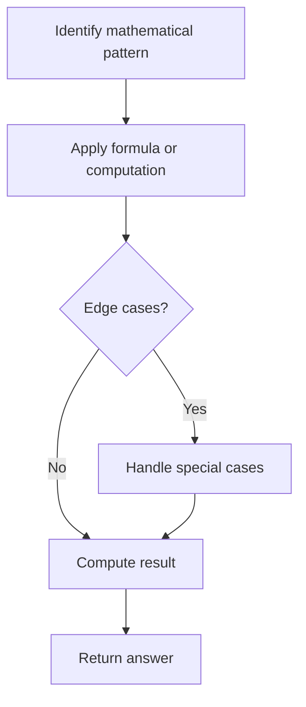

# Problem 972: Equal Rational Numbers

**Difficulty:** Hard  
**Tags:** Math, String  
**Pattern:** Math  
**Link:** [leetcode.com/problems/equal-rational-numbers](https://leetcode.com/problems/equal-rational-numbers/)

## Description

Given two strings `s` and `t`, each of which represents a non-negative rational number, return `true` if and only if they represent the same number. The strings may use parentheses to denote the repeating part of the rational number.

A **rational number** can be represented using up to three parts: `<IntegerPart>`, `<NonRepeatingPart>`, and a `<RepeatingPart>`. The number will be represented in one of the following three ways:

	- `<IntegerPart>`

	
		For example, `12`, `0`, and `123`.
	
	
	- `<IntegerPart>**<.>**<NonRepeatingPart>`
	
		For example, `0.5`, `1.`, `2.12`, and `123.0001`.
	
	
	- `<IntegerPart>**<.>**<NonRepeatingPart>**<(>**<RepeatingPart>**<)>**`
	
		For example, `0.1(6)`, `1.(9)`, `123.00(1212)`.
	
	

The repeating portion of a decimal expansion is conventionally denoted within a pair of round brackets. For example:

	- `1/6 = 0.16666666... = 0.1(6) = 0.1666(6) = 0.166(66)`.

 

Example 1:

```

**Input:** s = "0.(52)", t = "0.5(25)"
**Output:** true
**Explanation:** Because "0.(52)" represents 0.52525252..., and "0.5(25)" represents 0.52525252525..... , the strings represent the same number.

```

Example 2:

```

**Input:** s = "0.1666(6)", t = "0.166(66)"
**Output:** true

```

Example 3:

```

**Input:** s = "0.9(9)", t = "1."
**Output:** true
**Explanation:** "0.9(9)" represents 0.999999999... repeated forever, which equals 1.  [See this link for an explanation.]
"1." represents the number 1, which is formed correctly: (IntegerPart) = "1" and (NonRepeatingPart) = "".

```

 

**Constraints:**

	- Each part consists only of digits.
	- The `<IntegerPart>` does not have leading zeros (except for the zero itself).
	- `1 <= <IntegerPart>.length <= 4`
	- `0 <= <NonRepeatingPart>.length <= 4`
	- `1 <= <RepeatingPart>.length <= 4`

## Approach: Math

Apply mathematical properties, formulas, or number-theoretic concepts. Look for patterns, modular arithmetic, or closed-form solutions.

## Pseudocode

```
1. Identify the mathematical pattern or formula
2. Apply computation:
   - Modular arithmetic for large numbers
   - GCD/LCM for divisibility
   - Sieve for primes
3. Handle edge cases
4. Return result
```

## Algorithm Flow



## Complexity Analysis

- **Time:** O(n) or O(sqrt(n))
- **Space:** O(1)

## Solution (Python3)

```python
class Solution:
    def isRationalEqual(self, s: str, t: str) -> bool:
        # Mathematical approach
        result = 0
        x = s
        while x != 0:
            result = result * 10 + x % 10
            x //= 10 if isinstance(x, int) else 1
        return result
```

## Solution (C++)

```cpp
#include <string>
#include <vector>
using namespace std;

class Solution {
public:
    bool isRationalEqual(string& s, string& t) {
        // Mathematical approach
        long long result = 0;
        int x = s;
        while (x != 0) {
            result = result * 10 + x % 10;
            x /= 10;
        }
        return (int)result;
    }
};
```
