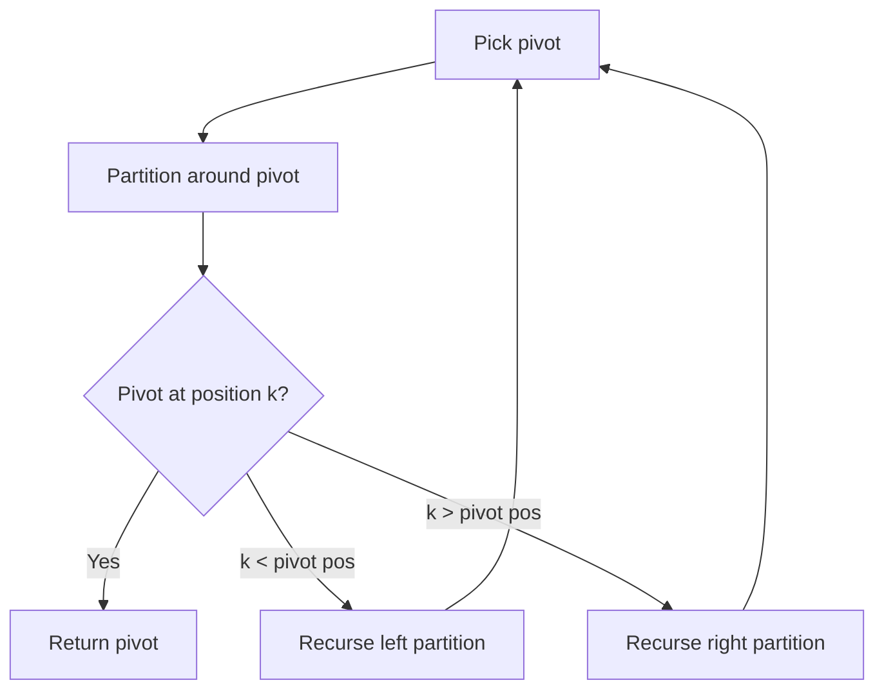

# Problem 973: K Closest Points to Origin

**Difficulty:** Medium  
**Tags:** Array, Math, Divide and Conquer, Geometry, Sorting, Heap (Priority Queue), Quickselect  
**Pattern:** Heap / Quickselect  
**Link:** [leetcode.com/problems/k-closest-points-to-origin](https://leetcode.com/problems/k-closest-points-to-origin/)

## Description

Given an array of `points` where `points[i] = [xi, yi]` represents a point on the **X-Y** plane and an integer `k`, return the `k` closest points to the origin `(0, 0)`.

The distance between two points on the **X-Y** plane is the Euclidean distance (i.e., `√(x1 - x2)^2 + (y1 - y2)^2`).

You may return the answer in **any order**. The answer is **guaranteed** to be **unique** (except for the order that it is in).

 

Example 1:

```

**Input:** points = [[1,3],[-2,2]], k = 1
**Output:** [[-2,2]]
**Explanation:**
The distance between (1, 3) and the origin is sqrt(10).
The distance between (-2, 2) and the origin is sqrt(8).
Since sqrt(8) < sqrt(10), (-2, 2) is closer to the origin.
We only want the closest k = 1 points from the origin, so the answer is just [[-2,2]].

```

Example 2:

```

**Input:** points = [[3,3],[5,-1],[-2,4]], k = 2
**Output:** [[3,3],[-2,4]]
**Explanation:** The answer [[-2,4],[3,3]] would also be accepted.

```

 

**Constraints:**

	- `1 <= k <= points.length <= 10^4`
	- `-10^4 <= xi, yi <= 10^4`

## Approach: Heap / Quickselect

Max-heap of size k (negated distances). Keep k closest points.

## Pseudocode

```
1. Pick pivot element
2. Partition: elements < pivot | pivot | elements > pivot
3. If pivot is at position k: return pivot
4. If k < pivot position: recurse left
5. If k > pivot position: recurse right
```

## Algorithm Flow



## Complexity Analysis

- **Time:** O(n log k)
- **Space:** O(k)

## Solution (Python3)

```python
import heapq

class Solution:
    def kClosest(self, points: list[list[int]], k: int) -> list[list[int]]:
        heap = []
        for x, y in points:
            dist = -(x*x + y*y)
            if len(heap) < k:
                heapq.heappush(heap, (dist, x, y))
            elif dist > heap[0][0]:
                heapq.heapreplace(heap, (dist, x, y))
        return [[x, y] for _, x, y in heap]
```

## Solution (C++)

```cpp
#include <algorithm>
#include <string>
#include <vector>
using namespace std;

class Solution {
public:
    vector<vector<int>> kClosest(vector<vector<int>>& points, int k) {
        // Quickselect - O(n) average time
        int k = k;
        nth_element(points.begin(), points.begin() + points.size() - k, points.end());
        return points[points.size() - k];
    }
};
```
