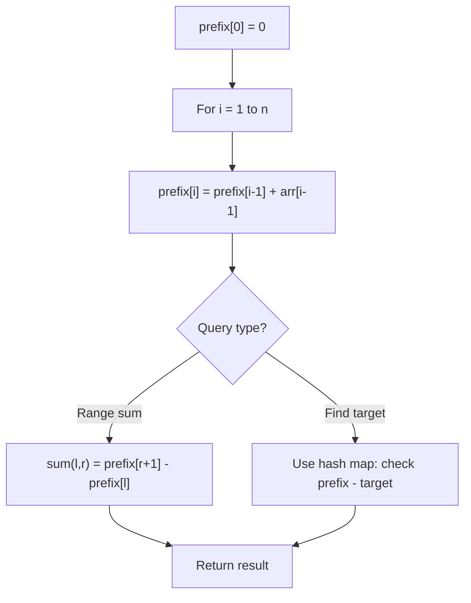

# Problem 974: Subarray Sums Divisible by K

**Difficulty:** Medium  
**Tags:** Array, Hash Table, Prefix Sum  
**Pattern:** Prefix Sum  
**Link:** [leetcode.com/problems/subarray-sums-divisible-by-k](https://leetcode.com/problems/subarray-sums-divisible-by-k/)

## Description

Given an integer array `nums` and an integer `k`, return *the number of non-empty **subarrays** that have a sum divisible by *`k`.

A **subarray** is a **contiguous** part of an array.

 

Example 1:

```

**Input:** nums = [4,5,0,-2,-3,1], k = 5
**Output:** 7
**Explanation:** There are 7 subarrays with a sum divisible by k = 5:
[4, 5, 0, -2, -3, 1], [5], [5, 0], [5, 0, -2, -3], [0], [0, -2, -3], [-2, -3]

```

Example 2:

```

**Input:** nums = [5], k = 9
**Output:** 0

```

 

**Constraints:**

	- `1 <= nums.length <= 3 * 10^4`
	- `-10^4 <= nums[i] <= 10^4`
	- `2 <= k <= 10^4`

## Approach: Prefix Sum

Build a prefix sum array where prefix[i] = sum of elements 0..i-1. Any subarray sum [l..r] = prefix[r+1] - prefix[l]. Combine with hash map for O(n) subarray sum queries.

## Pseudocode

```
1. Build prefix sum array: prefix[0]=0, prefix[i]=prefix[i-1]+arr[i-1]
2. Use prefix sums to answer queries:
   - Subarray sum [l..r] = prefix[r+1] - prefix[l]
   - Or use hash map to find prefix[j]-prefix[i] == target
3. Return result
```

## Algorithm Flow



## Complexity Analysis

- **Time:** O(n)
- **Space:** O(n)

## Solution (Python3)

```python
class Solution:
    def subarraysDivByK(self, nums: List[int], k: int) -> int:
        # Prefix sum approach - O(n) time, O(n) space
        prefix = {0: -1}
        curr_sum = 0
        result = 0
        target = k if isinstance(k, int) else 0
        for i, val in enumerate(nums):
            curr_sum += val
            if curr_sum - target in prefix:
                result = max(result, i - prefix[curr_sum - target])
            if curr_sum not in prefix:
                prefix[curr_sum] = i
        return result
```

## Solution (C++)

```cpp
#include <algorithm>
#include <string>
#include <unordered_map>
#include <vector>
using namespace std;

class Solution {
public:
    int subarraysDivByK(vector<int>& nums, int k) {
        // Prefix sum approach - O(n) time, O(n) space
        unordered_map<int, int> prefix;
        prefix[0] = -1;
        int curr_sum = 0, result = 0;
        int target = k;
        for (int i = 0; i < (int)nums.size(); i++) {
            curr_sum += nums[i];
            if (prefix.count(curr_sum - target)) {
                result = max(result, i - prefix[curr_sum - target]);
            }
            if (!prefix.count(curr_sum)) {
                prefix[curr_sum] = i;
            }
        }
        return result;
    }
};
```
