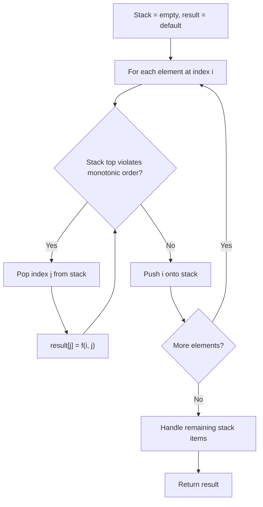
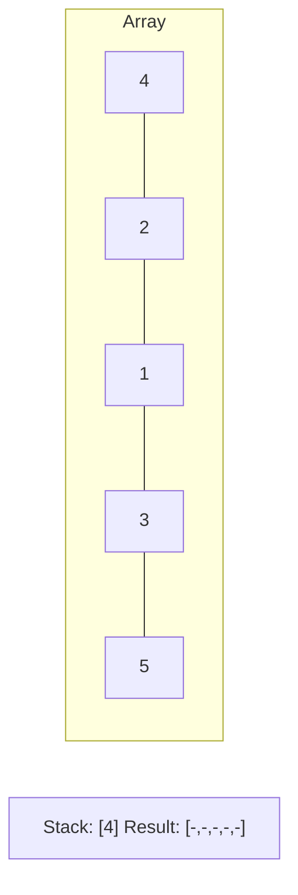
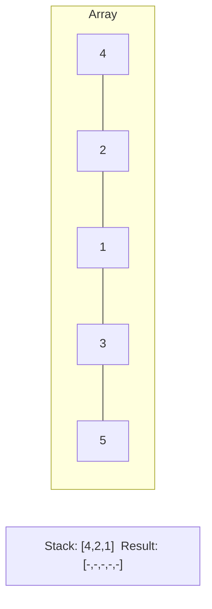
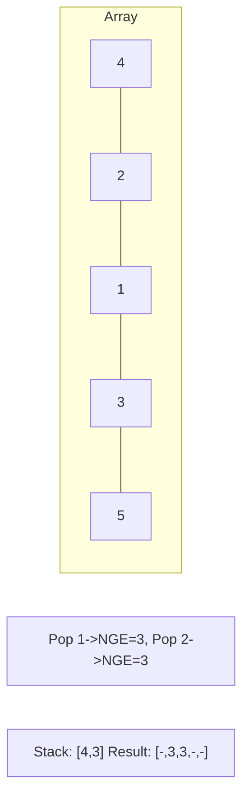
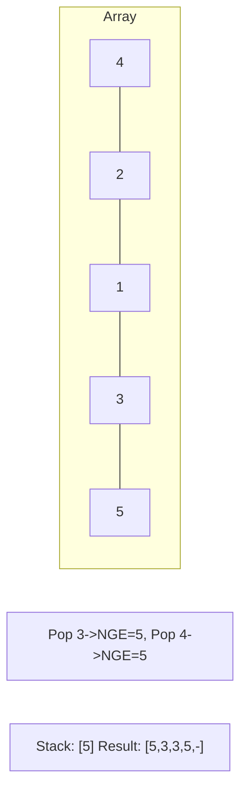

# Problem 975: Odd Even Jump

**Difficulty:** Hard  
**Tags:** Array, Dynamic Programming, Stack, Sorting, Monotonic Stack, Ordered Set  
**Pattern:** Monotonic Stack  
**Link:** [leetcode.com/problems/odd-even-jump](https://leetcode.com/problems/odd-even-jump/)

## Description

You are given an integer array `arr`. From some starting index, you can make a series of jumps. The (1^st, 3^rd, 5^th, ...) jumps in the series are called **odd-numbered jumps**, and the (2^nd, 4^th, 6^th, ...) jumps in the series are called **even-numbered jumps**. Note that the **jumps** are numbered, not the indices.

You may jump forward from index `i` to index `j` (with `i < j`) in the following way:

	- During **odd-numbered jumps** (i.e., jumps 1, 3, 5, ...), you jump to the index `j` such that `arr[i] <= arr[j]` and `arr[j]` is the smallest possible value. If there are multiple such indices `j`, you can only jump to the **smallest** such index `j`.
	- During **even-numbered jumps** (i.e., jumps 2, 4, 6, ...), you jump to the index `j` such that `arr[i] >= arr[j]` and `arr[j]` is the largest possible value. If there are multiple such indices `j`, you can only jump to the **smallest** such index `j`.
	- It may be the case that for some index `i`, there are no legal jumps.

A starting index is **good** if, starting from that index, you can reach the end of the array (index `arr.length - 1`) by jumping some number of times (possibly 0 or more than once).

Return *the number of **good** starting indices*.

 

Example 1:

```

**Input:** arr = [10,13,12,14,15]
**Output:** 2
**Explanation:** 
From starting index i = 0, we can make our 1st jump to i = 2 (since arr[2] is the smallest among arr[1], arr[2], arr[3], arr[4] that is greater or equal to arr[0]), then we cannot jump any more.
From starting index i = 1 and i = 2, we can make our 1st jump to i = 3, then we cannot jump any more.
From starting index i = 3, we can make our 1st jump to i = 4, so we have reached the end.
From starting index i = 4, we have reached the end already.
In total, there are 2 different starting indices i = 3 and i = 4, where we can reach the end with some number of
jumps.

```

Example 2:

```

**Input:** arr = [2,3,1,1,4]
**Output:** 3
**Explanation:** 
From starting index i = 0, we make jumps to i = 1, i = 2, i = 3:
During our 1st jump (odd-numbered), we first jump to i = 1 because arr[1] is the smallest value in [arr[1], arr[2], arr[3], arr[4]] that is greater than or equal to arr[0].
During our 2nd jump (even-numbered), we jump from i = 1 to i = 2 because arr[2] is the largest value in [arr[2], arr[3], arr[4]] that is less than or equal to arr[1]. arr[3] is also the largest value, but 2 is a smaller index, so we can only jump to i = 2 and not i = 3
During our 3rd jump (odd-numbered), we jump from i = 2 to i = 3 because arr[3] is the smallest value in [arr[3], arr[4]] that is greater than or equal to arr[2].
We can't jump from i = 3 to i = 4, so the starting index i = 0 is not good.
In a similar manner, we can deduce that:
From starting index i = 1, we jump to i = 4, so we reach the end.
From starting index i = 2, we jump to i = 3, and then we can't jump anymore.
From starting index i = 3, we jump to i = 4, so we reach the end.
From starting index i = 4, we are already at the end.
In total, there are 3 different starting indices i = 1, i = 3, and i = 4, where we can reach the end with some
number of jumps.

```

Example 3:

```

**Input:** arr = [5,1,3,4,2]
**Output:** 3
**Explanation:** We can reach the end from starting indices 1, 2, and 4.

```

 

**Constraints:**

	- `1 <= arr.length <= 2 * 10^4`
	- `0 <= arr[i] < 10^5`

## Approach: Monotonic Stack

Maintain a stack where elements are always in monotonic order (increasing or decreasing). When a new element violates the monotonic property, pop elements and compute results (e.g., next greater/smaller element, spans, areas).

## Pseudocode

```
1. Initialize empty stack, result array
2. For each element (index i):
   a. While stack not empty and arr[i] breaks monotonic order:
      - Pop index j from stack
      - result[j] = compute(i, j)
   b. Push i onto stack
3. Handle remaining elements in stack
4. Return result
```

## Algorithm Flow



## Visual State Transitions

**Monotonic Stack (Next Greater Element):**

**Frame 1: Process first elements**


**Frame 2: Push smaller elements**


**Frame 3: Element 3 pops 1 and 2**


**Frame 4: Element 5 pops all**



## Complexity Analysis

- **Time:** O(n)
- **Space:** O(n)

## Solution (Python3)

```python
class Solution:
    def oddEvenJumps(self, arr: List[int]) -> int:
        # Monotonic stack - O(n) time, O(n) space
        n = len(arr)
        result = [0] * n
        stack = []  # indices
        for i in range(n):
            while stack and arr[i] > arr[stack[-1]]:
                idx = stack.pop()
                result[idx] = i - idx
            stack.append(i)
        return result
```

## Solution (C++)

```cpp
#include <stack>
#include <string>
#include <vector>
using namespace std;

class Solution {
public:
    int oddEvenJumps(vector<int>& arr) {
        // Monotonic stack - O(n) time, O(n) space
        int n = arr.size();
        vector<int> result(n, 0);
        stack<int> st;
        for (int i = 0; i < n; i++) {
            while (!st.empty() && arr[i] > arr[st.top()]) {
                int idx = st.top(); st.pop();
                result[idx] = i - idx;
            }
            st.push(i);
        }
        return result;
    }
};
```
