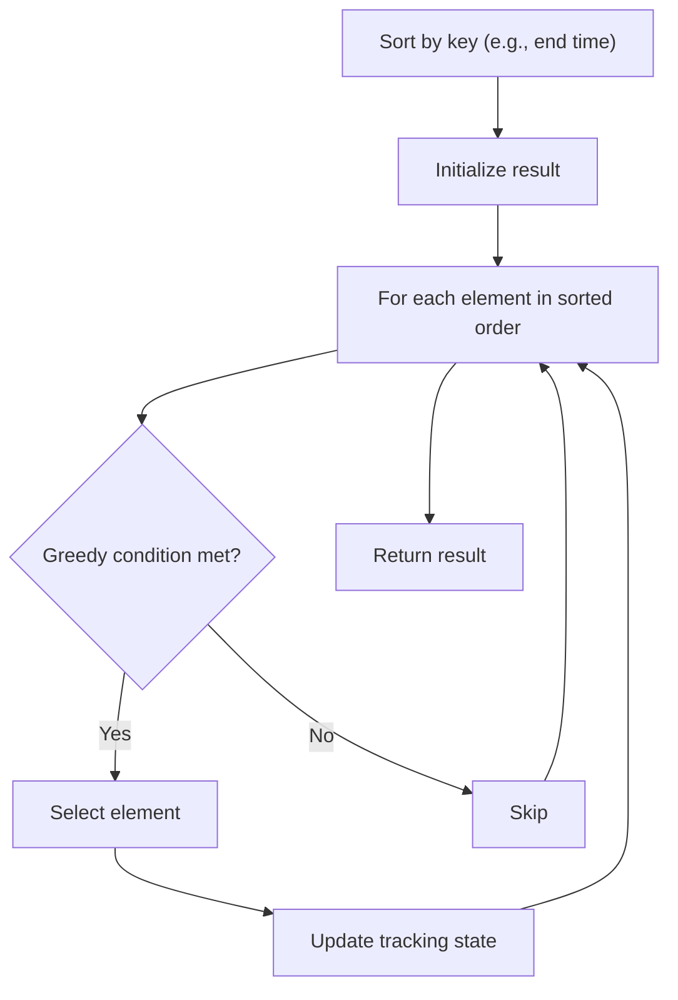

# Problem 976: Largest Perimeter Triangle

**Difficulty:** Easy  
**Tags:** Array, Math, Greedy, Sorting  
**Pattern:** Greedy with Sorting  
**Link:** [leetcode.com/problems/largest-perimeter-triangle](https://leetcode.com/problems/largest-perimeter-triangle/)

## Description

Given an integer array `nums`, return *the largest perimeter of a triangle with a non-zero area, formed from three of these lengths*. If it is impossible to form any triangle of a non-zero area, return `0`.

 

Example 1:

```

**Input:** nums = [2,1,2]
**Output:** 5
**Explanation:** You can form a triangle with three side lengths: 1, 2, and 2.

```

Example 2:

```

**Input:** nums = [1,2,1,10]
**Output:** 0
**Explanation:** 
You cannot use the side lengths 1, 1, and 2 to form a triangle.
You cannot use the side lengths 1, 1, and 10 to form a triangle.
You cannot use the side lengths 1, 2, and 10 to form a triangle.
As we cannot use any three side lengths to form a triangle of non-zero area, we return 0.

```

 

**Constraints:**

	- `3 <= nums.length <= 10^4`
	- `1 <= nums[i] <= 10^6`

## Approach: Greedy with Sorting

Sort the input by a key criterion, then greedily process elements in sorted order. The sorting ensures the greedy choice is always optimal.

## Pseudocode

```
1. Sort elements by key (start time, weight, etc.)
2. Initialize result, tracking variables
3. For each element in sorted order:
   a. Apply greedy selection rule
   b. Update result
4. Return result
```

## Algorithm Flow



## Complexity Analysis

- **Time:** O(n log n)
- **Space:** O(n)

## Solution (Python3)

```python
class Solution:
    def largestPerimeter(self, nums: List[int]) -> int:
        # Sort + greedy - O(n log n) time
        nums.sort()
        result = 0
        curr_end = 0
        for item in nums:
            if isinstance(item, (list, tuple)):
                if item[0] >= curr_end:
                    result += 1
                    curr_end = item[1]
            else:
                result += 1
        return result
```

## Solution (C++)

```cpp
#include <algorithm>
#include <string>
#include <vector>
using namespace std;

class Solution {
public:
    int largestPerimeter(vector<int>& nums) {
        // Sort + greedy - O(n log n) time
        sort(nums.begin(), nums.end());
        int result = 0, curr_end = 0;
        for (auto& item : nums) {
            result++;
        }
        return result;
    }
};
```
