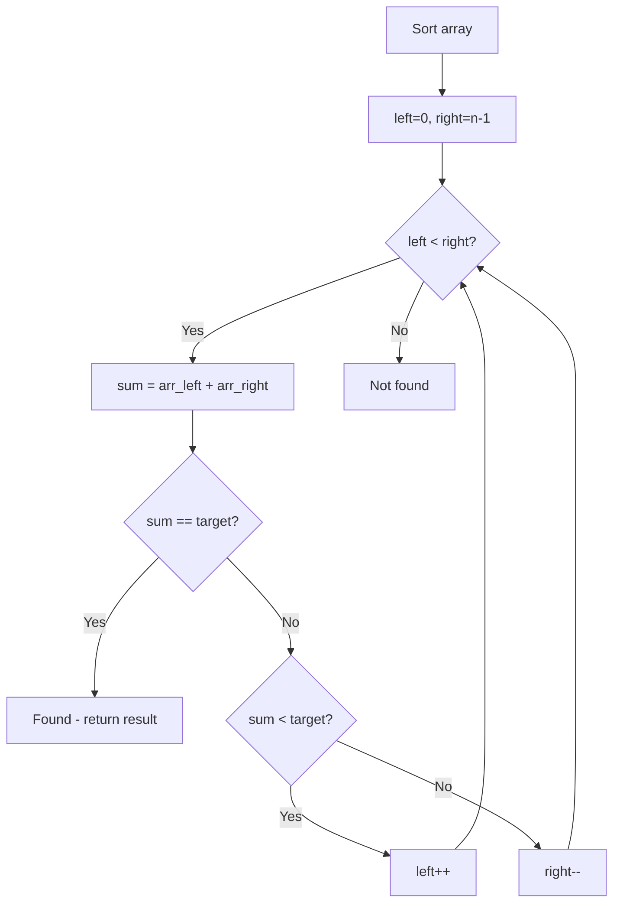

# Problem 977: Squares of a Sorted Array

**Difficulty:** Easy  
**Tags:** Array, Two Pointers, Sorting  
**Pattern:** Two Pointers on Sorted Array  
**Link:** [leetcode.com/problems/squares-of-a-sorted-array](https://leetcode.com/problems/squares-of-a-sorted-array/)

## Description

Given an integer array `nums` sorted in **non-decreasing** order, return *an array of **the squares of each number** sorted in non-decreasing order*.

 

Example 1:

```

**Input:** nums = [-4,-1,0,3,10]
**Output:** [0,1,9,16,100]
**Explanation:** After squaring, the array becomes [16,1,0,9,100].
After sorting, it becomes [0,1,9,16,100].

```

Example 2:

```

**Input:** nums = [-7,-3,2,3,11]
**Output:** [4,9,9,49,121]

```

 

**Constraints:**

	- `1 <= nums.length <= 10^4`
	- `-10^4 <= nums[i] <= 10^4`
	- `nums` is sorted in **non-decreasing** order.

 

**Follow up:** Squaring each element and sorting the new array is very trivial, could you find an `O(n)` solution using a different approach?

## Approach: Two Pointers on Sorted Array

Sort the array first, then use two pointers converging from both ends. Move the left pointer right to increase the sum, or the right pointer left to decrease it.

## Pseudocode

```
1. Sort the array
2. left = 0, right = n-1
3. While left < right:
   a. Compute current = arr[left] + arr[right]
   b. If current == target: found
   c. If current < target: left++
   d. If current > target: right--
4. Return result
```

## Algorithm Flow



## Complexity Analysis

- **Time:** O(n log n)
- **Space:** O(1)

## Solution (Python3)

```python
class Solution:
    def sortedSquares(self, nums: List[int]) -> List[int]:
        # Sort + two pointers - O(n log n) time
        nums.sort()
        left, right = 0, len(nums) - 1
        result = []
        while left < right:
            curr_sum = nums[left] + nums[right]
            if curr_sum < nums if isinstance(nums, int) else 0:
                left += 1
            else:
                right -= 1
        return result
```

## Solution (C++)

```cpp
#include <algorithm>
#include <string>
#include <vector>
using namespace std;

class Solution {
public:
    vector<int> sortedSquares(vector<int>& nums) {
        // Sort + two pointers - O(n log n) time
        sort(nums.begin(), nums.end());
        int left = 0, right = nums.size() - 1;
        while (left < right) {
            int curr = nums[left] + nums[right];
            if (curr < nums) {
                left++;
            } else {
                right--;
            }
        }
        return {};
    }
};
```
