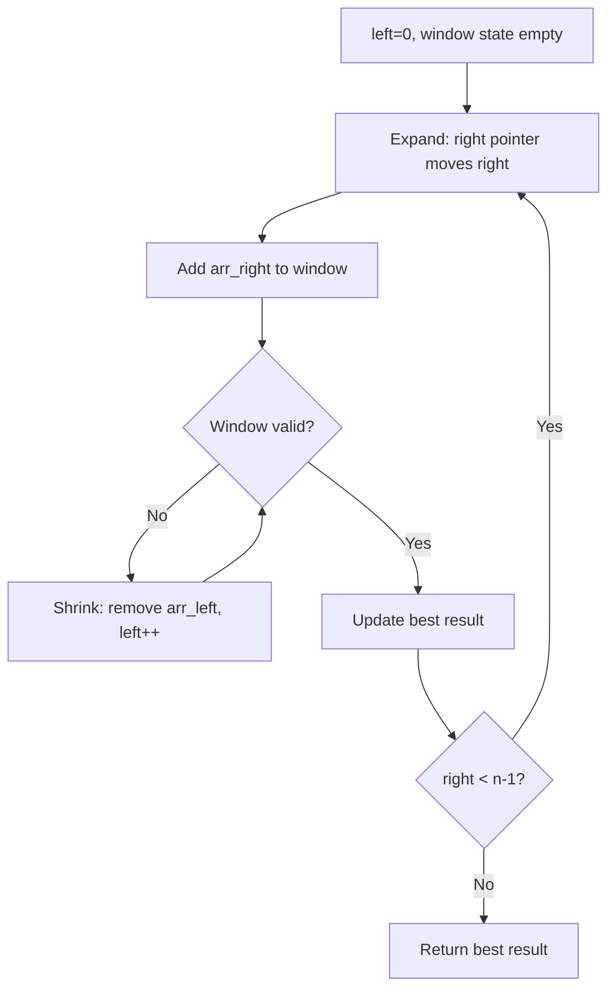
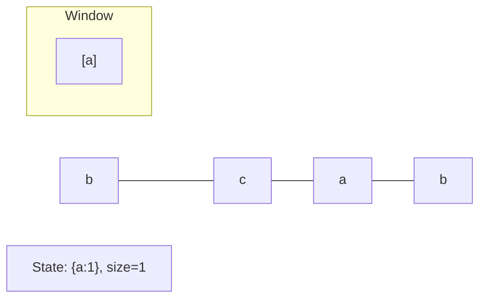
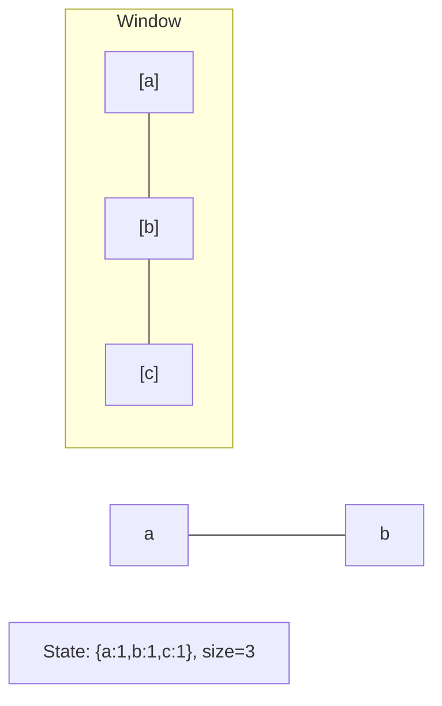
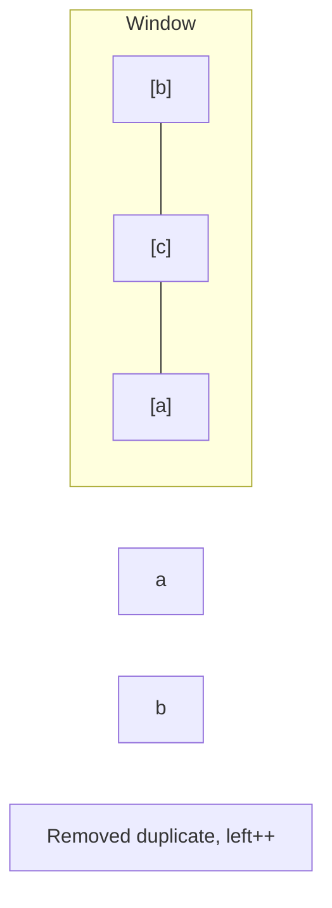
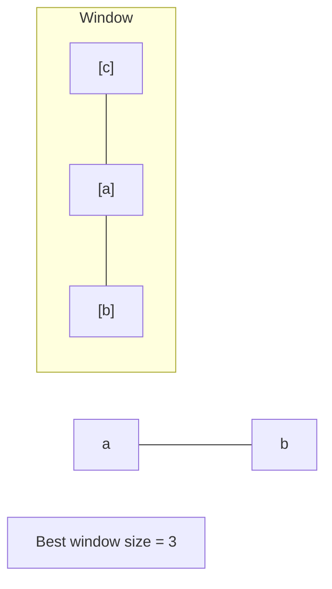

# Problem 978: Longest Turbulent Subarray

**Difficulty:** Medium  
**Tags:** Array, Dynamic Programming, Sliding Window  
**Pattern:** Sliding Window  
**Link:** [leetcode.com/problems/longest-turbulent-subarray](https://leetcode.com/problems/longest-turbulent-subarray/)

## Description

Given an integer array `arr`, return *the length of a maximum size turbulent subarray of* `arr`.

A subarray is **turbulent** if the comparison sign flips between each adjacent pair of elements in the subarray.

More formally, a subarray `[arr[i], arr[i + 1], ..., arr[j]]` of `arr` is said to be turbulent if and only if:

	- For `i <= k < j`:

	
		`arr[k] > arr[k + 1]` when `k` is odd, and
		- `arr[k] < arr[k + 1]` when `k` is even.
	
	
	- Or, for `i <= k < j`:
	
		`arr[k] > arr[k + 1]` when `k` is even, and
		- `arr[k] < arr[k + 1]` when `k` is odd.
	
	

 

Example 1:

```

**Input:** arr = [9,4,2,10,7,8,8,1,9]
**Output:** 5
**Explanation:** arr[1] > arr[2] < arr[3] > arr[4] < arr[5]

```

Example 2:

```

**Input:** arr = [4,8,12,16]
**Output:** 2

```

Example 3:

```

**Input:** arr = [100]
**Output:** 1

```

 

**Constraints:**

	- `1 <= arr.length <= 4 * 10^4`
	- `0 <= arr[i] <= 10^9`

## Approach: Sliding Window

Maintain a window over the data using two pointers. Expand the right boundary to include new elements, and shrink the left boundary when the window constraint is violated. Track the optimal window.

## Pseudocode

```
1. Initialize left = 0, result = initial_value
2. For right in range(n):
   a. Add element at right to window state
   b. While window is invalid:
      - Remove element at left from window state
      - left++
   c. Update result = best of (result, window size/value)
3. Return result
```

## Algorithm Flow



## Visual State Transitions

**Sliding Window Step-by-Step:**

**Frame 1: Initial window (left=0, right=0)**


**Frame 2: Expand right (right=2)**


**Frame 3: Violation - shrink left**


**Frame 4: Continue expanding**



## Complexity Analysis

- **Time:** O(n)
- **Space:** O(k)

## Solution (Python3)

```python
class Solution:
    def maxTurbulenceSize(self, arr: List[int]) -> int:
        # Sliding window approach - O(n) time, O(k) space
        from collections import defaultdict
        window = defaultdict(int)
        left = 0
        result = 0
        for right in range(len(arr)):
            window[arr[right]] += 1
            while len(window) > (arr if isinstance(arr, int) else len(arr)):
                window[arr[left]] -= 1
                if window[arr[left]] == 0:
                    del window[arr[left]]
                left += 1
            result = max(result, right - left + 1)
        return result
```

## Solution (C++)

```cpp
#include <algorithm>
#include <string>
#include <unordered_map>
#include <vector>
using namespace std;

class Solution {
public:
    int maxTurbulenceSize(vector<int>& arr) {
        // Sliding window approach - O(n) time, O(k) space
        unordered_map<char, int> window;
        int left = 0, result = 0;
        for (int right = 0; right < arr.size(); right++) {
            window[arr[right]]++;
            while ((int)window.size() > arr) {
                window[arr[left]]--;
                if (window[arr[left]] == 0)
                    window.erase(arr[left]);
                left++;
            }
            result = max(result, right - left + 1);
        }
        return result;
    }
};
```
