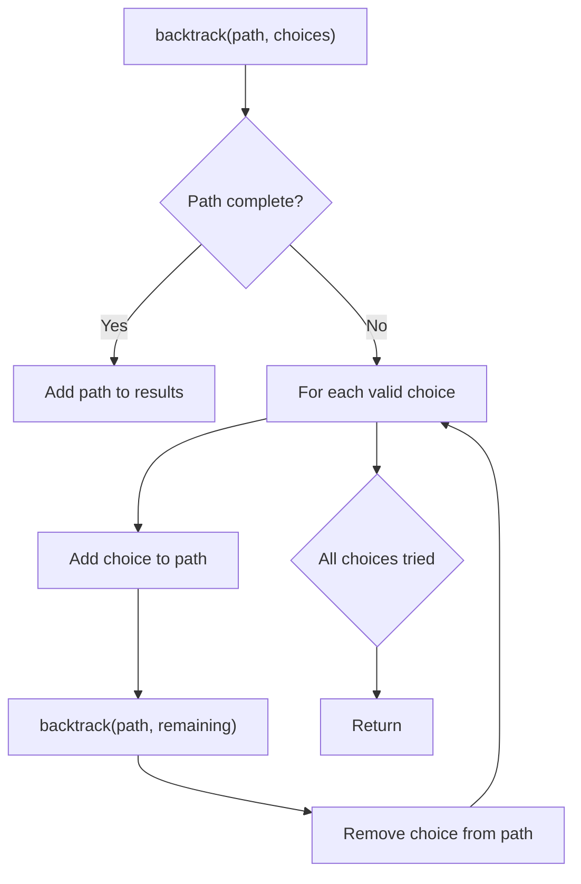
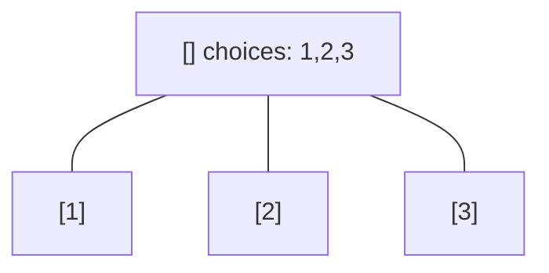
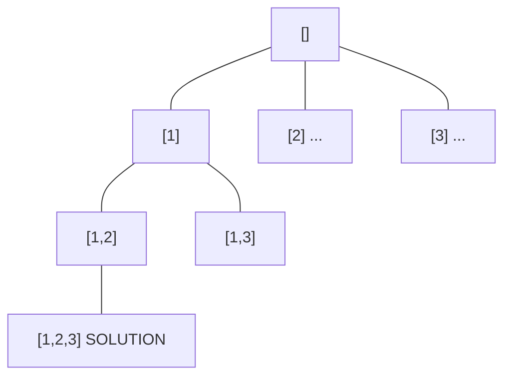
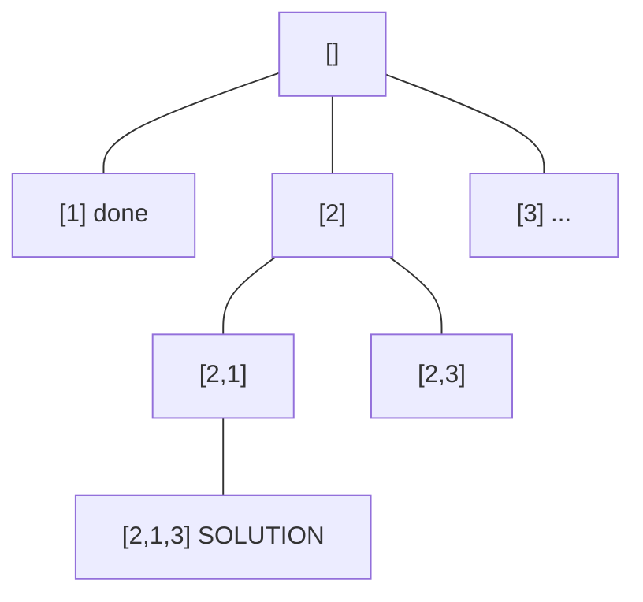
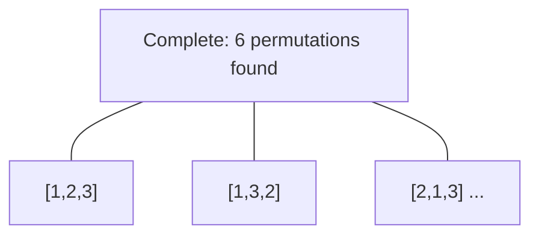

# Problem 980: Unique Paths III

**Difficulty:** Hard  
**Tags:** Array, Backtracking, Bit Manipulation, Matrix  
**Pattern:** Backtracking  
**Link:** [leetcode.com/problems/unique-paths-iii](https://leetcode.com/problems/unique-paths-iii/)

## Description

You are given an `m x n` integer array `grid` where `grid[i][j]` could be:

	- `1` representing the starting square. There is exactly one starting square.
	- `2` representing the ending square. There is exactly one ending square.
	- `0` representing empty squares we can walk over.
	- `-1` representing obstacles that we cannot walk over.

Return *the number of 4-directional walks from the starting square to the ending square, that walk over every non-obstacle square exactly once*.

 

Example 1:

```

**Input:** grid = [[1,0,0,0],[0,0,0,0],[0,0,2,-1]]
**Output:** 2
**Explanation:** We have the following two paths: 
1. (0,0),(0,1),(0,2),(0,3),(1,3),(1,2),(1,1),(1,0),(2,0),(2,1),(2,2)
2. (0,0),(1,0),(2,0),(2,1),(1,1),(0,1),(0,2),(0,3),(1,3),(1,2),(2,2)

```

Example 2:

```

**Input:** grid = [[1,0,0,0],[0,0,0,0],[0,0,0,2]]
**Output:** 4
**Explanation:** We have the following four paths: 
1. (0,0),(0,1),(0,2),(0,3),(1,3),(1,2),(1,1),(1,0),(2,0),(2,1),(2,2),(2,3)
2. (0,0),(0,1),(1,1),(1,0),(2,0),(2,1),(2,2),(1,2),(0,2),(0,3),(1,3),(2,3)
3. (0,0),(1,0),(2,0),(2,1),(2,2),(1,2),(1,1),(0,1),(0,2),(0,3),(1,3),(2,3)
4. (0,0),(1,0),(2,0),(2,1),(1,1),(0,1),(0,2),(0,3),(1,3),(1,2),(2,2),(2,3)

```

Example 3:

```

**Input:** grid = [[0,1],[2,0]]
**Output:** 0
**Explanation:** There is no path that walks over every empty square exactly once.
Note that the starting and ending square can be anywhere in the grid.

```

 

**Constraints:**

	- `m == grid.length`
	- `n == grid[i].length`
	- `1 <= m, n <= 20`
	- `1 <= m * n <= 20`
	- `-1 <= grid[i][j] <= 2`
	- There is exactly one starting cell and one ending cell.

## Approach: Backtracking

Explore all possible solutions by building candidates incrementally. At each step, make a choice and recurse. If the choice leads to a dead end, undo the choice (backtrack) and try the next option.

## Pseudocode

```
1. Define backtrack(path, choices):
   a. If path is a complete solution: add to results
   b. For each choice in choices:
      - If choice is valid:
        * Add choice to path
        * backtrack(path, remaining_choices)
        * Remove choice from path (backtrack)
2. Call backtrack([], all_choices)
```

## Algorithm Flow



## Visual State Transitions

**Backtracking Decision Tree:**

**Frame 1: Root - start with empty path**


**Frame 2: Explore branch [1]**


**Frame 3: Backtrack, explore [2]**


**Frame 4: All solutions found**



## Complexity Analysis

- **Time:** O(k^n) or O(n!)
- **Space:** O(n)

## Solution (Python3)

```python
class Solution:
    def uniquePathsIII(self, grid: List[List[int]]) -> int:
        # Backtracking - O(2^n) or O(n!) time
        result = []
        
        def backtrack(path, start):
            result.append(path[:])
            for i in range(start, len(grid)):
                path.append(grid[i])
                backtrack(path, i + 1)
                path.pop()
        
        backtrack([], 0)
        return result
```

## Solution (C++)

```cpp
#include <functional>
#include <string>
#include <vector>
using namespace std;

class Solution {
public:
    int uniquePathsIII(vector<vector<int>>& grid) {
        // Backtracking - O(2^n) or O(n!) time
        vector<vector<int>> result;
        vector<int> path;
        function<void(int)> backtrack = [&](int start) {
            result.push_back(path);
            for (int i = start; i < (int)grid.size(); i++) {
                path.push_back(grid[i]);
                backtrack(i + 1);
                path.pop_back();
            }
        };
        backtrack(0);
        return result;
    }
};
```
