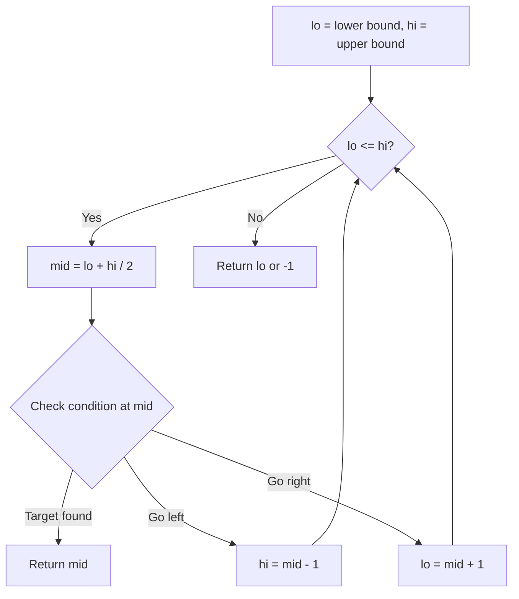
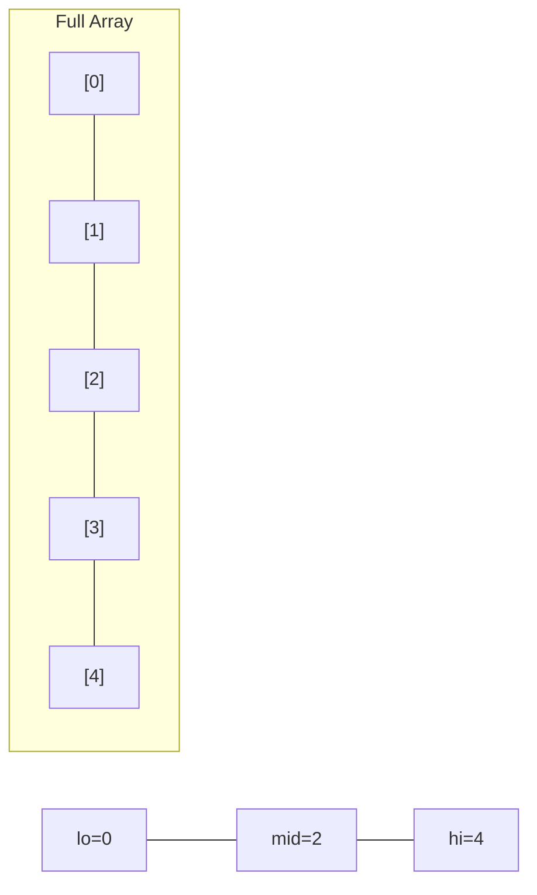
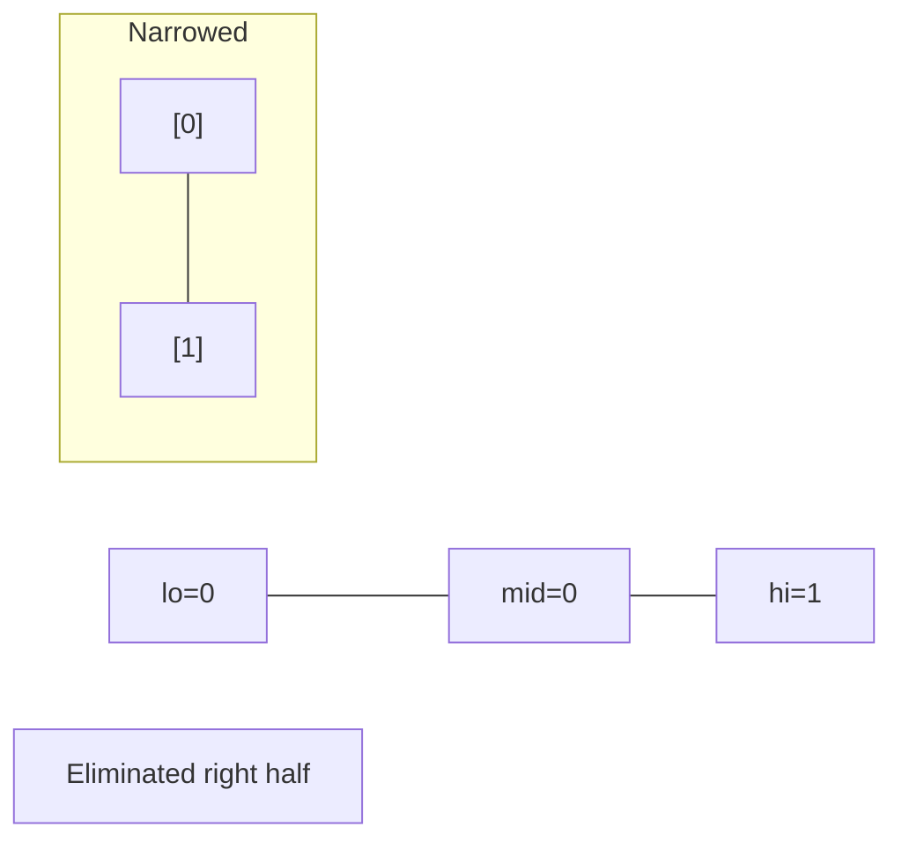
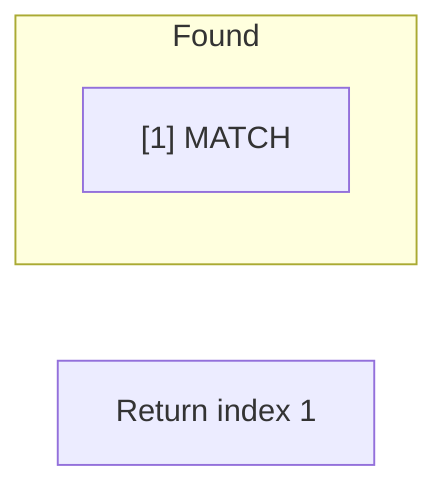

# Problem 981: Time Based Key-Value Store

**Difficulty:** Medium  
**Tags:** Hash Table, String, Binary Search, Design  
**Pattern:** Binary Search / Design  
**Link:** [leetcode.com/problems/time-based-key-value-store](https://leetcode.com/problems/time-based-key-value-store/)

## Description

Design a time-based key-value data structure that can store multiple values for the same key at different time stamps and retrieve the key's value at a certain timestamp.

Implement the `TimeMap` class:

	- `TimeMap()` Initializes the object of the data structure.
	- `void set(String key, String value, int timestamp)` Stores the key `key` with the value `value` at the given time `timestamp`.
	- `String get(String key, int timestamp)` Returns a value such that `set` was called previously, with `timestamp_prev <= timestamp`. If there are multiple such values, it returns the value associated with the largest `timestamp_prev`. If there are no values, it returns `""`.

 

Example 1:

```

**Input**
["TimeMap", "set", "get", "get", "set", "get", "get"]
[[], ["foo", "bar", 1], ["foo", 1], ["foo", 3], ["foo", "bar2", 4], ["foo", 4], ["foo", 5]]
**Output**
[null, null, "bar", "bar", null, "bar2", "bar2"]

**Explanation**
TimeMap timeMap = new TimeMap();
timeMap.set("foo", "bar", 1);  // store the key "foo" and value "bar" along with timestamp = 1.
timeMap.get("foo", 1);         // return "bar"
timeMap.get("foo", 3);         // return "bar", since there is no value corresponding to foo at timestamp 3 and timestamp 2, then the only value is at timestamp 1 is "bar".
timeMap.set("foo", "bar2", 4); // store the key "foo" and value "bar2" along with timestamp = 4.
timeMap.get("foo", 4);         // return "bar2"
timeMap.get("foo", 5);         // return "bar2"

```

 

**Constraints:**

	- `1 <= key.length, value.length <= 100`
	- `key` and `value` consist of lowercase English letters and digits.
	- `1 <= timestamp <= 10^7`
	- All the timestamps `timestamp` of `set` are strictly increasing.
	- At most `2 * 10^5` calls will be made to `set` and `get`.

## Approach: Binary Search / Design

Store (timestamp, value) pairs sorted by timestamp. Binary search for largest timestamp <= query.

## Pseudocode

```
1. lo = lower_bound, hi = upper_bound
2. While lo <= hi (or lo < hi):
   a. mid = (lo + hi) // 2
   b. If condition(mid) is satisfied: record answer, search left half
   c. Else: search right half
3. Return answer
```

## Algorithm Flow



## Visual State Transitions

**Binary Search Step-by-Step:**

**Frame 1: Initial search space**


**Frame 2: Compare mid, narrow search**


**Frame 3: Found target**



## Complexity Analysis

- **Time:** O(log n) get, O(1) set
- **Space:** O(n)

## Solution (Python3)

```python
class TimeMap:
    def __init__(self):
        self.store = {}

    def set(self, key: str, value: str, timestamp: int) -> None:
        if key not in self.store:
            self.store[key] = []
        self.store[key].append((timestamp, value))

    def get(self, key: str, timestamp: int) -> str:
        if key not in self.store:
            return ''
        vals = self.store[key]
        lo, hi = 0, len(vals) - 1
        result = ''
        while lo <= hi:
            mid = (lo + hi) // 2
            if vals[mid][0] <= timestamp:
                result = vals[mid][1]
                lo = mid + 1
            else:
                hi = mid - 1
        return result
```

## Solution (C++)

```cpp
#include <string>
#include <vector>
using namespace std;

class TimeMap {
public:
    TimeMap() {
        // Initialize
    }

    void set(string& key, string& value, int timestamp) {
        return ;
    }

    string get(string& key, int timestamp) {
        return "";
    }

};
```
