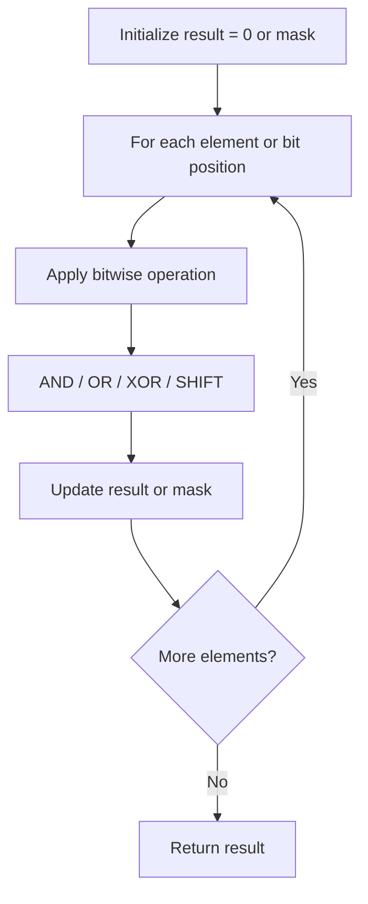

# Problem 982: Triples with Bitwise AND Equal To Zero

**Difficulty:** Hard  
**Tags:** Array, Hash Table, Bit Manipulation  
**Pattern:** Bit Manipulation  
**Link:** [leetcode.com/problems/triples-with-bitwise-and-equal-to-zero](https://leetcode.com/problems/triples-with-bitwise-and-equal-to-zero/)

## Description

Given an integer array nums, return *the number of **AND triples***.

An **AND triple** is a triple of indices `(i, j, k)` such that:

	- `0 <= i < nums.length`
	- `0 <= j < nums.length`
	- `0 <= k < nums.length`
	- `nums[i] & nums[j] & nums[k] == 0`, where `&` represents the bitwise-AND operator.

 

Example 1:

```

**Input:** nums = [2,1,3]
**Output:** 12
**Explanation:** We could choose the following i, j, k triples:
(i=0, j=0, k=1) : 2 & 2 & 1
(i=0, j=1, k=0) : 2 & 1 & 2
(i=0, j=1, k=1) : 2 & 1 & 1
(i=0, j=1, k=2) : 2 & 1 & 3
(i=0, j=2, k=1) : 2 & 3 & 1
(i=1, j=0, k=0) : 1 & 2 & 2
(i=1, j=0, k=1) : 1 & 2 & 1
(i=1, j=0, k=2) : 1 & 2 & 3
(i=1, j=1, k=0) : 1 & 1 & 2
(i=1, j=2, k=0) : 1 & 3 & 2
(i=2, j=0, k=1) : 3 & 2 & 1
(i=2, j=1, k=0) : 3 & 1 & 2

```

Example 2:

```

**Input:** nums = [0,0,0]
**Output:** 27

```

 

**Constraints:**

	- `1 <= nums.length <= 1000`
	- `0 <= nums[i] < 2^16`

## Approach: Bit Manipulation

Operate on individual bits using bitwise operators (AND, OR, XOR, shift). Common tricks: x & (x-1) removes lowest set bit, x ^ x = 0, XOR all elements to find unique.

## Pseudocode

```
1. Apply bitwise operations:
   - XOR all elements to cancel paired bits
   - Use bitmask to track state
   - Shift and mask to extract/set individual bits
2. Return result
```

## Algorithm Flow



## Complexity Analysis

- **Time:** O(n) or O(log n)
- **Space:** O(1)

## Solution (Python3)

```python
class Solution:
    def countTriplets(self, nums: List[int]) -> int:
        # Bit manipulation - O(n) time, O(1) space
        result = 0
        for val in nums:
            result ^= val
        return result
```

## Solution (C++)

```cpp
#include <string>
#include <vector>
using namespace std;

class Solution {
public:
    int countTriplets(vector<int>& nums) {
        // Bit manipulation - O(n) time, O(1) space
        int result = 0;
        for (int val : nums) {
            result ^= val;
        }
        return result;
    }
};
```
