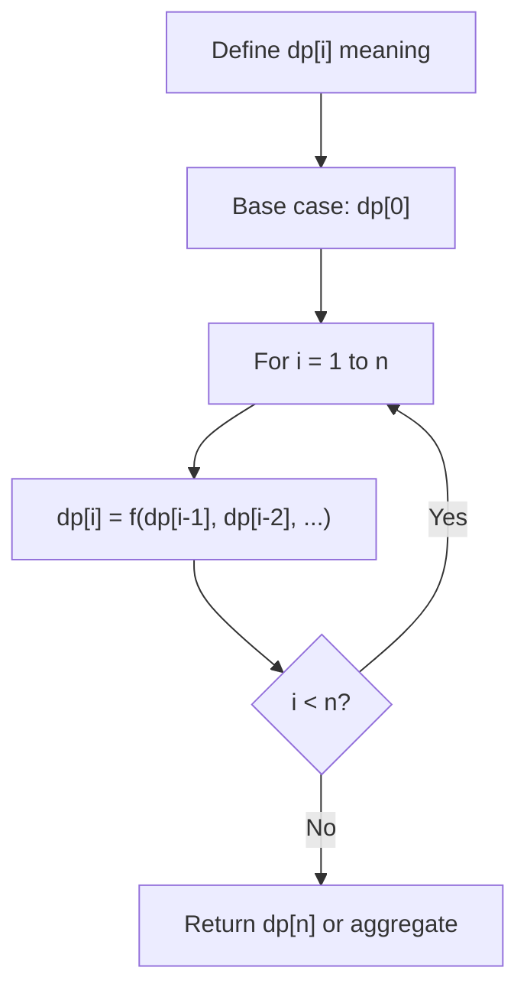
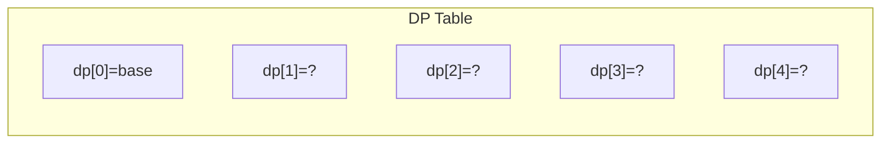
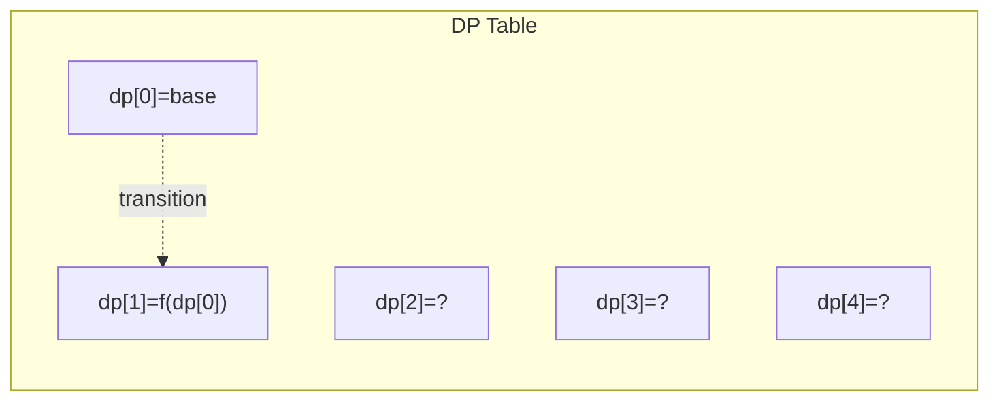
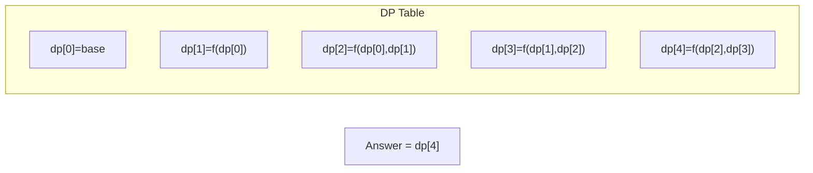

# Problem 983: Minimum Cost For Tickets

**Difficulty:** Medium  
**Tags:** Array, Dynamic Programming  
**Pattern:** Dynamic Programming (1D)  
**Link:** [leetcode.com/problems/minimum-cost-for-tickets](https://leetcode.com/problems/minimum-cost-for-tickets/)

## Description

You have planned some train traveling one year in advance. The days of the year in which you will travel are given as an integer array `days`. Each day is an integer from `1` to `365`.

Train tickets are sold in **three different ways**:

	- a **1-day** pass is sold for `costs[0]` dollars,
	- a **7-day** pass is sold for `costs[1]` dollars, and
	- a **30-day** pass is sold for `costs[2]` dollars.

The passes allow that many days of consecutive travel.

	- For example, if we get a **7-day** pass on day `2`, then we can travel for `7` days: `2`, `3`, `4`, `5`, `6`, `7`, and `8`.

Return *the minimum number of dollars you need to travel every day in the given list of days*.

 

Example 1:

```

**Input:** days = [1,4,6,7,8,20], costs = [2,7,15]
**Output:** 11
**Explanation:** For example, here is one way to buy passes that lets you travel your travel plan:
On day 1, you bought a 1-day pass for costs[0] = $2, which covered day 1.
On day 3, you bought a 7-day pass for costs[1] = $7, which covered days 3, 4, ..., 9.
On day 20, you bought a 1-day pass for costs[0] = $2, which covered day 20.
In total, you spent $11 and covered all the days of your travel.

```

Example 2:

```

**Input:** days = [1,2,3,4,5,6,7,8,9,10,30,31], costs = [2,7,15]
**Output:** 17
**Explanation:** For example, here is one way to buy passes that lets you travel your travel plan:
On day 1, you bought a 30-day pass for costs[2] = $15 which covered days 1, 2, ..., 30.
On day 31, you bought a 1-day pass for costs[0] = $2 which covered day 31.
In total, you spent $17 and covered all the days of your travel.

```

 

**Constraints:**

	- `1 <= days.length <= 365`
	- `1 <= days[i] <= 365`
	- `days` is in strictly increasing order.
	- `costs.length == 3`
	- `1 <= costs[i] <= 1000`

## Approach: Dynamic Programming (1D)

Break the problem into overlapping subproblems. Define dp[i] as the optimal value for the subproblem ending at or considering index i. Build the solution bottom-up, using previously computed dp values.

## Pseudocode

```
1. Define dp[i] = optimal value for subproblem i
2. Base case: dp[0] = initial value
3. For i from 1 to n:
   a. dp[i] = recurrence(dp[i-1], dp[i-2], ...)
4. Return dp[n] or max/min of dp
```

## Algorithm Flow



## Visual State Transitions

**1D Dynamic Programming Table Build:**

**Frame 1: Initialize base cases**


**Frame 2: Fill dp[1] from dp[0]**


**Frame 3: Fill remaining cells**



## Complexity Analysis

- **Time:** O(n)
- **Space:** O(n)

## Solution (Python3)

```python
class Solution:
    def mincostTickets(self, days: List[int], costs: List[int]) -> int:
        # Dynamic programming (1D) - O(n) time, O(n) space
        if not days:
            return 0
        n = len(days) if isinstance(days, list) else days
        dp = [0] * (n + 1)
        dp[0] = 1  # base case
        for i in range(1, n + 1):
            dp[i] = dp[i-1]  # transition (customize per problem)
            if i >= 2:
                dp[i] += dp[i-2]
        return dp[n]
```

## Solution (C++)

```cpp
#include <string>
#include <vector>
using namespace std;

class Solution {
public:
    int mincostTickets(vector<int>& days, vector<int>& costs) {
        // Dynamic programming (1D) - O(n) time, O(n) space
        int n = days;
        if (n <= 0) return 0;
        vector<int> dp(n + 1, 0);
        dp[0] = 1;
        for (int i = 1; i <= n; i++) {
            dp[i] = dp[i-1];
            if (i >= 2) dp[i] += dp[i-2];
        }
        return dp[n];
    }
};
```
