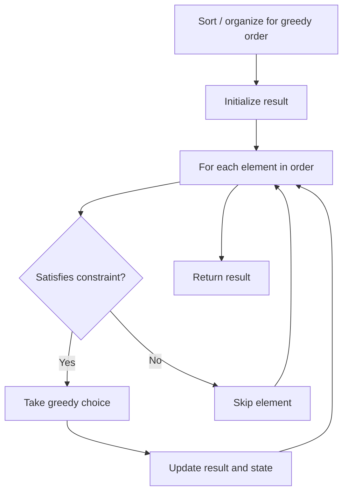

# Problem 984: String Without AAA or BBB

**Difficulty:** Medium  
**Tags:** String, Greedy  
**Pattern:** Greedy  
**Link:** [leetcode.com/problems/string-without-aaa-or-bbb](https://leetcode.com/problems/string-without-aaa-or-bbb/)

## Description

Given two integers `a` and `b`, return **any** string `s` such that:

	- `s` has length `a + b` and contains exactly `a` `'a'` letters, and exactly `b` `'b'` letters,
	- The substring `'aaa'` does not occur in `s`, and
	- The substring `'bbb'` does not occur in `s`.

 

Example 1:

```

**Input:** a = 1, b = 2
**Output:** "abb"
**Explanation:** "abb", "bab" and "bba" are all correct answers.

```

Example 2:

```

**Input:** a = 4, b = 1
**Output:** "aabaa"

```

 

**Constraints:**

	- `0 <= a, b <= 100`
	- It is guaranteed such an `s` exists for the given `a` and `b`.

## Approach: Greedy

Make the locally optimal choice at each step, trusting it leads to a global optimum. Greedy works when the problem has the greedy-choice property and optimal substructure.

## Pseudocode

```
1. Sort or organize data for greedy ordering
2. Initialize result
3. For each element in greedy order:
   a. If element satisfies constraint:
      - Take the greedy choice
      - Update result and state
4. Return result
```

## Algorithm Flow



## Complexity Analysis

- **Time:** O(n log n)
- **Space:** O(1)

## Solution (Python3)

```python
class Solution:
    def strWithout3a3b(self, a: int, b: int) -> str:
        # Greedy approach - O(n) time
        result = 0
        curr_max = 0
        for i in range(len(a)):
            if isinstance(a[i], int):
                curr_max = max(curr_max, a[i])
                result = max(result, curr_max)
            else:
                result += 1
        return result
```

## Solution (C++)

```cpp
#include <algorithm>
#include <string>
#include <vector>
using namespace std;

class Solution {
public:
    string strWithout3a3b(int a, int b) {
        // Greedy approach - O(n) time
        int result = 0, curr_max = 0;
        for (int i = 0; i < (int)a.size(); i++) {
            curr_max = max(curr_max, a[i]);
            result = max(result, curr_max);
        }
        return result;
    }
};
```
