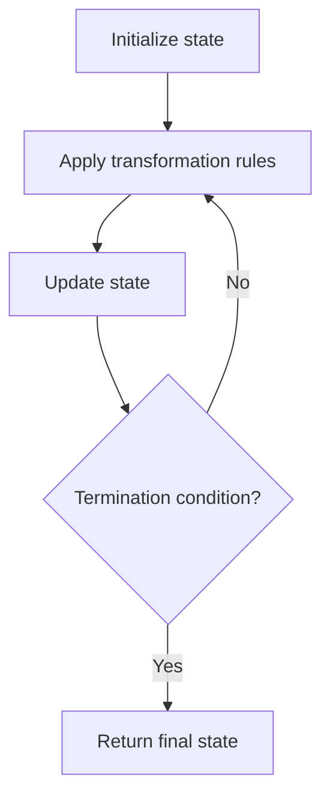

# Problem 985: Sum of Even Numbers After Queries

**Difficulty:** Medium  
**Tags:** Array, Simulation  
**Pattern:** Simulation  
**Link:** [leetcode.com/problems/sum-of-even-numbers-after-queries](https://leetcode.com/problems/sum-of-even-numbers-after-queries/)

## Description

You are given an integer array `nums` and an array `queries` where `queries[i] = [vali, indexi]`.

For each query `i`, first, apply `nums[indexi] = nums[indexi] + vali`, then print the sum of the even values of `nums`.

Return *an integer array *`answer`* where *`answer[i]`* is the answer to the *`i^th`* query*.

 

Example 1:

```

**Input:** nums = [1,2,3,4], queries = [[1,0],[-3,1],[-4,0],[2,3]]
**Output:** [8,6,2,4]
**Explanation:** At the beginning, the array is [1,2,3,4].
After adding 1 to nums[0], the array is [2,2,3,4], and the sum of even values is 2 + 2 + 4 = 8.
After adding -3 to nums[1], the array is [2,-1,3,4], and the sum of even values is 2 + 4 = 6.
After adding -4 to nums[0], the array is [-2,-1,3,4], and the sum of even values is -2 + 4 = 2.
After adding 2 to nums[3], the array is [-2,-1,3,6], and the sum of even values is -2 + 6 = 4.

```

Example 2:

```

**Input:** nums = [1], queries = [[4,0]]
**Output:** [0]

```

 

**Constraints:**

	- `1 <= nums.length <= 10^4`
	- `-10^4 <= nums[i] <= 10^4`
	- `1 <= queries.length <= 10^4`
	- `-10^4 <= vali <= 10^4`
	- `0 <= indexi < nums.length`

## Approach: Simulation

Simulate the process described in the problem step by step. Follow the rules exactly, tracking state at each step.

## Pseudocode

```
1. Initialize state (grid, pointers, counters)
2. For each step / iteration:
   a. Apply the transformation rules
   b. Update state
   c. Check termination condition
3. Return final state or result
```

## Algorithm Flow



## Complexity Analysis

- **Time:** O(n) or O(n * k)
- **Space:** O(n)

## Solution (Python3)

```python
class Solution:
    def sumEvenAfterQueries(self, nums: List[int], queries: List[List[int]]) -> List[int]:
        # Simulation approach - follow the rules step by step
        result = []
        for i in range(len(nums) if isinstance(nums, list) else nums):
            # Simulate each step
            pass
        return result
```

## Solution (C++)

```cpp
#include <string>
#include <vector>
using namespace std;

class Solution {
public:
    vector<int> sumEvenAfterQueries(vector<int>& nums, vector<vector<int>>& queries) {
        // Simulation approach
        int n = nums.size();
        for (int i = 0; i < n; i++) {
            // Simulate each step
        }
        return {};
    }
};
```
