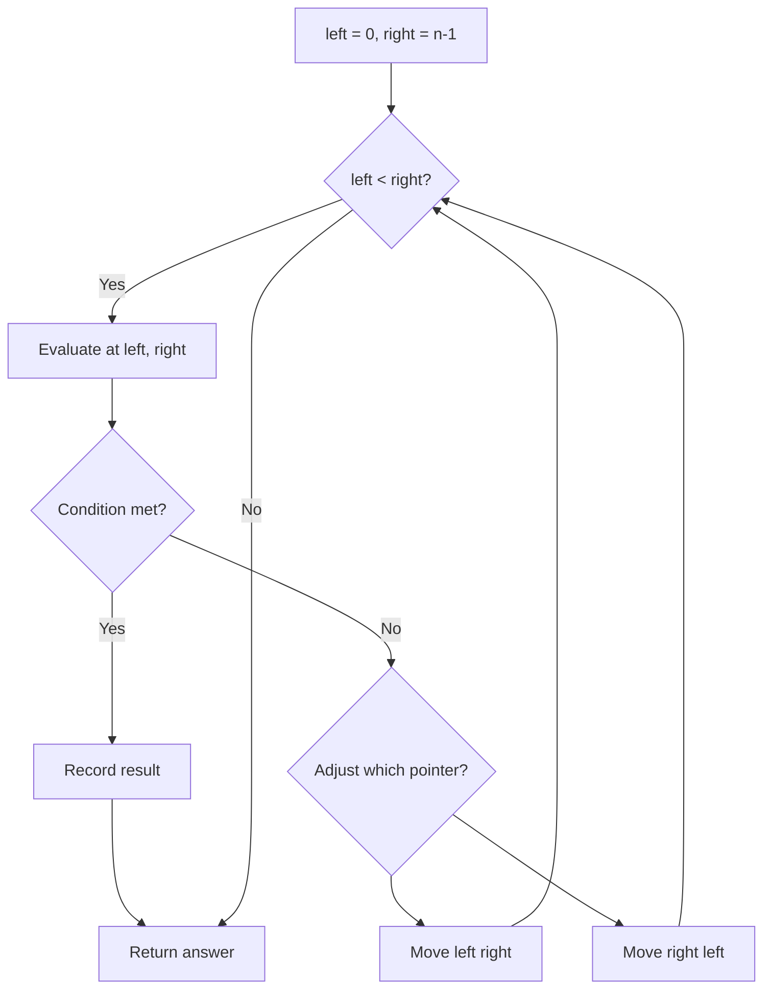
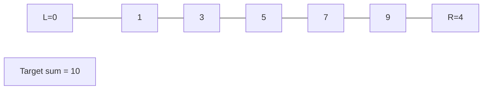
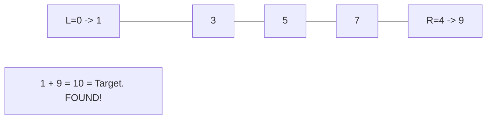

# Problem 986: Interval List Intersections

**Difficulty:** Medium  
**Tags:** Array, Two Pointers, Sweep Line  
**Pattern:** Two Pointers  
**Link:** [leetcode.com/problems/interval-list-intersections](https://leetcode.com/problems/interval-list-intersections/)

## Description

You are given two lists of closed intervals, `firstList` and `secondList`, where `firstList[i] = [starti, endi]` and `secondList[j] = [startj, endj]`. Each list of intervals is pairwise **disjoint** and in **sorted order**.

Return *the intersection of these two interval lists*.

A **closed interval** `[a, b]` (with `a <= b`) denotes the set of real numbers `x` with `a <= x <= b`.

The **intersection** of two closed intervals is a set of real numbers that are either empty or represented as a closed interval. For example, the intersection of `[1, 3]` and `[2, 4]` is `[2, 3]`.

 

Example 1:

```

**Input:** firstList = [[0,2],[5,10],[13,23],[24,25]], secondList = [[1,5],[8,12],[15,24],[25,26]]
**Output:** [[1,2],[5,5],[8,10],[15,23],[24,24],[25,25]]

```

Example 2:

```

**Input:** firstList = [[1,3],[5,9]], secondList = []
**Output:** []

```

 

**Constraints:**

	- `0 <= firstList.length, secondList.length <= 1000`
	- `firstList.length + secondList.length >= 1`
	- `0 <= starti < endi <= 10^9`
	- `endi < starti+1`
	- `0 <= startj < endj <= 10^9 `
	- `endj < startj+1`

## Approach: Two Pointers

Use two pointers moving through the data structure. Depending on the problem, pointers may move toward each other (converging), in the same direction (fast/slow), or independently.

## Pseudocode

```
1. Initialize left = 0, right = n-1 (or two independent pointers)
2. While pointers haven't crossed:
   a. Evaluate condition at pointer positions
   b. Move left pointer right or right pointer left
3. Return result
```

## Algorithm Flow



## Visual State Transitions

**Two Pointer Convergence:**

**Frame 1: Initialize pointers**


**Frame 2: Sum = 1+9 = 10, found!**



## Complexity Analysis

- **Time:** O(n)
- **Space:** O(1)

## Solution (Python3)

```python
class Solution:
    def intervalIntersection(self, firstList: List[List[int]], secondList: List[List[int]]) -> List[List[int]]:
        # Two pointer approach - O(n) time, O(1) space
        left, right = 0, len(firstList) - 1
        while left < right:
            curr = firstList[left] + firstList[right]
            if curr == secondList:
                return [left, right]
            elif curr < secondList:
                left += 1
            else:
                right -= 1
        return []
```

## Solution (C++)

```cpp
#include <string>
#include <vector>
using namespace std;

class Solution {
public:
    vector<vector<int>> intervalIntersection(vector<vector<int>>& firstList, vector<vector<int>>& secondList) {
        // Two pointer approach - O(n) time, O(1) space
        int left = 0, right = firstList.size() - 1;
        while (left < right) {
            int curr = firstList[left] + firstList[right];
            if (curr == secondList) {
                return {left, right};
            } else if (curr < secondList) {
                left++;
            } else {
                right--;
            }
        }
        return {};
    }
};
```
