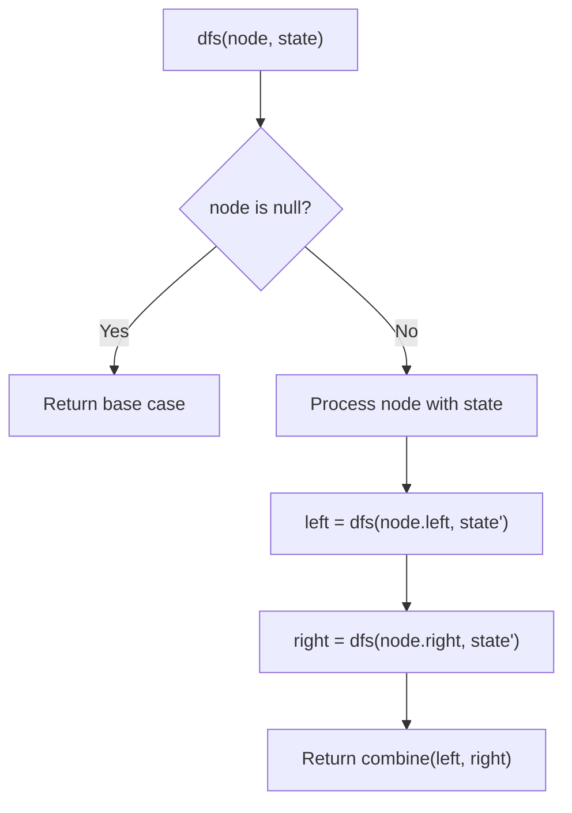
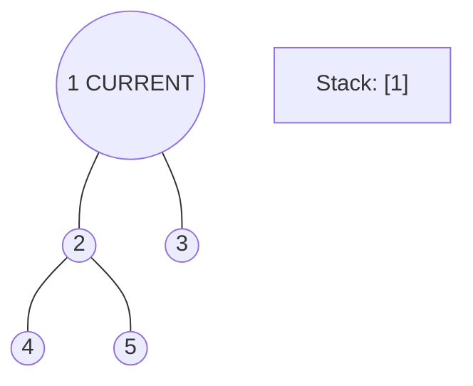
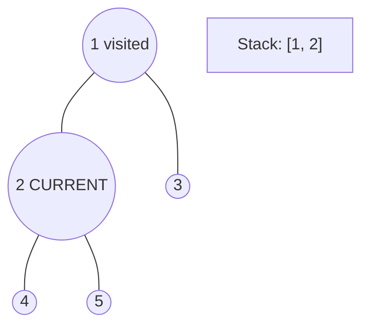
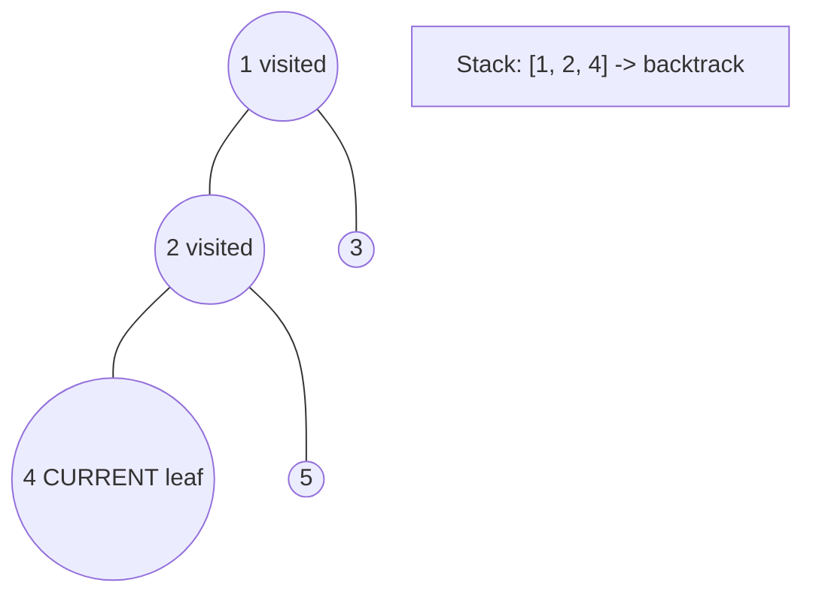
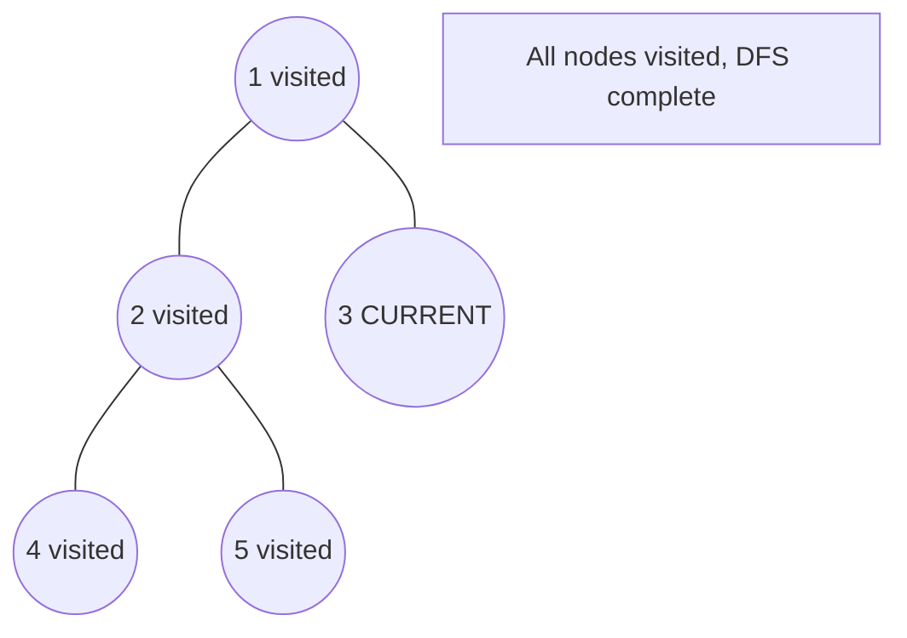

# Problem 987: Vertical Order Traversal of a Binary Tree

**Difficulty:** Hard  
**Tags:** Hash Table, Tree, Depth-First Search, Breadth-First Search, Sorting, Binary Tree  
**Pattern:** DFS Tree Traversal  
**Link:** [leetcode.com/problems/vertical-order-traversal-of-a-binary-tree](https://leetcode.com/problems/vertical-order-traversal-of-a-binary-tree/)

## Description

Given the `root` of a binary tree, calculate the **vertical order traversal** of the binary tree.

For each node at position `(row, col)`, its left and right children will be at positions `(row + 1, col - 1)` and `(row + 1, col + 1)` respectively. The root of the tree is at `(0, 0)`.

The **vertical order traversal** of a binary tree is a list of top-to-bottom orderings for each column index starting from the leftmost column and ending on the rightmost column. There may be multiple nodes in the same row and same column. In such a case, sort these nodes by their values.

Return *the **vertical order traversal** of the binary tree*.

 

Example 1:

```

**Input:** root = [3,9,20,null,null,15,7]
**Output:** [[9],[3,15],[20],[7]]
**Explanation:**
Column -1: Only node 9 is in this column.
Column 0: Nodes 3 and 15 are in this column in that order from top to bottom.
Column 1: Only node 20 is in this column.
Column 2: Only node 7 is in this column.
```

Example 2:

```

**Input:** root = [1,2,3,4,5,6,7]
**Output:** [[4],[2],[1,5,6],[3],[7]]
**Explanation:**
Column -2: Only node 4 is in this column.
Column -1: Only node 2 is in this column.
Column 0: Nodes 1, 5, and 6 are in this column.
          1 is at the top, so it comes first.
          5 and 6 are at the same position (2, 0), so we order them by their value, 5 before 6.
Column 1: Only node 3 is in this column.
Column 2: Only node 7 is in this column.

```

Example 3:

```

**Input:** root = [1,2,3,4,6,5,7]
**Output:** [[4],[2],[1,5,6],[3],[7]]
**Explanation:**
This case is the exact same as example 2, but with nodes 5 and 6 swapped.
Note that the solution remains the same since 5 and 6 are in the same location and should be ordered by their values.

```

 

**Constraints:**

	- The number of nodes in the tree is in the range `[1, 1000]`.
	- `0 <= Node.val <= 1000`

## Approach: DFS Tree Traversal

Perform depth-first search on the tree. Recurse on left and right subtrees, combining results bottom-up. Track state (path, depth, sum) during traversal.

## Pseudocode

```
1. Define dfs(node, state):
   a. Base case: if null, return default
   b. Process node with current state
   c. left_result = dfs(node.left, updated_state)
   d. right_result = dfs(node.right, updated_state)
   e. Return combine(left_result, right_result)
2. Return dfs(root, initial_state)
```

## Algorithm Flow



## Visual State Transitions

**DFS Tree Traversal Step-by-Step:**

**Frame 1: Start at root**


**Frame 2: Go left - visit node 2**


**Frame 3: Go left - visit node 4 (leaf)**


**Frame 4: Backtrack, visit node 5, then node 3**



## Complexity Analysis

- **Time:** O(n)
- **Space:** O(h)

## Solution (Python3)

```python
class Solution:
    def verticalTraversal(self, root: Optional[TreeNode]) -> List[List[int]]:
        # DFS on binary tree - O(n) time, O(h) space
        def dfs(node):
            if not node:
                return 0
            left = dfs(node.left)
            right = dfs(node.right)
            return 1 + max(left, right)
        
        result = dfs(root)
        return result
```

## Solution (C++)

```cpp
#include <algorithm>
#include <functional>
#include <string>
#include <vector>
using namespace std;

class Solution {
public:
    vector<vector<int>> verticalTraversal(TreeNode* root) {
        // DFS on binary tree - O(n) time, O(h) space
        function<int(TreeNode*)> dfs = [&](TreeNode* node) -> int {
            if (!node) return 0;
            int left = dfs(node->left);
            int right = dfs(node->right);
            return 1 + max(left, right);
        };
        return dfs(root);
    }
};
```
