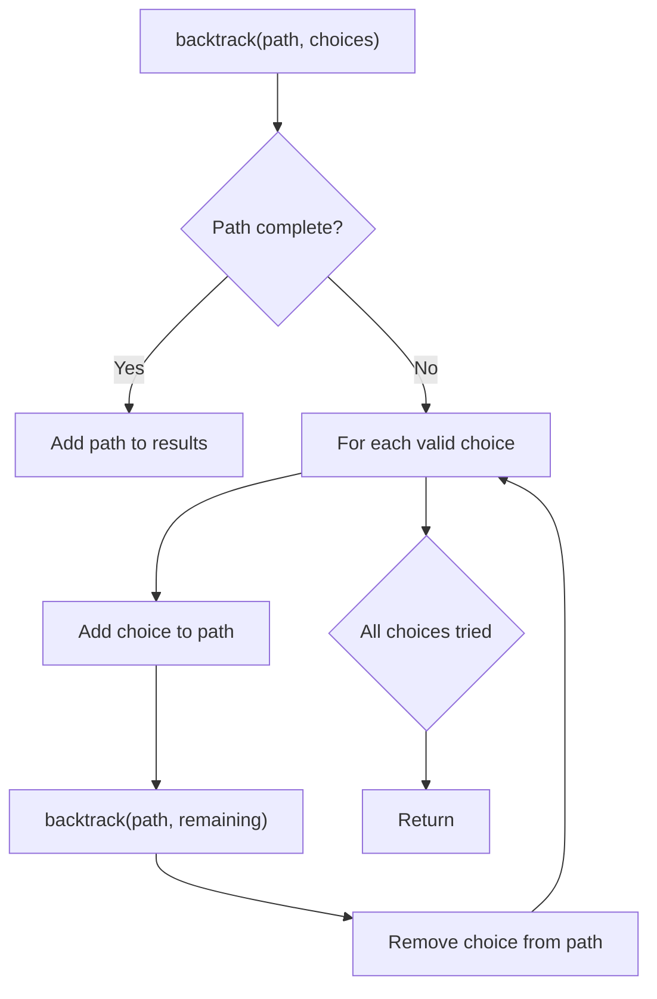
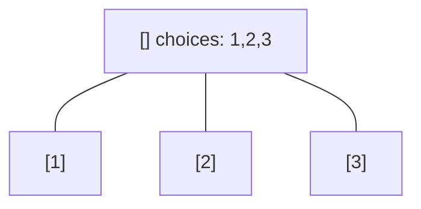
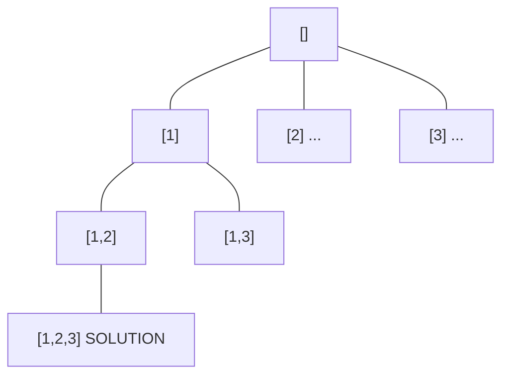
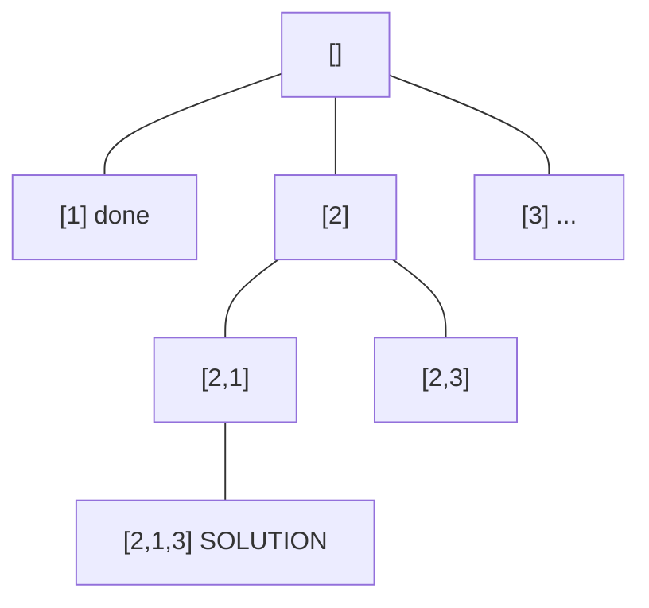
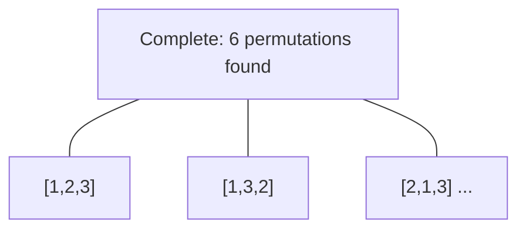

# Problem 988: Smallest String Starting From Leaf

**Difficulty:** Medium  
**Tags:** String, Backtracking, Tree, Depth-First Search, Binary Tree  
**Pattern:** Backtracking  
**Link:** [leetcode.com/problems/smallest-string-starting-from-leaf](https://leetcode.com/problems/smallest-string-starting-from-leaf/)

## Description

You are given the `root` of a binary tree where each node has a value in the range `[0, 25]` representing the letters `'a'` to `'z'`.

Return *the **lexicographically smallest** string that starts at a leaf of this tree and ends at the root*.

As a reminder, any shorter prefix of a string is **lexicographically smaller**.

	- For example, `"ab"` is lexicographically smaller than `"aba"`.

A leaf of a node is a node that has no children.

 

Example 1:

```

**Input:** root = [0,1,2,3,4,3,4]
**Output:** "dba"

```

Example 2:

```

**Input:** root = [25,1,3,1,3,0,2]
**Output:** "adz"

```

Example 3:

```

**Input:** root = [2,2,1,null,1,0,null,0]
**Output:** "abc"

```

 

**Constraints:**

	- The number of nodes in the tree is in the range `[1, 8500]`.
	- `0 <= Node.val <= 25`

## Approach: Backtracking

Explore all possible solutions by building candidates incrementally. At each step, make a choice and recurse. If the choice leads to a dead end, undo the choice (backtrack) and try the next option.

## Pseudocode

```
1. Define backtrack(path, choices):
   a. If path is a complete solution: add to results
   b. For each choice in choices:
      - If choice is valid:
        * Add choice to path
        * backtrack(path, remaining_choices)
        * Remove choice from path (backtrack)
2. Call backtrack([], all_choices)
```

## Algorithm Flow



## Visual State Transitions

**Backtracking Decision Tree:**

**Frame 1: Root - start with empty path**


**Frame 2: Explore branch [1]**


**Frame 3: Backtrack, explore [2]**


**Frame 4: All solutions found**



## Complexity Analysis

- **Time:** O(k^n) or O(n!)
- **Space:** O(n)

## Solution (Python3)

```python
class Solution:
    def smallestFromLeaf(self, root: Optional[TreeNode]) -> str:
        # Backtracking - O(2^n) or O(n!) time
        result = []
        
        def backtrack(path, start):
            result.append(path[:])
            for i in range(start, len(root)):
                path.append(root[i])
                backtrack(path, i + 1)
                path.pop()
        
        backtrack([], 0)
        return result
```

## Solution (C++)

```cpp
#include <functional>
#include <string>
#include <vector>
using namespace std;

class Solution {
public:
    string smallestFromLeaf(TreeNode* root) {
        // Backtracking - O(2^n) or O(n!) time
        vector<vector<int>> result;
        vector<int> path;
        function<void(int)> backtrack = [&](int start) {
            result.push_back(path);
            for (int i = start; i < (int)root.size(); i++) {
                path.push_back(root[i]);
                backtrack(i + 1);
                path.pop_back();
            }
        };
        backtrack(0);
        return result;
    }
};
```
