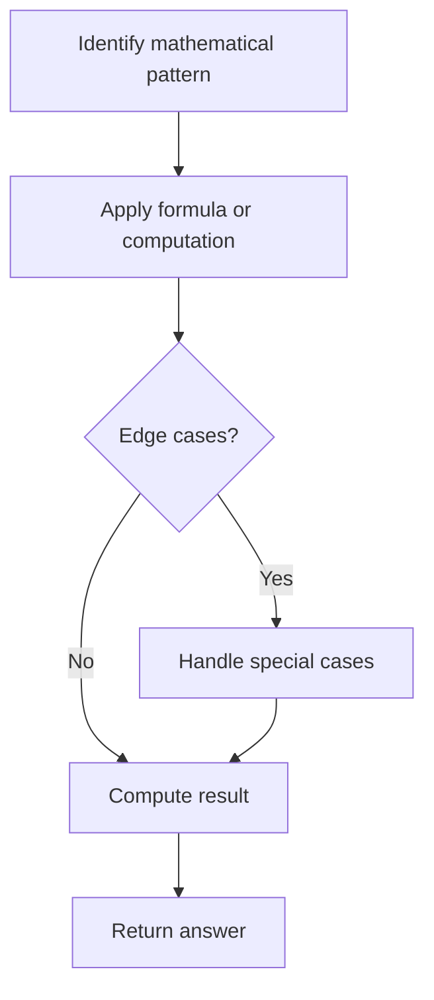

# Problem 989: Add to Array-Form of Integer

**Difficulty:** Easy  
**Tags:** Array, Math  
**Pattern:** Math  
**Link:** [leetcode.com/problems/add-to-array-form-of-integer](https://leetcode.com/problems/add-to-array-form-of-integer/)

## Description

The **array-form** of an integer `num` is an array representing its digits in left to right order.

	- For example, for `num = 1321`, the array form is `[1,3,2,1]`.

Given `num`, the **array-form** of an integer, and an integer `k`, return *the **array-form** of the integer* `num + k`.

 

Example 1:

```

**Input:** num = [1,2,0,0], k = 34
**Output:** [1,2,3,4]
**Explanation:** 1200 + 34 = 1234

```

Example 2:

```

**Input:** num = [2,7,4], k = 181
**Output:** [4,5,5]
**Explanation:** 274 + 181 = 455

```

Example 3:

```

**Input:** num = [2,1,5], k = 806
**Output:** [1,0,2,1]
**Explanation:** 215 + 806 = 1021

```

 

**Constraints:**

	- `1 <= num.length <= 10^4`
	- `0 <= num[i] <= 9`
	- `num` does not contain any leading zeros except for the zero itself.
	- `1 <= k <= 10^4`

## Approach: Math

Apply mathematical properties, formulas, or number-theoretic concepts. Look for patterns, modular arithmetic, or closed-form solutions.

## Pseudocode

```
1. Identify the mathematical pattern or formula
2. Apply computation:
   - Modular arithmetic for large numbers
   - GCD/LCM for divisibility
   - Sieve for primes
3. Handle edge cases
4. Return result
```

## Algorithm Flow



## Complexity Analysis

- **Time:** O(n) or O(sqrt(n))
- **Space:** O(1)

## Solution (Python3)

```python
class Solution:
    def addToArrayForm(self, num: List[int], k: int) -> List[int]:
        # Mathematical approach
        result = 0
        x = num
        while x != 0:
            result = result * 10 + x % 10
            x //= 10 if isinstance(x, int) else 1
        return result
```

## Solution (C++)

```cpp
#include <string>
#include <vector>
using namespace std;

class Solution {
public:
    vector<int> addToArrayForm(vector<int>& num, int k) {
        // Mathematical approach
        long long result = 0;
        int x = num;
        while (x != 0) {
            result = result * 10 + x % 10;
            x /= 10;
        }
        return (int)result;
    }
};
```
