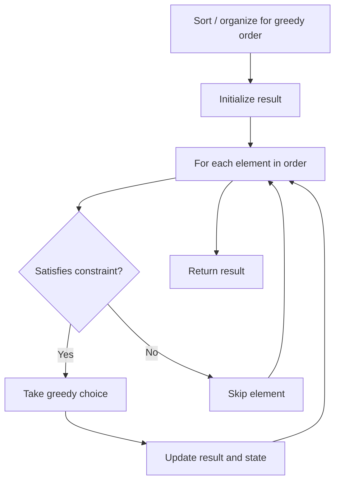

# Problem 991: Broken Calculator

**Difficulty:** Medium  
**Tags:** Math, Greedy  
**Pattern:** Greedy  
**Link:** [leetcode.com/problems/broken-calculator](https://leetcode.com/problems/broken-calculator/)

## Description

There is a broken calculator that has the integer `startValue` on its display initially. In one operation, you can:

	- multiply the number on display by `2`, or
	- subtract `1` from the number on display.

Given two integers `startValue` and `target`, return *the minimum number of operations needed to display *`target`* on the calculator*.

 

Example 1:

```

**Input:** startValue = 2, target = 3
**Output:** 2
**Explanation:** Use double operation and then decrement operation {2 -> 4 -> 3}.

```

Example 2:

```

**Input:** startValue = 5, target = 8
**Output:** 2
**Explanation:** Use decrement and then double {5 -> 4 -> 8}.

```

Example 3:

```

**Input:** startValue = 3, target = 10
**Output:** 3
**Explanation:** Use double, decrement and double {3 -> 6 -> 5 -> 10}.

```

 

**Constraints:**

	- `1 <= startValue, target <= 10^9`

## Approach: Greedy

Make the locally optimal choice at each step, trusting it leads to a global optimum. Greedy works when the problem has the greedy-choice property and optimal substructure.

## Pseudocode

```
1. Sort or organize data for greedy ordering
2. Initialize result
3. For each element in greedy order:
   a. If element satisfies constraint:
      - Take the greedy choice
      - Update result and state
4. Return result
```

## Algorithm Flow



## Complexity Analysis

- **Time:** O(n log n)
- **Space:** O(1)

## Solution (Python3)

```python
class Solution:
    def brokenCalc(self, startValue: int, target: int) -> int:
        # Greedy approach - O(n) time
        result = 0
        curr_max = 0
        for i in range(len(startValue)):
            if isinstance(startValue[i], int):
                curr_max = max(curr_max, startValue[i])
                result = max(result, curr_max)
            else:
                result += 1
        return result
```

## Solution (C++)

```cpp
#include <algorithm>
#include <string>
#include <vector>
using namespace std;

class Solution {
public:
    int brokenCalc(int startValue, int target) {
        // Greedy approach - O(n) time
        int result = 0, curr_max = 0;
        for (int i = 0; i < (int)startValue.size(); i++) {
            curr_max = max(curr_max, startValue[i]);
            result = max(result, curr_max);
        }
        return result;
    }
};
```
