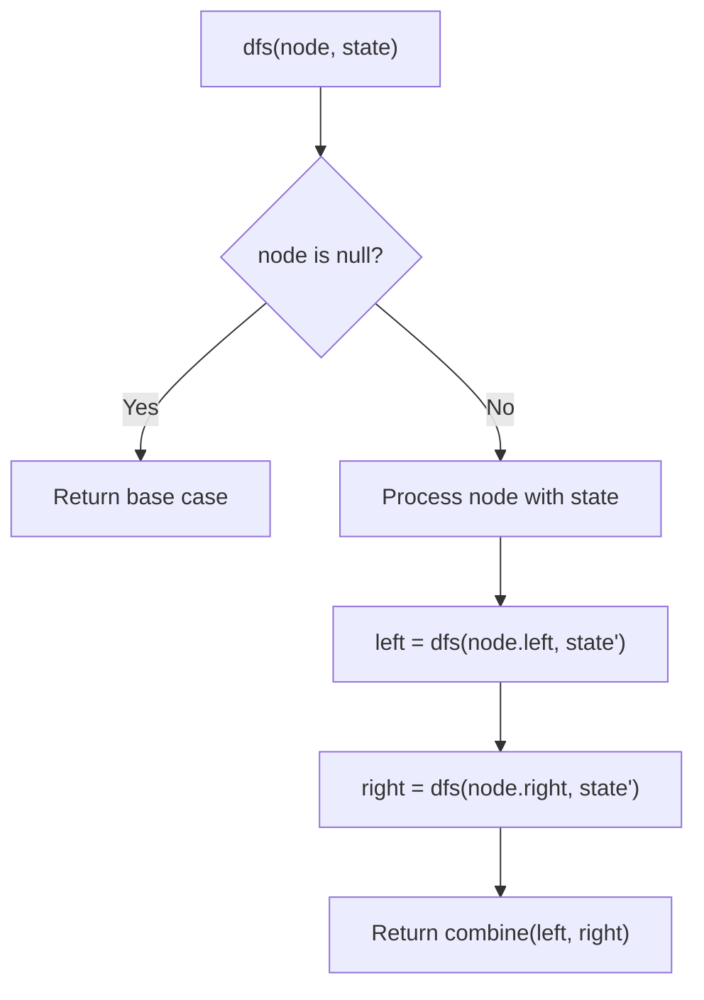
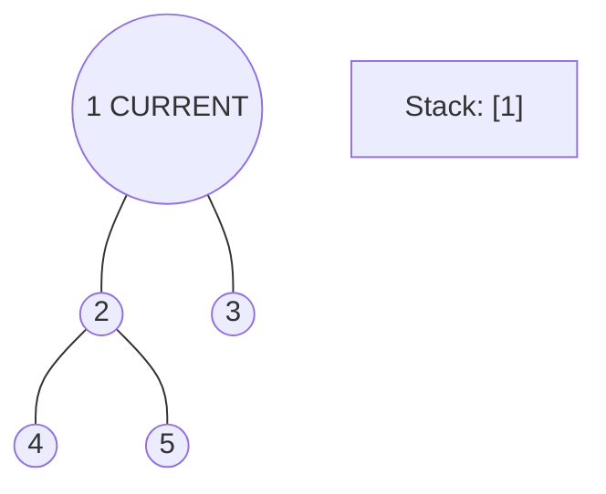
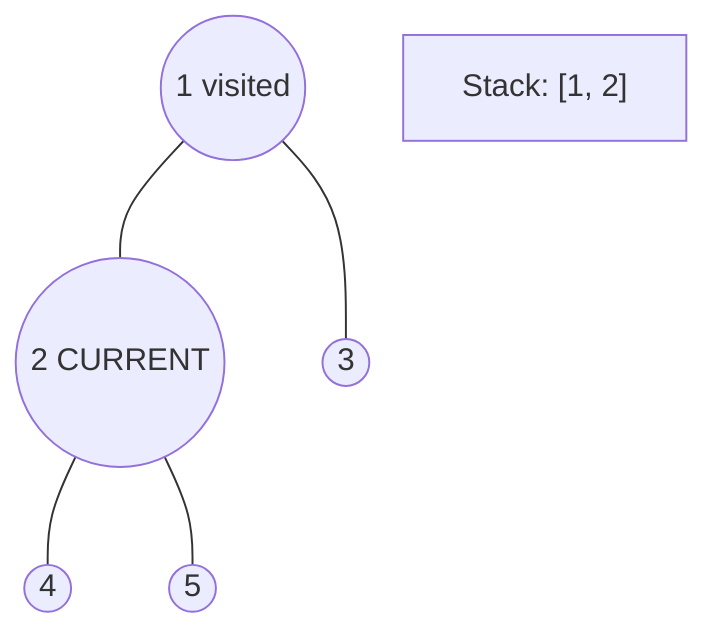
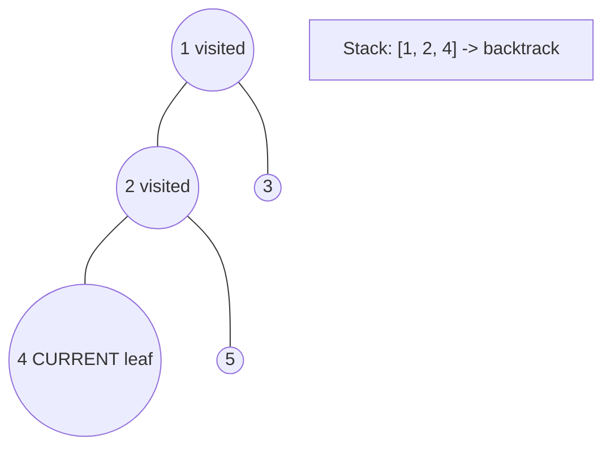
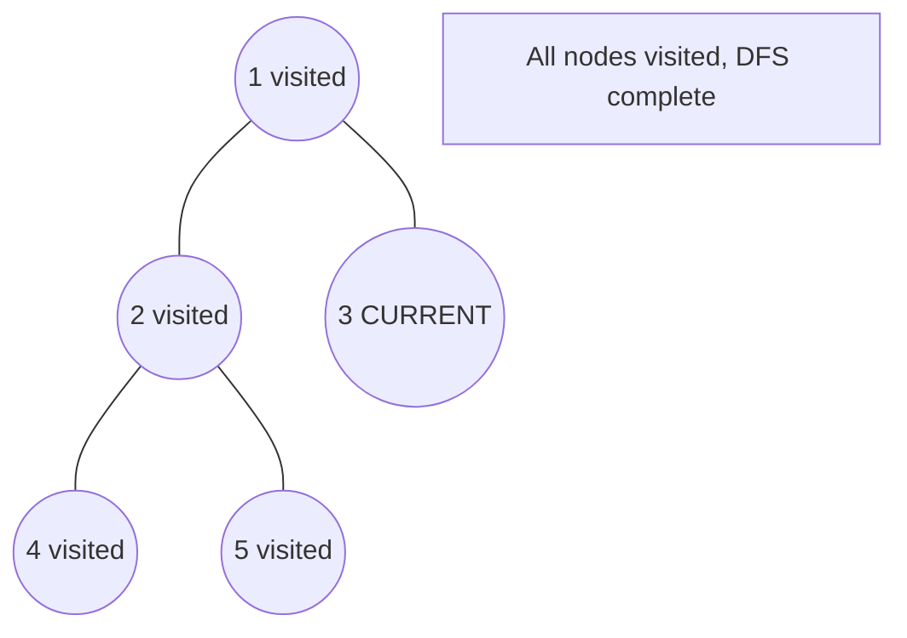

# Problem 993: Cousins in Binary Tree

**Difficulty:** Easy  
**Tags:** Tree, Depth-First Search, Breadth-First Search, Binary Tree  
**Pattern:** DFS Tree Traversal  
**Link:** [leetcode.com/problems/cousins-in-binary-tree](https://leetcode.com/problems/cousins-in-binary-tree/)

## Description

Given the `root` of a binary tree with unique values and the values of two different nodes of the tree `x` and `y`, return `true` *if the nodes corresponding to the values *`x`* and *`y`* in the tree are **cousins**, or *`false`* otherwise.*

Two nodes of a binary tree are **cousins** if they have the same depth with different parents.

Note that in a binary tree, the root node is at the depth `0`, and children of each depth `k` node are at the depth `k + 1`.

 

Example 1:

```

**Input:** root = [1,2,3,4], x = 4, y = 3
**Output:** false

```

Example 2:

```

**Input:** root = [1,2,3,null,4,null,5], x = 5, y = 4
**Output:** true

```

Example 3:

```

**Input:** root = [1,2,3,null,4], x = 2, y = 3
**Output:** false

```

 

**Constraints:**

	- The number of nodes in the tree is in the range `[2, 100]`.
	- `1 <= Node.val <= 100`
	- Each node has a **unique** value.
	- `x != y`
	- `x` and `y` are exist in the tree.

## Approach: DFS Tree Traversal

Perform depth-first search on the tree. Recurse on left and right subtrees, combining results bottom-up. Track state (path, depth, sum) during traversal.

## Pseudocode

```
1. Define dfs(node, state):
   a. Base case: if null, return default
   b. Process node with current state
   c. left_result = dfs(node.left, updated_state)
   d. right_result = dfs(node.right, updated_state)
   e. Return combine(left_result, right_result)
2. Return dfs(root, initial_state)
```

## Algorithm Flow



## Visual State Transitions

**DFS Tree Traversal Step-by-Step:**

**Frame 1: Start at root**


**Frame 2: Go left - visit node 2**


**Frame 3: Go left - visit node 4 (leaf)**


**Frame 4: Backtrack, visit node 5, then node 3**



## Complexity Analysis

- **Time:** O(n)
- **Space:** O(h)

## Solution (Python3)

```python
class Solution:
    def isCousins(self, root: Optional[TreeNode], x: int, y: int) -> bool:
        # DFS on binary tree - O(n) time, O(h) space
        def dfs(node):
            if not node:
                return 0
            left = dfs(node.left)
            right = dfs(node.right)
            return 1 + max(left, right)
        
        result = dfs(root)
        return result
```

## Solution (C++)

```cpp
#include <algorithm>
#include <functional>
#include <string>
#include <vector>
using namespace std;

class Solution {
public:
    bool isCousins(TreeNode* root, int x, int y) {
        // DFS on binary tree - O(n) time, O(h) space
        function<int(TreeNode*)> dfs = [&](TreeNode* node) -> int {
            if (!node) return 0;
            int left = dfs(node->left);
            int right = dfs(node->right);
            return 1 + max(left, right);
        };
        return dfs(root);
    }
};
```
