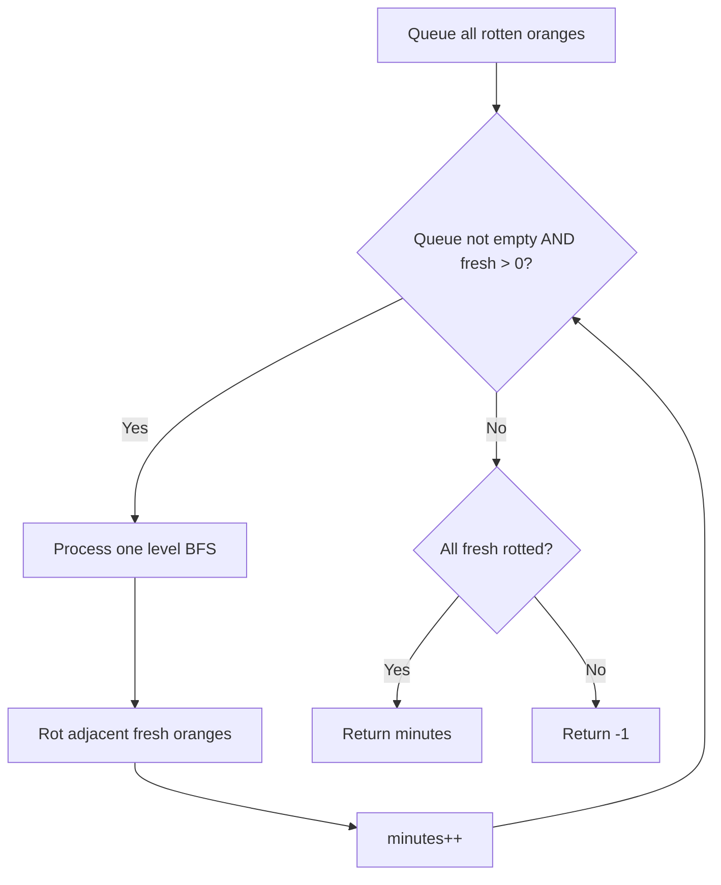
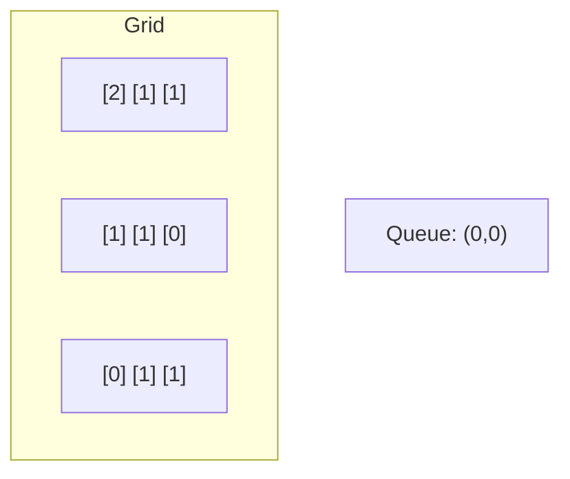
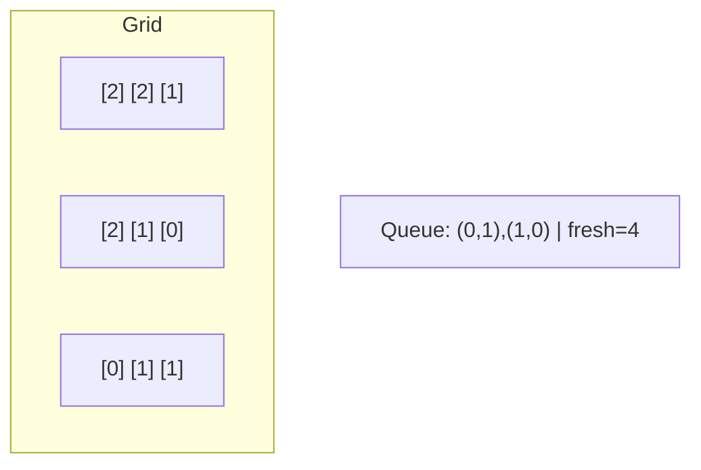
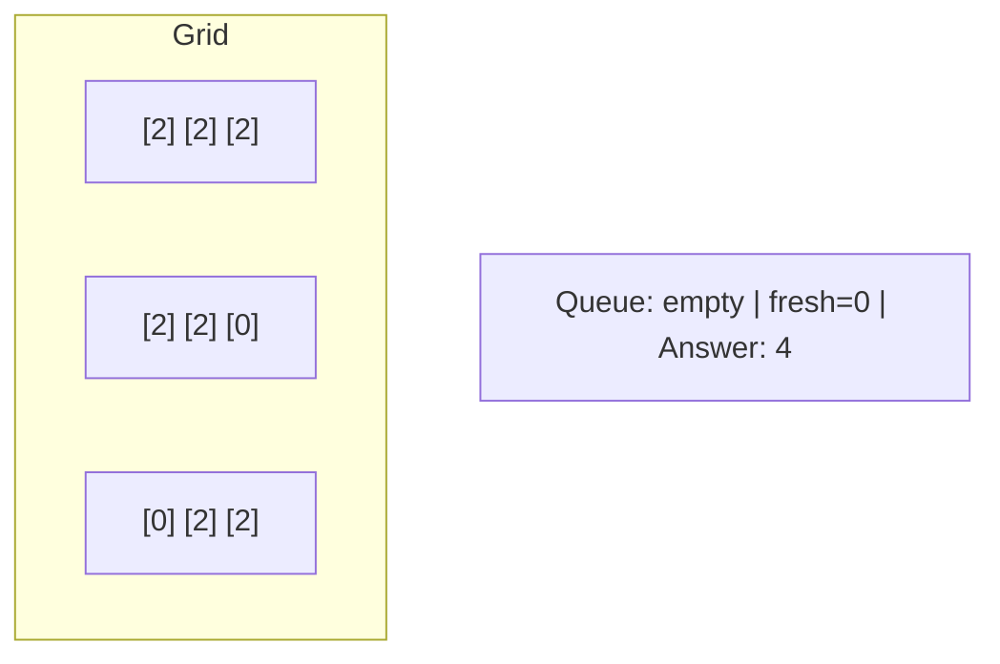

# Problem 994: Rotting Oranges

**Difficulty:** Medium  
**Tags:** Array, Breadth-First Search, Matrix  
**Pattern:** BFS / Graph  
**Link:** [leetcode.com/problems/rotting-oranges](https://leetcode.com/problems/rotting-oranges/)

## Description

You are given an `m x n` `grid` where each cell can have one of three values:

	- `0` representing an empty cell,
	- `1` representing a fresh orange, or
	- `2` representing a rotten orange.

Every minute, any fresh orange that is **4-directionally adjacent** to a rotten orange becomes rotten.

Return *the minimum number of minutes that must elapse until no cell has a fresh orange*. If *this is impossible, return* `-1`.

 

Example 1:

```

**Input:** grid = [[2,1,1],[1,1,0],[0,1,1]]
**Output:** 4

```

Example 2:

```

**Input:** grid = [[2,1,1],[0,1,1],[1,0,1]]
**Output:** -1
**Explanation:** The orange in the bottom left corner (row 2, column 0) is never rotten, because rotting only happens 4-directionally.

```

Example 3:

```

**Input:** grid = [[0,2]]
**Output:** 0
**Explanation:** Since there are already no fresh oranges at minute 0, the answer is just 0.

```

 

**Constraints:**

	- `m == grid.length`
	- `n == grid[i].length`
	- `1 <= m, n <= 10`
	- `grid[i][j]` is `0`, `1`, or `2`.

## Approach: BFS / Graph

Multi-source BFS from all rotten oranges simultaneously. Track minutes as levels.

## Pseudocode

```
1. Enqueue all source cells, mark visited
2. distance = 0
3. While queue not empty:
   a. Process all cells at current distance
   b. For each cell, enqueue unvisited neighbors
   c. distance++
4. Return result
```

## Algorithm Flow



## Visual State Transitions

**Multi-source BFS Step-by-Step:**

**Frame 1: Initial Grid (2=rotten, 1=fresh, 0=empty)**


**Frame 2: Minute 1 - Spread from (0,0)**


**Frame 3: Minute 2 - Spread from (0,1) and (1,0)**


**Frame 4: Minute 3 - All reachable oranges rotten**



## Complexity Analysis

- **Time:** O(m*n)
- **Space:** O(m*n)

## Solution (Python3)

```python
from collections import deque

class Solution:
    def orangesRotting(self, grid: list[list[int]]) -> int:
        m, n = len(grid), len(grid[0])
        queue = deque()
        fresh = 0
        for i in range(m):
            for j in range(n):
                if grid[i][j] == 2:
                    queue.append((i, j))
                elif grid[i][j] == 1:
                    fresh += 1
        if fresh == 0:
            return 0
        minutes = 0
        while queue:
            minutes += 1
            for _ in range(len(queue)):
                r, c = queue.popleft()
                for dr, dc in [(-1,0),(1,0),(0,-1),(0,1)]:
                    nr, nc = r+dr, c+dc
                    if 0 <= nr < m and 0 <= nc < n and grid[nr][nc] == 1:
                        grid[nr][nc] = 2
                        fresh -= 1
                        queue.append((nr, nc))
        return minutes - 1 if fresh == 0 else -1
```

## Solution (C++)

```cpp
#include <algorithm>
#include <queue>
#include <string>
#include <tuple>
#include <vector>
using namespace std;

class Solution {
public:
    int orangesRotting(vector<vector<int>>& grid) {
        // BFS on grid - O(m*n) time
        if (grid.empty()) return 0;
        int rows = grid.size(), cols = grid[0].size();
        queue<tuple<int,int,int>> q;
        vector<vector<bool>> visited(rows, vector<bool>(cols, false));
        int dirs[4][2] = {{1,0},{-1,0},{0,1},{0,-1}};
        for (int r = 0; r < rows; r++)
            for (int c = 0; c < cols; c++)
                if (grid[r][c] == 1) {
                    q.push({r, c, 0});
                    visited[r][c] = true;
                }
        int steps = 0;
        while (!q.empty()) {
            auto [r, c, d] = q.front(); q.pop();
            steps = max(steps, d);
            for (auto& dir : dirs) {
                int nr = r+dir[0], nc = c+dir[1];
                if (nr>=0 && nr<rows && nc>=0 && nc<cols && !visited[nr][nc]) {
                    visited[nr][nc] = true;
                    q.push({nr, nc, d+1});
                }
            }
        }
        return steps;
    }
};
```
