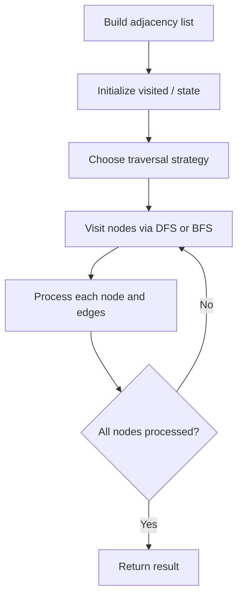

# Problem 997: Find the Town Judge

**Difficulty:** Easy  
**Tags:** Array, Hash Table, Graph Theory  
**Pattern:** Graph Algorithm  
**Link:** [leetcode.com/problems/find-the-town-judge](https://leetcode.com/problems/find-the-town-judge/)

## Description

In a town, there are `n` people labeled from `1` to `n`. There is a rumor that one of these people is secretly the town judge.

If the town judge exists, then:

	- The town judge trusts nobody.
	- Everybody (except for the town judge) trusts the town judge.
	- There is exactly one person that satisfies properties **1** and **2**.

You are given an array `trust` where `trust[i] = [ai, bi]` representing that the person labeled `ai` trusts the person labeled `bi`. If a trust relationship does not exist in `trust` array, then such a trust relationship does not exist.

Return *the label of the town judge if the town judge exists and can be identified, or return *`-1`* otherwise*.

 

Example 1:

```

**Input:** n = 2, trust = [[1,2]]
**Output:** 2

```

Example 2:

```

**Input:** n = 3, trust = [[1,3],[2,3]]
**Output:** 3

```

Example 3:

```

**Input:** n = 3, trust = [[1,3],[2,3],[3,1]]
**Output:** -1

```

 

**Constraints:**

	- `1 <= n <= 1000`
	- `0 <= trust.length <= 10^4`
	- `trust[i].length == 2`
	- All the pairs of `trust` are **unique**.
	- `ai != bi`
	- `1 <= ai, bi <= n`

## Approach: Graph Algorithm

Build an adjacency list/matrix from the input. Apply graph traversal (DFS/BFS), shortest path, or connectivity algorithm as needed.

## Pseudocode

```
1. Build adjacency list from edges
2. Initialize visited/distance arrays
3. Apply traversal algorithm:
   - DFS/BFS for reachability
   - Dijkstra/Bellman-Ford for shortest path
   - Union-Find for connectivity
4. Return result
```

## Algorithm Flow



## Complexity Analysis

- **Time:** O(V + E)
- **Space:** O(V + E)

## Solution (Python3)

```python
class Solution:
    def findJudge(self, n: int, trust: List[List[int]]) -> int:
        # Graph traversal - O(V+E) time
        from collections import defaultdict
        graph = defaultdict(list)
        # Build adjacency list from input
        n = len(n) if isinstance(n, list) else n
        visited = [False] * n
        result = 0
        
        def dfs(node):
            visited[node] = True
            for neighbor in graph[node]:
                if not visited[neighbor]:
                    dfs(neighbor)
        
        for i in range(n):
            if not visited[i]:
                dfs(i)
                result += 1
        return result
```

## Solution (C++)

```cpp
#include <functional>
#include <string>
#include <vector>
using namespace std;

class Solution {
public:
    int findJudge(int n, vector<vector<int>>& trust) {
        // Graph traversal - O(V+E) time
        int n = n.size();
        vector<vector<int>> graph(n);
        vector<bool> visited(n, false);
        int result = 0;
        function<void(int)> dfs = [&](int node) {
            visited[node] = true;
            for (int neighbor : graph[node]) {
                if (!visited[neighbor]) dfs(neighbor);
            }
        };
        for (int i = 0; i < n; i++) {
            if (!visited[i]) {
                dfs(i);
                result++;
            }
        }
        return result;
    }
};
```
