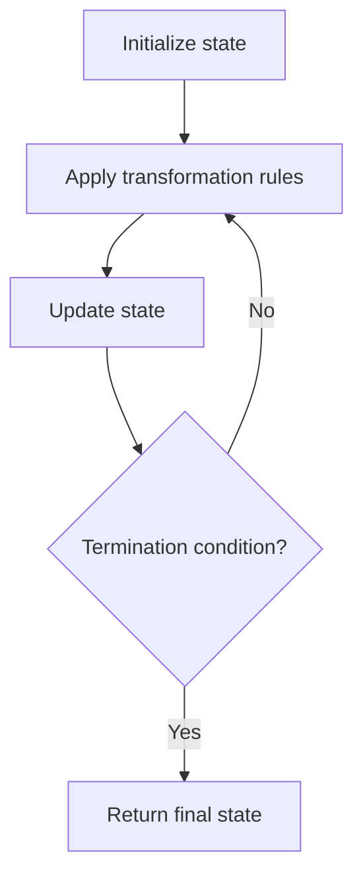

# Problem 999: Available Captures for Rook

**Difficulty:** Easy  
**Tags:** Array, Matrix, Simulation  
**Pattern:** Simulation  
**Link:** [leetcode.com/problems/available-captures-for-rook](https://leetcode.com/problems/available-captures-for-rook/)

## Description

You are given an `8 x 8` **matrix** representing a chessboard. There is **exactly one** white rook represented by `'R'`, some number of white bishops `'B'`, and some number of black pawns `'p'`. Empty squares are represented by `'.'`.

A rook can move any number of squares horizontally or vertically (up, down, left, right) until it reaches another piece *or* the edge of the board. A rook is **attacking** a pawn if it can move to the pawn's square in one move.

Note: A rook cannot move through other pieces, such as bishops or pawns. This means a rook cannot attack a pawn if there is another piece blocking the path.

Return the **number of pawns** the white rook is **attacking**.

 

Example 1:

**Input:** board = [[".",".",".",".",".",".",".","."],[".",".",".","p",".",".",".","."],[".",".",".","R",".",".",".","p"],[".",".",".",".",".",".",".","."],[".",".",".",".",".",".",".","."],[".",".",".","p",".",".",".","."],[".",".",".",".",".",".",".","."],[".",".",".",".",".",".",".","."]]

**Output:** 3

**Explanation:**

In this example, the rook is attacking all the pawns.

Example 2:

**Input:** board = [[".",".",".",".",".",".","."],[".","p","p","p","p","p",".","."],[".","p","p","B","p","p",".","."],[".","p","B","R","B","p",".","."],[".","p","p","B","p","p",".","."],[".","p","p","p","p","p",".","."],[".",".",".",".",".",".",".","."],[".",".",".",".",".",".",".","."]]

**Output:** 0

**Explanation:**

The bishops are blocking the rook from attacking any of the pawns.

Example 3:

**Input:** board = [[".",".",".",".",".",".",".","."],[".",".",".","p",".",".",".","."],[".",".",".","p",".",".",".","."],["p","p",".","R",".","p","B","."],[".",".",".",".",".",".",".","."],[".",".",".","B",".",".",".","."],[".",".",".","p",".",".",".","."],[".",".",".",".",".",".",".","."]]

**Output:** 3

**Explanation:**

The rook is attacking the pawns at positions b5, d6, and f5.

 

**Constraints:**

	- `board.length == 8`
	- `board[i].length == 8`
	- `board[i][j]` is either `'R'`, `'.'`, `'B'`, or `'p'`
	- There is exactly one cell with `board[i][j] == 'R'`

## Approach: Simulation

Simulate the process described in the problem step by step. Follow the rules exactly, tracking state at each step.

## Pseudocode

```
1. Initialize state (grid, pointers, counters)
2. For each step / iteration:
   a. Apply the transformation rules
   b. Update state
   c. Check termination condition
3. Return final state or result
```

## Algorithm Flow



## Complexity Analysis

- **Time:** O(n) or O(n * k)
- **Space:** O(n)

## Solution (Python3)

```python
class Solution:
    def numRookCaptures(self, board: List[List[str]]) -> int:
        # Simulation approach - follow the rules step by step
        result = 0
        for i in range(len(board) if isinstance(board, list) else board):
            # Simulate each step
            pass
        return result
```

## Solution (C++)

```cpp
#include <string>
#include <vector>
using namespace std;

class Solution {
public:
    int numRookCaptures(vector<vector<string>>& board) {
        // Simulation approach
        int n = board.size();
        for (int i = 0; i < n; i++) {
            // Simulate each step
        }
        return 0;
    }
};
```
