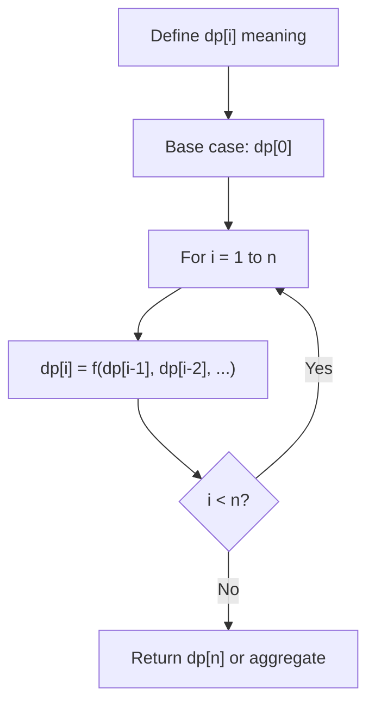
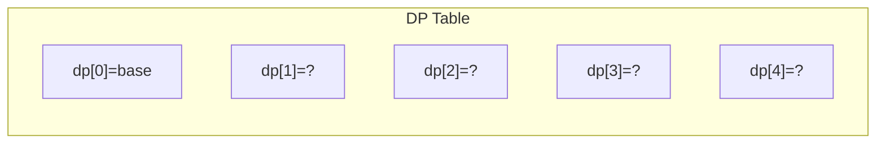
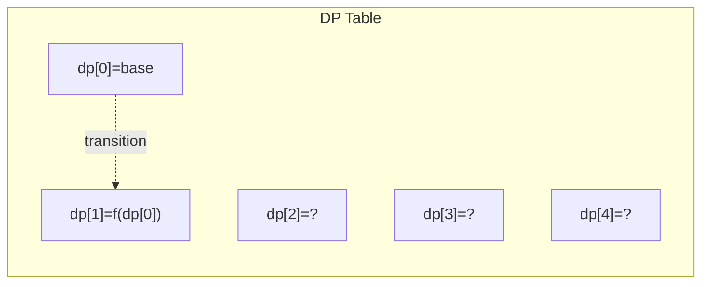
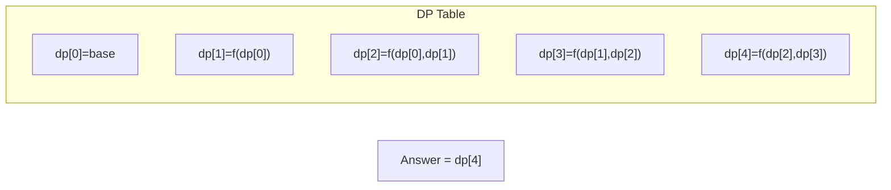

# Problem 1000: Minimum Cost to Merge Stones

**Difficulty:** Hard  
**Tags:** Array, Dynamic Programming, Prefix Sum  
**Pattern:** Dynamic Programming (1D)  
**Link:** [leetcode.com/problems/minimum-cost-to-merge-stones](https://leetcode.com/problems/minimum-cost-to-merge-stones/)

## Description

There are `n` piles of `stones` arranged in a row. The `i^th` pile has `stones[i]` stones.

A move consists of merging exactly `k` **consecutive** piles into one pile, and the cost of this move is equal to the total number of stones in these `k` piles.

Return *the minimum cost to merge all piles of stones into one pile*. If it is impossible, return `-1`.

 

Example 1:

```

**Input:** stones = [3,2,4,1], k = 2
**Output:** 20
**Explanation:** We start with [3, 2, 4, 1].
We merge [3, 2] for a cost of 5, and we are left with [5, 4, 1].
We merge [4, 1] for a cost of 5, and we are left with [5, 5].
We merge [5, 5] for a cost of 10, and we are left with [10].
The total cost was 20, and this is the minimum possible.

```

Example 2:

```

**Input:** stones = [3,2,4,1], k = 3
**Output:** -1
**Explanation:** After any merge operation, there are 2 piles left, and we can't merge anymore.  So the task is impossible.

```

Example 3:

```

**Input:** stones = [3,5,1,2,6], k = 3
**Output:** 25
**Explanation:** We start with [3, 5, 1, 2, 6].
We merge [5, 1, 2] for a cost of 8, and we are left with [3, 8, 6].
We merge [3, 8, 6] for a cost of 17, and we are left with [17].
The total cost was 25, and this is the minimum possible.

```

 

**Constraints:**

	- `n == stones.length`
	- `1 <= n <= 30`
	- `1 <= stones[i] <= 100`
	- `2 <= k <= 30`

## Approach: Dynamic Programming (1D)

Break the problem into overlapping subproblems. Define dp[i] as the optimal value for the subproblem ending at or considering index i. Build the solution bottom-up, using previously computed dp values.

## Pseudocode

```
1. Define dp[i] = optimal value for subproblem i
2. Base case: dp[0] = initial value
3. For i from 1 to n:
   a. dp[i] = recurrence(dp[i-1], dp[i-2], ...)
4. Return dp[n] or max/min of dp
```

## Algorithm Flow



## Visual State Transitions

**1D Dynamic Programming Table Build:**

**Frame 1: Initialize base cases**


**Frame 2: Fill dp[1] from dp[0]**


**Frame 3: Fill remaining cells**



## Complexity Analysis

- **Time:** O(n)
- **Space:** O(n)

## Solution (Python3)

```python
class Solution:
    def mergeStones(self, stones: List[int], k: int) -> int:
        # Dynamic programming (1D) - O(n) time, O(n) space
        if not stones:
            return 0
        n = len(stones) if isinstance(stones, list) else stones
        dp = [0] * (n + 1)
        dp[0] = 1  # base case
        for i in range(1, n + 1):
            dp[i] = dp[i-1]  # transition (customize per problem)
            if i >= 2:
                dp[i] += dp[i-2]
        return dp[n]
```

## Solution (C++)

```cpp
#include <string>
#include <vector>
using namespace std;

class Solution {
public:
    int mergeStones(vector<int>& stones, int k) {
        // Dynamic programming (1D) - O(n) time, O(n) space
        int n = stones;
        if (n <= 0) return 0;
        vector<int> dp(n + 1, 0);
        dp[0] = 1;
        for (int i = 1; i <= n; i++) {
            dp[i] = dp[i-1];
            if (i >= 2) dp[i] += dp[i-2];
        }
        return dp[n];
    }
};
```
