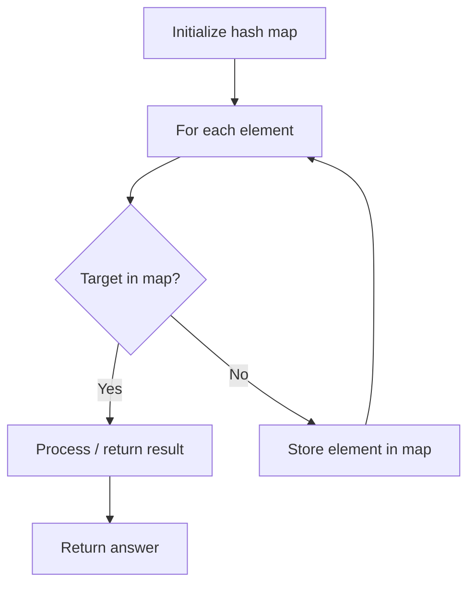

# Problem 1001: Grid Illumination

**Difficulty:** Hard  
**Tags:** Array, Hash Table  
**Pattern:** Hash Map Lookup  
**Link:** [leetcode.com/problems/grid-illumination](https://leetcode.com/problems/grid-illumination/)

## Description

There is a 2D `grid` of size `n x n` where each cell of this grid has a lamp that is initially **turned off**.

You are given a 2D array of lamp positions `lamps`, where `lamps[i] = [rowi, coli]` indicates that the lamp at `grid[rowi][coli]` is **turned on**. Even if the same lamp is listed more than once, it is turned on.

When a lamp is turned on, it **illuminates its cell** and **all other cells** in the same **row, column, or diagonal**.

You are also given another 2D array `queries`, where `queries[j] = [rowj, colj]`. For the `j^th` query, determine whether `grid[rowj][colj]` is illuminated or not. After answering the `j^th` query, **turn off** the lamp at `grid[rowj][colj]` and its **8 adjacent lamps** if they exist. A lamp is adjacent if its cell shares either a side or corner with `grid[rowj][colj]`.

Return *an array of integers *`ans`*,** where *`ans[j]`* should be *`1`* if the cell in the *`j^th`* query was illuminated, or *`0`* if the lamp was not.*

 

Example 1:

```

**Input:** n = 5, lamps = [[0,0],[4,4]], queries = [[1,1],[1,0]]
**Output:** [1,0]
**Explanation:** We have the initial grid with all lamps turned off. In the above picture we see the grid after turning on the lamp at grid[0][0] then turning on the lamp at grid[4][4].
The 0th query asks if the lamp at grid[1][1] is illuminated or not (the blue square). It is illuminated, so set ans[0] = 1. Then, we turn off all lamps in the red square.

The 1st query asks if the lamp at grid[1][0] is illuminated or not (the blue square). It is not illuminated, so set ans[1] = 0. Then, we turn off all lamps in the red rectangle.

```

Example 2:

```

**Input:** n = 5, lamps = [[0,0],[4,4]], queries = [[1,1],[1,1]]
**Output:** [1,1]

```

Example 3:

```

**Input:** n = 5, lamps = [[0,0],[0,4]], queries = [[0,4],[0,1],[1,4]]
**Output:** [1,1,0]

```

 

**Constraints:**

	- `1 <= n <= 10^9`
	- `0 <= lamps.length <= 20000`
	- `0 <= queries.length <= 20000`
	- `lamps[i].length == 2`
	- `0 <= rowi, coli < n`
	- `queries[j].length == 2`
	- `0 <= rowj, colj < n`

## Approach: Hash Map Lookup

Use a hash map (dictionary) to store elements for O(1) lookup. Iterate through the input, checking membership or counting frequencies in the map.

## Pseudocode

```
1. Initialize hash map
2. Iterate through elements:
   a. Check if target/complement exists in map
   b. If found: process result
   c. Otherwise: store element in map
3. Return result
```

## Algorithm Flow



## Complexity Analysis

- **Time:** O(n)
- **Space:** O(n)

## Solution (Python3)

```python
class Solution:
    def gridIllumination(self, n: int, lamps: List[List[int]], queries: List[List[int]]) -> List[int]:
        # Hash map approach - O(n) time, O(n) space
        seen = {}
        for i, val in enumerate(n):
            complement = lamps - val
            if complement in seen:
                return [seen[complement], i]
            seen[val] = i
        return []
```

## Solution (C++)

```cpp
#include <string>
#include <unordered_map>
#include <vector>
using namespace std;

class Solution {
public:
    vector<int> gridIllumination(int n, vector<vector<int>>& lamps, vector<vector<int>>& queries) {
        // Hash map approach - O(n) time, O(n) space
        unordered_map<int, int> seen;
        for (int i = 0; i < n.size(); i++) {
            int complement = lamps - n[i];
            if (seen.count(complement)) {
                return {seen[complement], i};
            }
            seen[n[i]] = i;
        }
        return {};
    }
};
```
