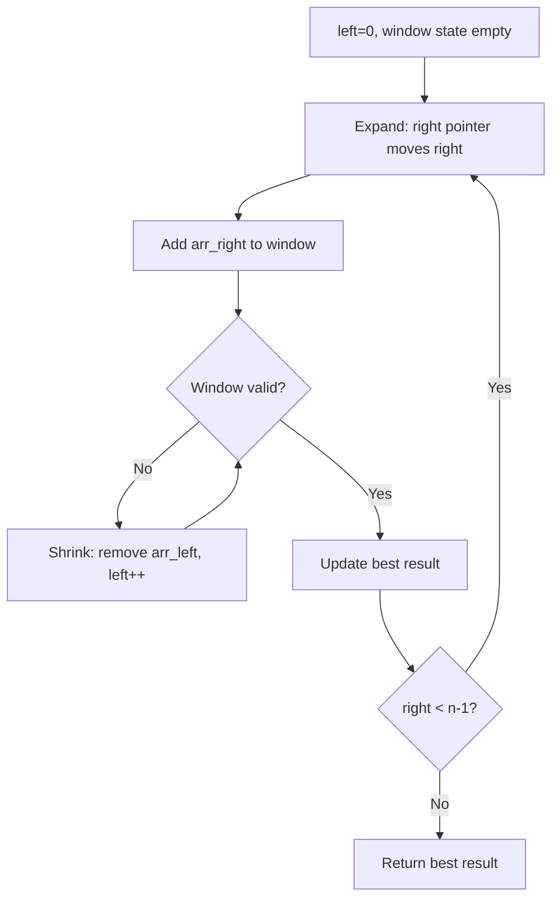
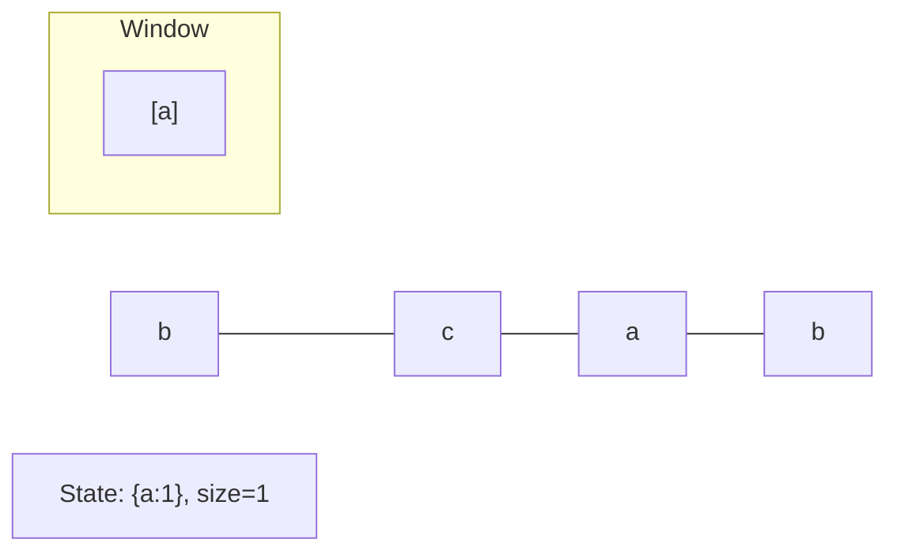
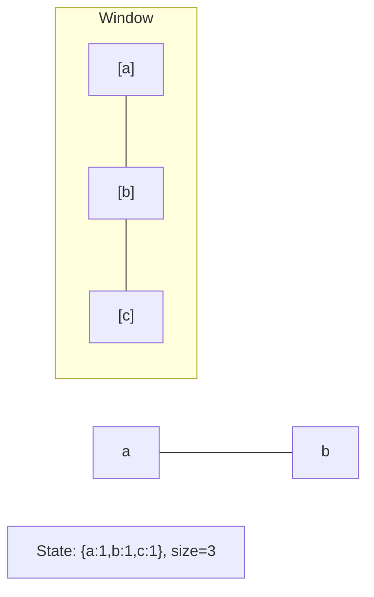
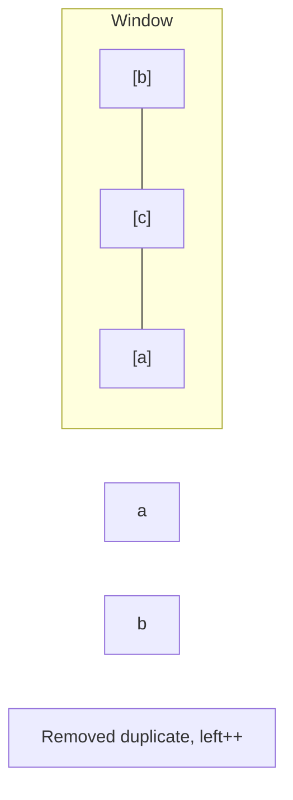
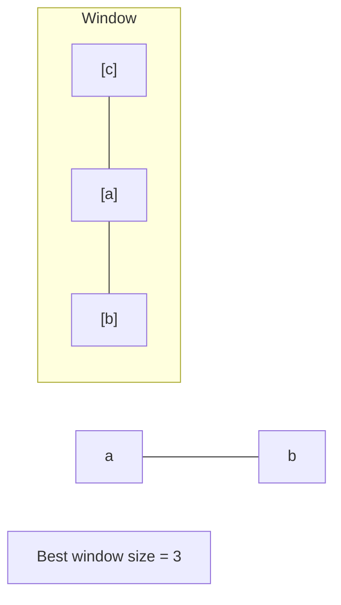

# Problem 1004: Max Consecutive Ones III

**Difficulty:** Medium  
**Tags:** Array, Binary Search, Sliding Window, Prefix Sum  
**Pattern:** Sliding Window  
**Link:** [leetcode.com/problems/max-consecutive-ones-iii](https://leetcode.com/problems/max-consecutive-ones-iii/)

## Description

Given a binary array `nums` and an integer `k`, return *the maximum number of consecutive *`1`*'s in the array if you can flip at most* `k` `0`'s.

 

Example 1:

```

**Input:** nums = [1,1,1,0,0,0,1,1,1,1,0], k = 2
**Output:** 6
**Explanation:** [1,1,1,0,0,**1**,1,1,1,1,**1**]
Bolded numbers were flipped from 0 to 1. The longest subarray is underlined.
```

Example 2:

```

**Input:** nums = [0,0,1,1,0,0,1,1,1,0,1,1,0,0,0,1,1,1,1], k = 3
**Output:** 10
**Explanation:** [0,0,1,1,**1**,**1**,1,1,1,**1**,1,1,0,0,0,1,1,1,1]
Bolded numbers were flipped from 0 to 1. The longest subarray is underlined.

```

 

**Constraints:**

	- `1 <= nums.length <= 10^5`
	- `nums[i]` is either `0` or `1`.
	- `0 <= k <= nums.length`

## Approach: Sliding Window

Sliding window: track zeros count. Shrink window when zeros > k.

## Pseudocode

```
1. Initialize left = 0, result = initial_value
2. For right in range(n):
   a. Add element at right to window state
   b. While window is invalid:
      - Remove element at left from window state
      - left++
   c. Update result = best of (result, window size/value)
3. Return result
```

## Algorithm Flow



## Visual State Transitions

**Sliding Window Step-by-Step:**

**Frame 1: Initial window (left=0, right=0)**


**Frame 2: Expand right (right=2)**


**Frame 3: Violation - shrink left**


**Frame 4: Continue expanding**



## Complexity Analysis

- **Time:** O(n)
- **Space:** O(1)

## Solution (Python3)

```python
class Solution:
    def longestOnes(self, nums: list[int], k: int) -> int:
        left = 0
        zeros = 0
        max_len = 0
        for right in range(len(nums)):
            if nums[right] == 0:
                zeros += 1
            while zeros > k:
                if nums[left] == 0:
                    zeros -= 1
                left += 1
            max_len = max(max_len, right - left + 1)
        return max_len
```

## Solution (C++)

```cpp
#include <algorithm>
#include <string>
#include <unordered_map>
#include <vector>
using namespace std;

class Solution {
public:
    int longestOnes(vector<int>& nums, int k) {
        // Sliding window approach - O(n) time, O(k) space
        unordered_map<char, int> window;
        int left = 0, result = 0;
        for (int right = 0; right < nums.size(); right++) {
            window[nums[right]]++;
            while ((int)window.size() > k) {
                window[nums[left]]--;
                if (window[nums[left]] == 0)
                    window.erase(nums[left]);
                left++;
            }
            result = max(result, right - left + 1);
        }
        return result;
    }
};
```
