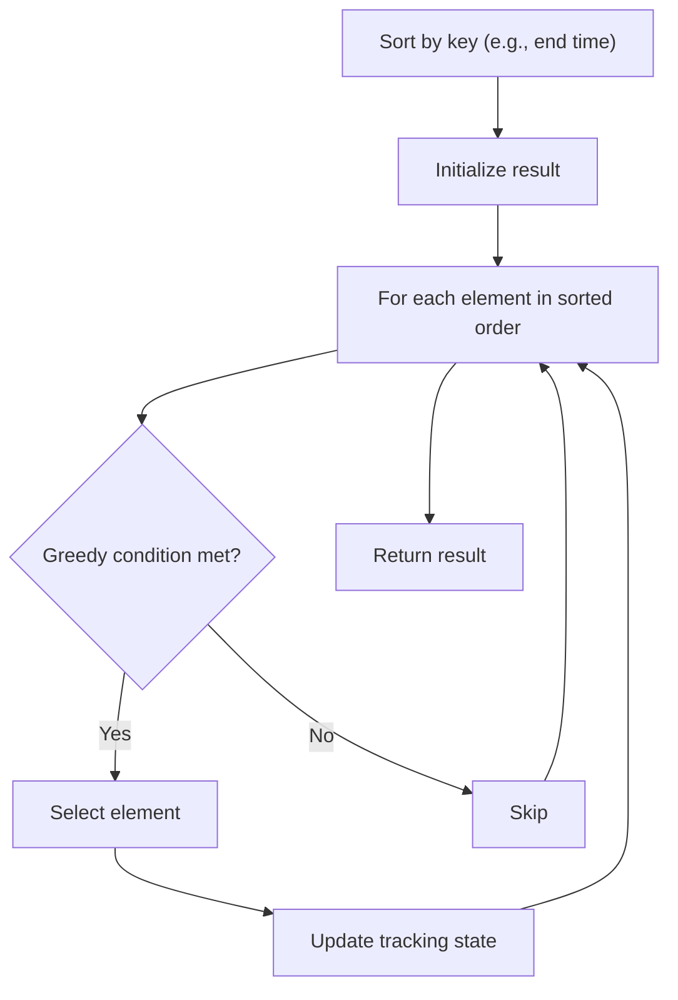

# Problem 1005: Maximize Sum Of Array After K Negations

**Difficulty:** Easy  
**Tags:** Array, Greedy, Sorting  
**Pattern:** Greedy with Sorting  
**Link:** [leetcode.com/problems/maximize-sum-of-array-after-k-negations](https://leetcode.com/problems/maximize-sum-of-array-after-k-negations/)

## Description

Given an integer array `nums` and an integer `k`, modify the array in the following way:

	- choose an index `i` and replace `nums[i]` with `-nums[i]`.

You should apply this process exactly `k` times. You may choose the same index `i` multiple times.

Return *the largest possible sum of the array after modifying it in this way*.

 

Example 1:

```

**Input:** nums = [4,2,3], k = 1
**Output:** 5
**Explanation:** Choose index 1 and nums becomes [4,-2,3].

```

Example 2:

```

**Input:** nums = [3,-1,0,2], k = 3
**Output:** 6
**Explanation:** Choose indices (1, 2, 2) and nums becomes [3,1,0,2].

```

Example 3:

```

**Input:** nums = [2,-3,-1,5,-4], k = 2
**Output:** 13
**Explanation:** Choose indices (1, 4) and nums becomes [2,3,-1,5,4].

```

 

**Constraints:**

	- `1 <= nums.length <= 10^4`
	- `-100 <= nums[i] <= 100`
	- `1 <= k <= 10^4`

## Approach: Greedy with Sorting

Sort the input by a key criterion, then greedily process elements in sorted order. The sorting ensures the greedy choice is always optimal.

## Pseudocode

```
1. Sort elements by key (start time, weight, etc.)
2. Initialize result, tracking variables
3. For each element in sorted order:
   a. Apply greedy selection rule
   b. Update result
4. Return result
```

## Algorithm Flow



## Complexity Analysis

- **Time:** O(n log n)
- **Space:** O(n)

## Solution (Python3)

```python
class Solution:
    def largestSumAfterKNegations(self, nums: List[int], k: int) -> int:
        # Sort + greedy - O(n log n) time
        nums.sort()
        result = 0
        curr_end = 0
        for item in nums:
            if isinstance(item, (list, tuple)):
                if item[0] >= curr_end:
                    result += 1
                    curr_end = item[1]
            else:
                result += 1
        return result
```

## Solution (C++)

```cpp
#include <algorithm>
#include <string>
#include <vector>
using namespace std;

class Solution {
public:
    int largestSumAfterKNegations(vector<int>& nums, int k) {
        // Sort + greedy - O(n log n) time
        sort(nums.begin(), nums.end());
        int result = 0, curr_end = 0;
        for (auto& item : nums) {
            result++;
        }
        return result;
    }
};
```
